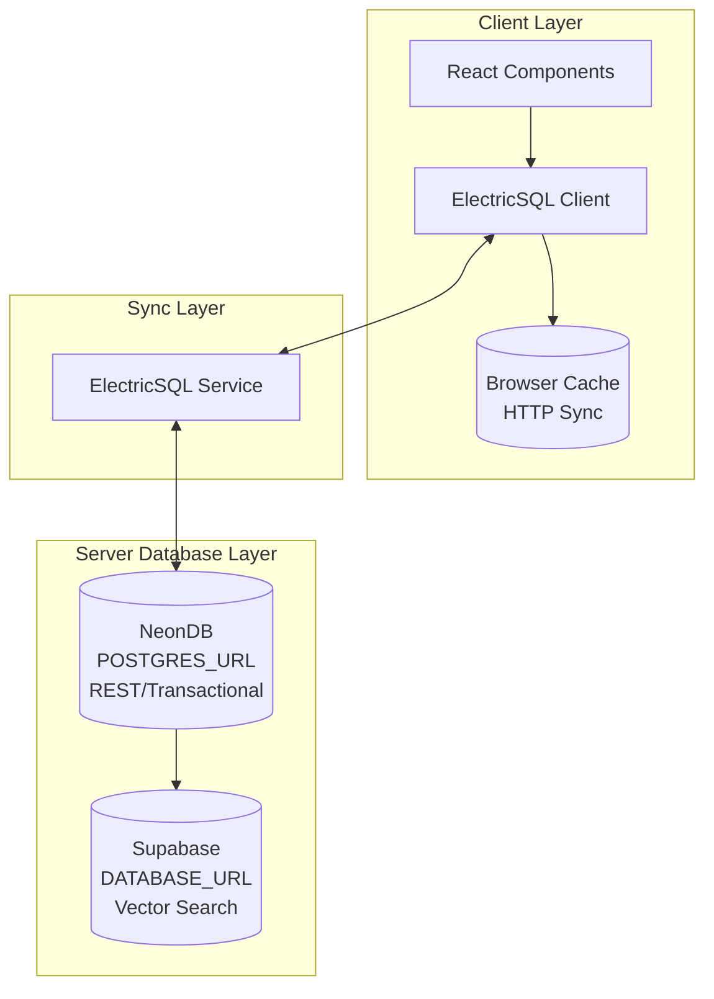

# RevealUI System Architecture

**Last Updated:** 2026-03-16
**Status:** Complete Architecture Design
**Version:** 2.0

---

## Table of Contents

1. [Executive Summary](#executive-summary)
2. [Architecture Overview](#architecture-overview)
3. [Database Architecture](#database-architecture)
   - [Triple Database Design](#triple-database-design)
   - [NeonDB (Primary Database)](#neondb-primary-database)
   - [Supabase (Vector Database)](#supabase-vector-database)
   - [ElectricSQL (Sync Layer)](#electricsql-sync-layer)
   - [Database Client Factory](#database-client-factory)
4. [Multi-Tenant Architecture](#multi-tenant-architecture)
   - [Tenant Model](#tenant-model)
   - [Role Hierarchy](#role-hierarchy)
   - [Access Control](#access-control)
   - [Data Isolation](#data-isolation)
5. [Type Safety & Contracts Layer](#type-safety--contracts-layer)
   - [Contracts System](#contracts-system)
   - [Type Adapters](#type-adapters)
   - [Type Bridges](#type-bridges)
   - [Generated Types](#generated-types)
6. [Vercel Platform Integration](#vercel-platform-integration)
   - [Vercel AI SDK](#vercel-ai-sdk)
   - [Remote Procedure Calls (RPC)](#remote-procedure-calls-rpc)
   - [Vercel Blob Storage](#vercel-blob-storage)
   - [Analytics & Monitoring](#analytics--monitoring)
7. [Build System](#build-system)
   - [Turbopack Configuration](#turbopack-configuration)
   - [Development vs Production](#development-vs-production)
8. [Data Flow Patterns](#data-flow-patterns)
9. [Commercial Architecture](#commercial-architecture)
10. [Security & Access Control](#security--access-control)
11. [Performance & Scaling](#performance--scaling)
12. [Migration Strategy](#migration-strategy)
13. [Monitoring & Observability](#monitoring--observability)
14. [Testing Strategy](#testing-strategy)
15. [Best Practices](#best-practices)
16. [Configuration Reference](#configuration-reference)
17. [Troubleshooting](#troubleshooting)
18. [Component Mapping](#component-mapping)
    - [UI Components](#ui-components)
    - [Business Logic](#business-logic)
    - [Data Schemas & Contracts](#data-schemas--contracts)
    - [Component-to-Schema Relationships](#component-to-schema-relationships)
    - [Key Patterns](#key-patterns)
    - [File Locations Summary](#file-locations-summary)
    - [Extension Guide](#extension-guide)
19. [References](#references)

---

## Executive Summary

RevealUI implements a hybrid multi-database architecture with comprehensive type safety, integrating multiple specialized systems for optimal performance and scalability. Every architectural decision is guided by the **[JOSHUA Stack](./JOSHUA.md)** principles — Justifiable, Orthogonal, Sovereign, Hermetic, Unified, Adaptive.

### Core Systems

1. **NeonDB (POSTGRES_URL)**: Transactional REST API + ElectricSQL sync source
2. **Supabase (DATABASE_URL)**: Vector database for AI embeddings and semantic search
3. **ElectricSQL**: Real-time synchronization for agent contexts and conversations
4. **Vercel AI SDK**: Streaming AI completions with React hooks
5. **Vercel Blob Storage**: Media and file storage
6. **Remote Procedure Calls (RPC)**: Type-safe API calls
7. **Vercel Analytics & Speed Insights**: Performance monitoring

### Architecture Type

Hybrid Multi-Database + Vercel Cloud Platform Integration with Full Type Safety

### Key Benefits

- ✅ **Performance Isolation**: REST, vector, and sync operations don't interfere
- ✅ **Independent Scaling**: Each system scales based on workload
- ✅ **Type Safety**: End-to-end type safety from database to frontend
- ✅ **Real-Time Sync**: Offline-first with automatic synchronization
- ✅ **Multi-Tenancy**: Complete data isolation between tenants
- ✅ **Security**: Clear access boundaries with row-level security

### Commercial Reality

RevealUI's business model should align with account or workspace ownership, not a legacy per-user license table used as the primary SaaS entitlement source.

The architecture should support four commercial layers:

- **Platform subscription** for account-level access and core administration
- **Metered agent execution** for workflow runs, tool calls, and expensive automation
- **Commerce fees** for transactions or paid API flows RevealUI helps complete
- **Trust and governance** for approvals, audit, policy, and compliance controls

### Runtime Database Access Policy

Application runtime code should default to `drizzle-orm` for database reads and writes.

Allowed exceptions are narrow:

- versioned migrations under `packages/db/migrations`
- setup/bootstrap SQL under `packages/db/src/migrations`
- low-level database tests
- the dynamic collection storage adapter in `packages/core/src/collections/operations/sqlAdapter.ts`

That last exception is temporary, not a preferred pattern. It exists because the current collection engine resolves table and column names from config at runtime, which does not fit Drizzle's compile-time table model cleanly. New runtime SQL should not be added outside that adapter boundary.

---

## Architecture Overview

### System Diagram

```
┌─────────────────────────────────────────────────────────────────┐
│                        Frontend (React/Next.js)                  │
│  ┌──────────────────────────────────────────────────────────┐  │
│  │  Generated Types (@revealui/core/generated/types)        │  │
│  │  - CMS Config Types    - Supabase Types                  │  │
│  │  - NeonDB Types        - Shared Type Definitions         │  │
│  └──────────────────────────────────────────────────────────┘  │
└─────────────────────────────────────────────────────────────────┘
                              │
                    ┌─────────┴─────────┐
                    │   Type-Safe APIs  │
                    │   (REST/RPC)      │
                    └─────────┬─────────┘
                              │
┌─────────────────────────────────────────────────────────────────┐
│              Type Safety Layer & Contracts                      │
│  ┌──────────────────────────────────────────────────────────┐  │
│  │  Contracts (@revealui/contracts/cms)                     │  │
│  │  - ConfigContract    - CollectionContract                │  │
│  │  - FieldContract     - GlobalContract                    │  │
│  │  - Runtime Validation (Zod) + Compile-time (TypeScript)  │  │
│  └──────────────────────────────────────────────────────────┘  │
│  ┌──────────────────────────────────────────────────────────┐  │
│  │  Type Adapters & Bridges                                 │  │
│  │  - Type Adapter (DB ↔ RevealUI)                          │  │
│  │  - Type Bridge (Drizzle ↔ Contracts)                     │  │
│  │  - Contract Mappers (DB Rows ↔ Validated Entities)       │  │
│  └──────────────────────────────────────────────────────────┘  │
└─────────────────────────────────────────────────────────────────┘
                              │
        ┌─────────────────────┼─────────────────────┐
        │                     │                     │
┌───────▼────────┐   ┌───────▼────────┐   ┌───────▼────────┐
│  REST API      │   │  Vercel AI SDK │   │  RPC Services  │
│  (NeonDB)      │   │  (Streaming)   │   │  (Type-safe)   │
└───────┬────────┘   └───────┬────────┘   └───────┬────────┘
        │                     │                     │
┌───────▼────────┐   ┌───────▼────────┐   ┌───────▼────────┐
│   NeonDB       │   │   Supabase     │   │ Vercel Blob    │
│  (Relational)  │   │   (Vectors)    │   │   (Storage)    │
└───────┬────────┘   └────────────────┘   └────────────────┘
        │
┌───────▼────────┐
│  ElectricSQL   │
│  (Real-time)   │
└────────────────┘
        │
┌───────▼────────┐
│  Vercel Tools  │
│ (Analytics,    │
│  Insights)     │
└────────────────┘
```

### Type Safety Flow

1. **Frontend** → Uses generated types for compile-time safety
2. **API Routes** → Validates with contracts (runtime + compile-time)
3. **Type Adapters** → Convert DB types ↔ RevealUI types
4. **Database** → Drizzle ORM provides type-safe queries

---

## Database Architecture

### Triple Database Design

RevealUI uses three separate database layers for optimal performance and scalability:



### Benefits of Triple Database Architecture

#### 1. Performance Isolation ✅

**Problem Solved:**

- Vector similarity searches (HNSW indexes) are CPU/memory intensive
- Heavy vector queries can slow down transactional REST operations
- Embedding generation competes with user-facing queries

**Benefit:**

- NeonDB handles REST/transactional workloads with predictable latency
- Supabase handles vector operations independently
- Each database optimized for its workload

**Real-World Impact:**

```
Scenario: Agent performs semantic search over 1M embeddings
- Single DB: REST API latency spikes 200-500ms during search
- Triple DB: REST API unaffected, vector search isolated
```

#### 2. Independent Scaling ✅

**NeonDB:**

- Scale for transactional throughput (connections, query speed)
- Serverless/scale-to-zero for variable REST workload

**Supabase:**

- Scale for vector storage/query performance (CPU, memory for HNSW)
- Dedicated instances for CPU-heavy operations

**ElectricSQL:**

- Lightweight sync service
- Scales with client connections

#### 3. Security & Access Control ✅

**Separation of Concerns:**

- **NeonDB**: Contains user PII, auth data, sensitive business logic
- **Supabase**: Contains embeddings, agent memories (less sensitive)
- **ElectricSQL**: Syncs filtered data with row-level security

**Access Pattern:**

```
REST API Services → NeonDB (user data, CMS)
AI Agent Services → Supabase (vector search)
Client Apps → ElectricSQL → NeonDB (real-time sync)
```

#### 4. Real-Time Sync & Local-First Architecture ✅

**ElectricSQL Benefits:**

- Client-side local-first storage (browser cache via HTTP sync)
- Cross-tab synchronization for agent data
- Offline-first operation with automatic sync
- Reduced server load (queries against local DB)
- Better user experience (instant reads, background writes)

#### 5. Cost Efficiency ✅

**Optimized Spend:**

- NeonDB: Pay for transactional capacity needed
- Supabase: Pay for vector storage/compute needed
- ElectricSQL: Self-hosted sync service (no additional DB cost)
- Avoid over-provisioning one database for both workloads

---

## NeonDB (Primary Database)

### Role

Transactional REST API + Real-time Sync Source

### Stores

**Core Relational Data:**

- Users, sessions, authentication
- Sites, pages, CMS content
- Media, posts, metadata

**Agent Relational Data:**

- `agent_contexts` - Working memory, session context
- `conversations` - Chat threads with messages
- `agent_actions` - Audit log of agent actions

**NOT Stored:**

- ❌ Agent memories with embeddings (moved to Supabase)

### Characteristics

- High connection count for REST API
- Low-latency transactional queries
- Optimized for relational joins
- Source of truth for ElectricSQL sync

### Connection

```env
POSTGRES_URL=postgresql://...@neon.tech/...
```

### Schema Organization

```typescript
// packages/db/src/core/rest.ts (NeonDB schema)
export * from "./users";
export * from "./sites";
export * from "./pages";
export * from "./sessions";
export * from "./agents/contexts"; // ElectricSQL sync
export * from "./agents/conversations"; // ElectricSQL sync
export * from "./agents/actions";
```

---

## Supabase (Vector Database)

### Role

AI/Vector Operations + Semantic Search

### Stores

**Agent Memories with Embeddings:**

- `agent_memories` - Long-term memory with `vector(1536)` embeddings
- Vector similarity search optimized
- HNSW indexes for fast semantic retrieval

### Characteristics

- CPU-optimized for vector operations
- Large embedding storage capacity
- Optimized for similarity search
- Isolated from transactional workloads

### Connection

```env
DATABASE_URL=postgresql://...@db.supabase.co/...
```

### Why Separate

1. Vector similarity searches are CPU/memory intensive
2. Heavy vector queries don't affect REST API latency
3. Independent scaling for vector workloads
4. Better cost optimization

### Schema Organization

```typescript
// packages/db/src/core/vector.ts (Supabase schema)
export * from "./agents/vector-memories"; // Vector data only
```

### Vector Memory Service

```typescript
// packages/ai/src/memory/vector-memory.ts
import { getVectorClient } from "@revealui/db/client";
import { agentMemories } from "@revealui/db/core/vector";

export class VectorMemoryService {
  private db = getVectorClient(); // Supabase

  async searchSimilar(
    queryEmbedding: number[],
    options: {
      userId?: string;
      siteId?: string;
      limit?: number;
    } = {},
  ) {
    let query = this.db
      .select()
      .from(agentMemories)
      .orderBy(sql`embedding <-> ${queryEmbedding}::vector`)
      .limit(options.limit ?? 10);

    // Filter by user/site (reference IDs, not FKs)
    if (options.userId) {
      query = query.where(eq(agentMemories.userId, options.userId));
    }
    if (options.siteId) {
      query = query.where(eq(agentMemories.siteId, options.siteId));
    }

    return await query;
  }

  async create(memory: AgentMemory) {
    // Only writes to Supabase
    return await this.db.insert(agentMemories).values({
      ...memory,
      embedding: `[${memory.embedding.vector.join(",")}]`,
      // Reference IDs (not foreign keys)
      userId: memory.metadata?.custom?.userId,
      siteId: memory.metadata?.siteId,
    });
  }
}
```

---

## ElectricSQL (Sync Layer)

### Role

Real-time synchronization for client-side data

### Syncs from NeonDB

- ✅ `agent_contexts` - Working memory across tabs
- ✅ `conversations` - Chat threads across sessions
- ❌ **NOT** `agent_memories` - Don't need real-time sync

### Characteristics

- Reads from NeonDB (POSTGRES_URL)
- Syncs via HTTP shapes to clients
- CRDT-based conflict resolution
- Offline-first with automatic sync

### Connection

```env
ELECTRIC_SERVICE_URL=http://localhost:5133
NEXT_PUBLIC_ELECTRIC_SERVICE_URL=http://localhost:5133
```

### Why ElectricSQL

- Real-time updates across browser tabs
- Offline support with automatic sync
- Optimistic updates with conflict resolution
- Type-safe client-side queries

### Configuration

```yaml
# infrastructure/docker-compose/services/electric.yml
services:
  electric-sql:
    environment:
      # Connect to NeonDB (not Supabase)
      - DATABASE_URL=${POSTGRES_URL} # Source of truth

      # Sync configuration
      - ELECTRIC_WRITE_TO_PG_MODE=direct_writes
      - ELECTRIC_REPLICATION_MODE=pglite
```

### Shape Proxy Routes

```typescript
// apps/cms/src/app/api/shapes/agent-contexts/route.ts
export async function GET(request: NextRequest) {
  const session = await getSession(request.headers);

  // Build ElectricSQL shape URL
  const originUrl = prepareElectricUrl(request.url);
  originUrl.searchParams.set("table", "agent_contexts");
  originUrl.searchParams.set("where", "agent_id = $1");
  originUrl.searchParams.set("params", JSON.stringify([session.user.id]));

  // ElectricSQL reads from NeonDB (POSTGRES_URL)
  return proxyElectricRequest(originUrl);
}
```

### Client-Side Usage

```typescript
// packages/sync/src/hooks/useAgentContext.ts
export function useAgentContext(agentId: string, sessionId: string) {
  // Shape request goes to CMS API proxy
  const shape = useShape({
    source: "http://localhost:3000/api/shapes/agent-contexts",
    table: "agent_contexts",
    where: { agent_id: agentId, session_id: sessionId },
  });

  // ElectricSQL syncs from NeonDB
  // Local storage in IndexedDB
  return shape.data;
}
```

---

## Database Client Factory

### Implementation

```typescript
// packages/db/src/client/index.ts

export type DatabaseType = "rest" | "vector";

let restClient: Database | null = null;
let vectorClient: Database | null = null;

export function getClient(type: DatabaseType = "rest"): Database {
  if (type === "vector") {
    if (!vectorClient) {
      const url = process.env.DATABASE_URL;
      if (!url) throw new Error("DATABASE_URL required for vector database");
      vectorClient = createClient({ connectionString: url });
    }
    return vectorClient;
  }

  // Default: REST/NeonDB (also used by ElectricSQL)
  if (!restClient) {
    const url = process.env.POSTGRES_URL || process.env.DATABASE_URL;
    if (!url) throw new Error("POSTGRES_URL required for REST database");
    restClient = createClient({ connectionString: url });
  }
  return restClient;
}

// Explicit helpers
export function getRestClient(): Database {
  return getClient("rest");
}

export function getVectorClient(): Database {
  return getClient("vector");
}
```

### Usage

```typescript
// REST operations
const db = getRestClient();
const users = await db.query.users.findMany();

// Vector operations
const vectorDb = getVectorClient();
const memories = await vectorDb
  .select()
  .from(agentMemories)
  .orderBy(sql`embedding <-> ${queryEmbedding}::vector`);
```

---

## Multi-Tenant Architecture

### Tenant Model

RevealUI implements robust multi-tenancy using RevealUI CMS 3.x, allowing multiple organizations to share the same application instance with complete data isolation.

```typescript
Tenants Collection {
  id: number
  name: string
  url: string
  // ... other fields
}
```

### User-Tenant Relationship

Users can be associated with multiple tenants, each with different roles:

```typescript
User {
  id: number
  email: string
  roles: ["user-super-admin" | "user-admin"]  // System-level roles
  tenants: [
    {
      tenant: Tenant (relationship)
      roles: ["tenant-super-admin" | "tenant-admin"]  // Tenant-specific roles
    }
  ]
  lastLoggedInTenant: Tenant (relationship)
}
```

---

## Role Hierarchy

### System-Level Roles

1. **User Super Admin** (`user-super-admin`)
   - Full system access across all tenants
   - Can manage all users and tenants
   - Can assign roles to other users
   - Highest privilege level

2. **User Admin** (`user-admin`)
   - System administration capabilities
   - Can manage users within assigned scope
   - Cannot modify super admin roles

### Tenant-Level Roles

3. **Tenant Super Admin** (`tenant-super-admin`)
   - Full access within their tenant(s)
   - Can manage tenant users and data
   - Cannot access other tenants' data

4. **Tenant Admin** (`tenant-admin`)
   - Administrative access within tenant
   - Limited user management
   - Cannot modify super admin settings

---

## Access Control

### Collection-Level Access

All collections implement tenant-aware access control:

```typescript
// Example: Pages Collection
{
  access: {
    create: authenticated,           // Must be logged in
    delete: authenticated,
    read: authenticatedOrPublished,  // Public can read published
    update: authenticated,
  }
}
```

### Access Control Functions

Located in `apps/cms/src/lib/access/`:

- `isAdmin.ts` - Checks for user-admin or user-super-admin
- `isSuperAdmin.ts` - Checks for user-super-admin only
- `isTenantAdminOrSuperAdmin.ts` - Checks tenant-level admin roles
- `checkTenantAccess.ts` - Verifies user has access to specific tenant
- `lastLoggedInTenant.ts` - Returns user's most recent tenant context

---

## Data Isolation

### Automatic Tenant Filtering

RevealUI CMS hooks automatically filter data by tenant:

```typescript
// All queries are scoped to user's current tenant
const pages = await revealui.find({
  collection: "pages",
  // Tenant filter applied automatically via hooks
});
```

### Last Logged-In Tenant

The system tracks which tenant a user most recently accessed:

```typescript
User.lastLoggedInTenant -> Tenant

// Updated automatically on login
hooks: {
  afterLogin: [recordLastLoggedInTenant]
}
```

### Tenant Isolation Guarantees

1. **Database Level**: Queries filtered by tenant relationship
2. **API Level**: Access control validates tenant membership
3. **UI Level**: Admin panel shows only current tenant's data

### Testing Tenant Isolation

**CRITICAL**: Always test that:

- Users cannot access other tenants' records
- Cross-tenant relationships are prevented
- Tenant switching properly updates context
- Super admins can access all tenants (by design)

---

## Type Safety & Contracts Layer

### Contracts System

The contracts system provides unified validation (TypeScript + Zod):

**Location:** `packages/contracts/src/cms/`

**What Contracts Provide:**

- **TypeScript Types** (compile-time safety)
- **Zod Schemas** (runtime validation)
- **Validation Functions** (runtime validation)
- **Type Guards** (runtime type checking)
- **Metadata** (documentation, versioning)

**Contract Types:**

- **ConfigContract** - Root CMS configuration validation
- **CollectionContract** - Collection configuration validation
- **FieldContract** - Field configuration validation
- **GlobalContract** - Global configuration validation

**Example Usage:**

```typescript
// Server: API Route validation
import { UserSchema } from "@revealui/contracts";
import { getRestClient } from "@revealui/db/client";

export async function POST(request: NextRequest) {
  const body = await request.json();

  // 1. Validate with contract (runtime + compile-time)
  const validatedUser = UserSchema.parse(body); // Throws if invalid

  // 2. Type is now known: User
  const db = getRestClient();
  await db.insert(users).values(validatedUser);

  return NextResponse.json(validatedUser);
}
```

### Type Adapters

**Role:** Convert between database types and RevealUI internal types

**Location:** `packages/core/src/core/database/type-adapter.ts`

**Key Functions:**

```typescript
// Convert DB row to RevealUI document
function dbRowToRevealUIDoc<TDoc, TDbRow>(dbRow: TDbRow): TDoc;

// Convert RevealUI document to DB insert
function revealUIDocToDbInsert<TDoc, TInsert>(doc: TDoc): TInsert;

// Convert DB row to contract-validated entity
function dbRowToContract<TContract, TDbRow>(
  contract: Contract<TContract>,
  dbRow: TDbRow,
): TContract;
```

**Usage in API Routes:**

```typescript
// apps/cms/src/app/api/users/route.ts
import { getRestClient } from "@revealui/db/client";
import { UserSchema } from "@revealui/contracts";
import { dbRowToContract } from "@revealui/core/database/type-adapter";

export async function GET() {
  const db = getRestClient();
  const dbUser = await db.query.users.findFirst();

  // Convert DB type to validated contract type
  const validatedUser = dbRowToContract(UserSchema, dbUser);

  // Return to frontend (types match generated types)
  return NextResponse.json(validatedUser);
}
```

### Type Bridges

**Role:** Convert between Drizzle ORM types and Contract types

**Location:** `packages/contracts/src/database/type-bridge.ts`

**Key Functions:**

```typescript
// Convert DB row to contract type with mapper
function createDbRowMapper<TContract, TDbRow>(
  contract: Contract<TContract>,
  mapper?: (row: TDbRow) => unknown,
): (row: TDbRow) => TContract;

// Convert contract type to DB insert with mapper
function createContractToDbMapper<TContract, TInsert>(
  mapper?: (data: TContract) => TInsert,
): (data: TContract) => TInsert;
```

### Generated Types

**Role:** Auto-generated TypeScript types for frontend consumption

**Location:** `packages/core/src/generated/types/`

**Sources:**

1. **CMS Config Types** (`cms.ts`) - Generated from `revealui.config.ts`
2. **Supabase Types** (`supabase.ts`) - Generated from Supabase schema
3. **NeonDB Types** (`neon.ts`) - Generated from Drizzle schema

**Frontend Usage:**

```typescript
// apps/mainframe/src/components/Page.tsx
import type { Page, Site, User } from '@revealui/core/generated/types'

export function PageComponent({ page }: { page: Page }) {
  // Full type safety from generated types
  return (
    <div>
      <h1>{page.title}</h1>  {/* TypeScript knows this exists */}
      <p>{page.content}</p>
    </div>
  )
}
```

**Type Safety Flow:**

```
Frontend → Generated Types → API Route → Contract Validation → Type Adapter → Database
```

---

## Vercel Platform Integration

### Vercel AI SDK

**Role:** Type-safe streaming AI completions with React hooks

**Features:**

- ✅ **Streaming Responses:** Real-time token streaming to clients
- ✅ **React Hooks:** `useChat`, `useCompletion`, `useAssistant`
- ✅ **Type Safety:** Full TypeScript support
- ✅ **Error Handling:** Built-in error boundaries
- ✅ **Open-Model Inference:** Ubuntu Inference Snaps, BitNet, Ollama

**Integration with Vector Database:**

```typescript
// Server: apps/cms/src/app/api/chat/route.ts
import { streamText, convertToModelMessages } from 'ai'
import { getVectorClient } from '@revealui/db/client'

export async function POST(request: NextRequest) {
  const { messages } = await request.json()

  // 1. Search relevant memories from Supabase
  const vectorDb = getVectorClient()
  const queryEmbedding = await generateEmbedding(messages[messages.length - 1].content)
  const relevantMemories = await vectorDb
    .select()
    .from(agentMemories)
    .orderBy(sql`embedding <-> ${queryEmbedding}::vector`)
    .limit(5)

  // 2. Use memories as context — model string routes through AI Gateway
  const result = streamText({
    model: 'anthropic/claude-sonnet-4.6',
    messages: await convertToModelMessages(messages),
    system: `Relevant memories: ${relevantMemories.map(m => m.content).join('\n')}`,
  })

  return result.toUIMessageStreamResponse()
}

// Client: apps/cms/src/lib/components/Agent/index.tsx
import { useChat } from '@ai-sdk/react'
import { DefaultChatTransport } from '@ai-sdk/react'

export function AgentChat() {
  const { messages, status, sendMessage } = useChat({
    transport: new DefaultChatTransport({ api: '/api/chat' }),
  })

  return <Chat messages={messages} status={status} onSend={sendMessage} />
}
```

### Remote Procedure Calls (RPC)

**Role:** Type-safe API calls with shared types between client and server

**Implementation Pattern:**

```typescript
// Shared RPC Types (packages/core/src/rpc/types.ts)
export type RPCProcedure<TInput, TOutput> = {
  input: TInput;
  output: TOutput;
};

export type RPCRouter = {
  // AI/Agent Procedures
  "ai.chat": RPCProcedure<{ messages: Message[] }, { response: string }>;
  "ai.searchMemories": RPCProcedure<
    { query: string },
    { memories: AgentMemory[] }
  >;

  // Memory Procedures
  "memory.create": RPCProcedure<{ memory: AgentMemory }, { id: string }>;
  "memory.search": RPCProcedure<
    { queryEmbedding: number[] },
    { memories: AgentMemory[] }
  >;
};
```

**Server-Side RPC Handler:**

```typescript
// apps/cms/src/app/api/rpc/route.ts
import type { RPCRouter } from "@revealui/core/rpc/types";

export async function POST(request: NextRequest) {
  const { procedure, input } = await request.json();

  switch (procedure) {
    case "memory.search": {
      // Use Supabase vector search
      const vectorDb = getVectorClient();
      const memories = await vectorDb
        .select()
        .from(agentMemories)
        .orderBy(sql`embedding <-> ${input.queryEmbedding}::vector`)
        .limit(10);
      return NextResponse.json({ memories });
    }
  }
}
```

**Client-Side RPC Client:**

```typescript
// packages/core/src/rpc/client.ts
export class RPCClient {
  async call<T extends keyof RPCRouter>(
    procedure: T,
    input: RPCRouter[T]["input"],
  ): Promise<RPCRouter[T]["output"]> {
    const response = await fetch("/api/rpc", {
      method: "POST",
      headers: { "Content-Type": "application/json" },
      body: JSON.stringify({ procedure, input }),
    });
    return response.json();
  }
}

// Usage: Type-safe calls with automatic type inference
const rpc = new RPCClient();
const memories = await rpc.call("memory.search", { queryEmbedding });
// TypeScript knows memories is AgentMemory[]
```

### Vercel Blob Storage

**Role:** Scalable media and file storage for CMS content

**Implementation:**

```typescript
// packages/core/src/core/storage/vercel-blob.ts
import { put, del } from "@vercel/blob";

export function vercelBlobStorage(config: VercelBlobStorageConfig): Plugin {
  // Configure upload adapters for media collections
  collection.upload = {
    adapters: [
      {
        upload: async (file) => {
          const blob = await put(filePath, file.data, {
            access: "public",
            token: config.token, // BLOB_READ_WRITE_TOKEN
          });
          return { url: blob.url, filename: file.name };
        },
        delete: async (blobUrl) => await del(blobUrl),
      },
    ],
  };
}
```

**Data Flow:**

```
Media Upload → Next.js API → Vercel Blob Storage → Store URL in NeonDB
```

### Analytics & Monitoring

**Setup:**

```typescript
// apps/cms/src/app/(frontend)/layout.tsx
import { Analytics } from '@vercel/analytics/react'
import { SpeedInsights } from '@vercel/speed-insights/react'

export default function RootLayout({ children }) {
  return (
    <html>
      <body>
        {children}
        <Analytics />      {/* Pageview tracking */}
        <SpeedInsights />  {/* Core Web Vitals */}
      </body>
    </html>
  )
}
```

**Metrics Tracked:**

- **Analytics:** Page views, sessions, bounce rate
- **Speed Insights:** LCP, FID, CLS, TTFB

---

## Build System

### Turbopack Configuration

**Status:** Enabled for Development, Disabled for Production

**Date:** 2026-01-30

### Development Mode

```javascript
// apps/cms/next.config.mjs
turbopack: {
  root: path.join(__dirname, '../..'), // Point to monorepo root
  resolveExtensions: ['.ts', '.tsx', '.js', '.jsx', '.mjs', '.json'],
}
```

**Status:** ✅ Working correctly

- Monorepo workspace resolution works
- Fast hot reload (HMR)
- Proper module resolution

### Production Mode

```json
// apps/cms/package.json
"vercel-build": "cross-env NODE_OPTIONS=--no-deprecation TURBOPACK=0 next build"
```

**Status:** ❌ Disabled due to blocking issues

### Why Turbopack is Disabled for Production

#### Critical Issues

1. **Module Resolution Failures (46 errors)**
   - Turbopack cannot resolve `.js` extension imports from TypeScript source
   - Workspace packages use `moduleResolution: "bundler"`
   - TypeScript source uses `.js` extensions (ESM convention)
   - Webpack handles this correctly, Turbopack does not

2. **Edge Runtime Compatibility Warnings**
   - Node.js modules loaded in Edge Runtime routes
   - `instrumentation.ts` uses Node.js modules
   - Webpack allows this, Turbopack is stricter

3. **Workspace Package Subpath Exports**
   - Cannot resolve package subpath exports from workspace packages
   - Packages use complex `exports` maps in `package.json`
   - Turbopack's subpath resolution differs from Webpack

### Performance Comparison

**Build Time:**

- **Webpack (current):** ~45-60 seconds for full production build
- **Turbopack:** Build fails, unable to measure

**Dev Server Startup:**

- **Webpack:** ~8-12 seconds
- **Turbopack:** ~3-5 seconds ✅ (why we keep it for dev)

### Recommendations

**Short Term:** ✅ Keep Turbopack disabled for production builds

**Medium Term:** Monitor Next.js 16.x updates for Turbopack improvements

**Long Term:** Re-evaluate when Next.js 17 stable is released

### Testing Checklist

When re-evaluating Turbopack for production:

- [ ] Remove `TURBOPACK=0` flag from build script
- [ ] Run `pnpm build:cms` to test production build
- [ ] Check for module resolution errors
- [ ] Verify all workspace package imports resolve
- [ ] Test instrumentation.ts Edge Runtime warnings
- [ ] Compare bundle size with Webpack build
- [ ] Measure build time improvements
- [ ] Test production deployment
- [ ] Verify all API routes work correctly
- [ ] Check for runtime errors in production

---

## Data Flow Patterns

### REST API Flow

```
Client Request
    │
    ▼
Next.js API Route (apps/cms/src/app/api/...)
    │
    ├─→ NeonDB (POSTGRES_URL) ──┐
    │                            │
    │   ┌────────────────────────┘
    │   │
    │   ├─→ Query users/sites/pages
    │   ├─→ Query agent_contexts
    │   ├─→ Query conversations
    │   └─→ Write to NeonDB
    │
    └─→ Response to Client
```

### Vector Search Flow

```
AI Agent Request
    │
    ▼
Vector Memory Service (packages/ai/src/memory/...)
    │
    ├─→ Generate Embedding (Ollama nomic-embed-text)
    │
    ▼
Supabase (DATABASE_URL)
    │
    ├─→ Semantic Search (pgvector)
    │   └─→ SELECT * FROM agent_memories
    │       ORDER BY embedding <-> query_embedding
    │
    └─→ Return Similar Memories
```

### ElectricSQL Sync Flow

```
Client (Browser)
    │
    ├─→ Shape Request (/api/shapes/agent-contexts)
    │       │
    │       ▼
    │   CMS API Route (apps/cms/src/app/api/shapes/...)
    │       │
    │       ▼
    │   ElectricSQL Service (localhost:5133)
    │       │
    │       ▼
    │   NeonDB (POSTGRES_URL) ──┐
    │                           │
    │   ┌───────────────────────┘
    │   │
    │   └─→ Sync agent_contexts/conversations
    │
    ▼
Browser Cache (HTTP Sync)
    │
    └─→ React Hooks (useAgentContext, useConversations)
```

---

## Commercial Architecture

### Billing Owner

The primary billing owner should be an `account` or `workspace`, not an individual user record.

### Entitlement Model

For hosted RevealUI deployments, request-time entitlements should resolve through:

1. `session`
2. `membership`
3. `account or workspace`
4. `subscription and account entitlements`

Optional per-user licenses can still exist for personal or perpetual products, but they should not be the main control plane for hosted premium access.

### Commercial Objects

- **Accounts or workspaces**: the customer being billed
- **Memberships**: users and roles within the billing owner
- **Subscriptions**: Stripe-backed recurring commercial agreement
- **Account entitlements**: materialized features, limits, and status
- **Meters**: business-readable usage records such as workflow runs or tool calls
- **Optional user licenses**: secondary model for named-user or perpetual products

### Pricing Tracks

Four revenue tracks, all implemented:

- **Track A — Subscriptions**: predictable recurring software fee (Free / Pro / Max / Forge)
- **Track B — Agent credits**: usage billing for digital labor and automation (prepaid task bundles)
- **Track C — Perpetual licenses**: one-time purchase with annual support renewals (checkout + webhook handler wired)
- **Track D — Professional services**: per-engagement consulting, migration, architecture review, launch packages

### Preferred Metering Units

Customer-facing meters should map to business activity rather than upstream infrastructure cost:

- `agent_task`
- `workflow_run`
- `tool_call`
- `commerce_order_completed`
- `gmv_cents`
- `api_paid_call`
- `agent_wallet_authorization`

---

## Security & Access Control

### Connection Security

- Use different credentials for each database
- Rotate credentials independently
- Use connection pooling per database

### Access Control Layers

**REST API services:** Access to NeonDB only
**AI Agent services:** Access to Supabase only
**Admin services:** Access to both (for migrations, monitoring)

### Network Security

- Use VPC/private networking where possible
- Restrict Supabase access to AI agent IPs
- Use different API keys/permissions

### Tenant Security

**Database Level:** Queries filtered by tenant relationship
**API Level:** Access control validates tenant membership
**UI Level:** Admin panel shows only current tenant's data

---

## Performance & Scaling

### Database Performance

**NeonDB (REST):**

- Query latency (p50, p95, p99)
- Connection pool usage
- Transaction throughput
- ElectricSQL replication lag

**Supabase (Vector):**

- Vector search latency
- Embedding write throughput
- Storage growth
- HNSW index performance

**ElectricSQL:**

- Shape subscription count
- Sync latency
- Client connection count
- Replication lag from NeonDB

### Scaling Strategy

**NeonDB:**

- Scale for REST API connection count
- Serverless/scale-to-zero for variable workload
- Optimize for transactional throughput

**Supabase:**

- Scale for vector storage/compute
- Dedicated instances for CPU-heavy operations
- Optimize for embedding query patterns

**ElectricSQL:**

- Lightweight sync service
- Minimal resource usage
- Scales with client connections

---

## Migration Strategy

### Current Status

✅ **ElectricSQL Setup Complete**

- ElectricSQL service connected to NeonDB
- Agent tables electrified (agent_contexts, agent_memories, conversations)
- Client-side sync configured (@revealui/sync package)
- Real-time sync working for agent data

### Future Migration: Vector Operations to Supabase

#### Phase 1: Supabase Setup (Week 1)

- [ ] Enable `pgvector` extension in Supabase
- [ ] Create `agent_memories` table in Supabase
- [ ] Update config to support vector database
- [ ] Implement `getClient('vector')` in `@revealui/db`

#### Phase 2: Dual Write (Week 2)

- [ ] Write new agent memories to both NeonDB and Supabase
- [ ] Validate data consistency
- [ ] Monitor performance

#### Phase 3: Vector Migration (Week 3)

- [ ] Migrate existing embeddings from NeonDB to Supabase
- [ ] Update vector search to use Supabase
- [ ] Remove vector columns from NeonDB `agent_memories`
- [ ] Keep non-vector agent data in NeonDB (synced via ElectricSQL)

#### Phase 4: Cleanup (Week 4)

- [ ] Stop writing vectors to NeonDB
- [ ] Remove old vector infrastructure from NeonDB
- [ ] Update documentation
- [ ] Final architecture: NeonDB (REST) + Supabase (Vector) + ElectricSQL (Sync)

---

## Monitoring & Observability

### Key Metrics

**NeonDB:**

- P95 latency > 200ms
- Connection pool > 80%
- Error rate > 1%
- ElectricSQL lag > 5s

**Supabase:**

- Vector search latency > 500ms
- Storage growth > 10GB/day
- Embedding write failures

**ElectricSQL:**

- Sync latency > 2s
- Replication lag > 5s
- Service downtime > 1min
- Client connection failures > 1%

### Alerts Configuration

```
NeonDB:
- P95 latency > 200ms
- Connection pool > 80%
- ElectricSQL lag > 5s

Supabase:
- Vector search latency > 500ms
- Storage growth > 10GB/day

ElectricSQL:
- Sync latency > 2s
- Replication lag > 5s
```

---

## Testing Strategy

### Unit Tests

```typescript
// Test REST operations use NeonDB
test("user service uses NeonDB", async () => {
  const db = getRestClient();
  // Mock NeonDB, verify POSTGRES_URL used
});

// Test vector operations use Supabase
test("vector memory service uses Supabase", async () => {
  const db = getVectorClient();
  // Mock Supabase, verify DATABASE_URL used
});
```

### Integration Tests

```typescript
// Test ElectricSQL sync
test('agent context syncs via ElectricSQL', async () => {
  // Create context in NeonDB
  await restDb.insert(agentContexts).values(...)

  // Request shape via CMS API
  const response = await fetch('/api/shapes/agent-contexts')

  // Verify ElectricSQL syncs from NeonDB
  expect(response.ok).toBe(true)
})

// Test cross-database references
test('memory references user from NeonDB', async () => {
  // Create user in NeonDB
  const user = await createUserInNeonDB()

  // Create memory in Supabase with user ID
  const memory = await createMemoryInSupabase({ userId: user.id })

  // Verify reference works
  const retrieved = await getMemoryWithUser(memory.id)
  expect(retrieved.userId).toBe(user.id)
})
```

### Tenant Isolation Tests

```typescript
// Test cross-tenant data access prevention
test("users cannot access other tenants records", async () => {
  // Setup users in different tenants
  // Attempt cross-tenant access
  // Verify access denied
});

// Test tenant switching
test("tenant switching updates context", async () => {
  // User with multiple tenants
  // Switch tenant
  // Verify data filtered to new tenant
});
```

---

## Best Practices

### 1. Always Validate Tenant Access

Never assume tenant access. Always validate:

```typescript
// ✅ GOOD
const hasAccess = await checkTenantAccess({ req });
if (!hasAccess) return { status: 403 };

// ❌ BAD
// Assuming user has access without checking
```

### 2. Use Tenant-Scoped Queries

Filter by tenant in all custom queries:

```typescript
// ✅ GOOD
const data = await revealui.find({
  collection: "products",
  where: {
    tenant: {
      equals: user.lastLoggedInTenant,
    },
  },
});

// ❌ BAD
// Fetching all products without tenant filter
```

### 3. Use Database Client Factory

Always use the appropriate database client:

```typescript
// ✅ GOOD
const restDb = getRestClient(); // For REST/relational data
const vectorDb = getVectorClient(); // For vector operations

// ❌ BAD
// Using wrong database for operation
```

### 4. Validate with Contracts

Always validate API inputs with contracts:

```typescript
// ✅ GOOD
const validatedUser = UserSchema.parse(body);

// ❌ BAD
// Assuming input is valid without validation
```

### 5. Handle Cross-Database References

Use reference IDs, not foreign keys:

```typescript
// ✅ GOOD
await vectorDb.insert(agentMemories).values({
  userId: neonUser.id, // Reference ID
  // ... other fields
});

// ❌ BAD
// Attempting foreign key across databases
```

---

## Configuration Reference

### Environment Variables

```env
# NeonDB (REST + ElectricSQL source)
POSTGRES_URL=postgresql://...@neon.tech/...

# Supabase (Vector database)
DATABASE_URL=postgresql://...@db.supabase.co/...

# ElectricSQL Service
ELECTRIC_SERVICE_URL=http://localhost:5133
NEXT_PUBLIC_ELECTRIC_SERVICE_URL=http://localhost:5133

# Vercel Blob Storage
BLOB_READ_WRITE_TOKEN=vercel_blob_...

# AI Inference — open-model only (Ubuntu Inference Snaps, BitNet, Ollama)
# See docs/PRO.md for inference configuration
```

### Database Connections

```
REST API Routes → NeonDB (POSTGRES_URL)
Vector Services → Supabase (DATABASE_URL)
ElectricSQL → NeonDB (POSTGRES_URL)
```

### Table Distribution

**NeonDB Tables:**

```sql
-- Core relational data
users, sessions, sites, pages, site_collaborators
page_revisions, media, posts

-- Agent relational data (ElectricSQL sync)
agent_contexts      -- Working memory, session context
conversations       -- Chat threads with messages
agent_actions       -- Audit log of actions
```

**Supabase Tables:**

```sql
-- Vector data only
agent_memories      -- Long-term memory with embeddings
  - id
  - content
  - embedding vector(1536)  -- For similarity search
  - embedding_metadata jsonb
  - metadata jsonb
  - userId (reference, no FK)
  - siteId (reference, no FK)
```

**ElectricSQL Shapes:**

- `agent_contexts` - Real-time working memory
- `conversations` - Real-time chat threads

---

## Troubleshooting

### Common Issues

**Issue:** Users see data from wrong tenant

- **Solution:** Check `lastLoggedInTenant` is set correctly
- **Verify:** `recordLastLoggedInTenant` hook is active

**Issue:** Super admins can't access all tenants

- **Solution:** Verify super admin checks in access control
- **Check:** `isSuperAdmin` function implementation

**Issue:** Vector search not working

- **Solution:** Verify Supabase connection and pgvector extension
- **Check:** `getVectorClient()` returns correct database

**Issue:** ElectricSQL sync not working

- **Solution:** Verify ElectricSQL service is running
- **Check:** Shape proxy routes are configured correctly

**Issue:** Turbopack production build fails

- **Solution:** Verify `TURBOPACK=0` flag in build script
- **Check:** Module resolution errors in build output

---

## Component Mapping

This section provides a comprehensive mapping of all UI components, the business logic that drives them, and the data schemas/contracts that bind them together.

### UI Components

#### CMS Blocks (`apps/cms/src/lib/blocks/`)

Blocks are the primary content building units in the CMS. Each block has a corresponding component and schema.

##### Active Blocks

1. **ArchiveBlock** (`ArchiveBlock/Component.tsx`)
   - **Purpose**: Displays archive/listings of content
   - **Schema**: Uses `Page` type from `@/types`
   - **Business Logic**: `populateArchiveBlock` hook

2. **BannerBlock** (`Banner/Component.tsx`)
   - **Purpose**: Displays banner content
   - **Schema**: Uses `Page` type from `@/types`

3. **CallToActionBlock** (`CallToAction/Component.tsx`)
   - **Purpose**: Renders call-to-action sections
   - **Schema**: Extracted from `Page["layout"]` with `blockType: "cta"`
   - **Type**: `CallToActionBlockProps`

4. **CodeBlock** (`Code/Component.tsx`, `Code/Component.client.tsx`)
   - **Purpose**: Displays code snippets
   - **Schema**: `CodeBlockSchema` from `@revealui/contracts/content`

5. **ContentBlock** (`Content/Component.tsx`)
   - **Purpose**: Renders rich text content
   - **Schema**: Extracted from `Page["layout"]` with `blockType: "content"`
   - **Type**: `ContentBlockProps`

6. **FormBlock** (`Form/Component.tsx`)
   - **Purpose**: Renders dynamic forms with validation
   - **Schema**: `FormBlockSchema` from `@revealui/contracts/content`
   - **Business Logic**:
     - Uses `react-hook-form` for form state
     - `buildInitialFormState` for default values
     - Form submission via `/api/form-submissions`
   - **Sub-components**:
     - `Form/Text/index.tsx`
     - `Form/Email/index.tsx`
     - `Form/Number/index.tsx`
     - `Form/Textarea/index.tsx`
     - `Form/Select/index.tsx`
     - `Form/Checkbox/index.tsx`
     - `Form/Country/index.tsx`
     - `Form/Width/index.tsx`
     - `Form/Message/index.tsx`
     - `Form/State/index.tsx`
     - `Form/Error/index.tsx`

7. **MediaBlock** (`MediaBlock/Component.tsx`)
   - **Purpose**: Displays media (images, videos)
   - **Schema**: Extracted from `Page["layout"]` with `blockType: "mediaBlock"`
   - **Type**: `MediaBlockProps`

8. **RelatedPostsBlock** (`RelatedPosts/Component.tsx`)
   - **Purpose**: Shows related posts
   - **Schema**: Uses `Page` type

9. **StatsBlock** (`StatsBlock/Component.tsx`)
   - **Purpose**: Displays statistics/metrics
   - **Schema**: Uses `Page` type

10. **PageContentBlock** (`PageContent/Component.tsx`)
    - **Purpose**: Renders page content blocks

11. **PageListBlock** (`PageList/Component.tsx`)
    - **Purpose**: Lists pages

12. **ReusableContentBlock** (`ReusableContent/Component.tsx`)
    - **Purpose**: Reusable content sections

13. **SiteTitleBlock** (`SiteTitle/Component.tsx`)
    - **Purpose**: Displays site title

##### Block Renderer

- **RenderBlocks** (`RenderBlocks.tsx`)
  - **Purpose**: Main block renderer that maps block types to components
  - **Type**: `BlockProps` (union of all block prop types)
  - **Mapping**: `blockComponents` object maps `blockType` to component

#### CMS Components (`apps/cms/src/lib/components/`)

Reusable UI components used throughout the CMS.

1. **AdminBar** (`AdminBar/index.tsx`)
   - **Purpose**: Admin toolbar/bar component

2. **Agent** (`Agent/index.tsx`)
   - **Purpose**: AI agent interface component
   - **Business Logic**: Uses `useChat` hook

3. **Background** (`Background/`)
   - **Purpose**: Background styling components

4. **BeforeDashboard** (`BeforeDashboard/`)
   - **Purpose**: Pre-dashboard components

5. **BeforeLogin** (`BeforeLogin/`)
   - **Purpose**: Pre-login components

6. **Card** (`Card/index.tsx`)
   - **Purpose**: Card display component

7. **CollectionArchive** (`CollectionArchive/index.tsx`)
   - **Purpose**: Archive view for collections

8. **CustomerSelect** (`CustomerSelect/`)
   - **Purpose**: Customer selection component

9. **Icon** (`Icon/index.tsx`)
   - **Purpose**: Icon component

10. **Link** (`Link/index.tsx`)
    - **Purpose**: Link component with routing

11. **LivePreviewListener** (`LivePreviewListener/index.tsx`)
    - **Purpose**: Handles live preview updates

12. **Logo** (`Logo/index.tsx`)
    - **Purpose**: Logo display component

13. **Media** (`Media/`)
    - **Purpose**: Media display components
    - **Types**: `Media/types.ts`

14. **PageRange** (`PageRange/index.tsx`)
    - **Purpose**: Pagination component

15. **Pagination** (`Pagination/`)
    - **Purpose**: Pagination controls

16. **RevealUIRedirects** (`RevealUIRedirects/index.tsx`)
    - **Purpose**: RevealUI redirect management
    - **Note**: Handles server-side redirects for RevealUI routes

17. **RichText** (`RichText/`)
    - **Purpose**: Rich text editor/display
    - **Files**:
      - `index.tsx` - Main component
      - `serialize.tsx` - Serialization logic
      - `nodeFormat.tsx` - Node formatting

18. **UI Components** (`ui/`)
    - **Purpose**: Base UI components (buttons, checkboxes, form labels, etc.)
    - **Files**:
      - `button.tsx`
      - `checkbox.tsx`
      - `formlabel.tsx`

#### RevealUI Framework Components (`packages/core/src/client/ui/`)

Core framework UI components for the CMS admin interface.

1. **TextInput** (`index.tsx`)
   - **Props**: `TextInputProps`
   - **Purpose**: Text input field

2. **FieldLabel** (`index.tsx`)
   - **Props**: `FieldLabelProps`
   - **Purpose**: Form field label

3. **Button** (`index.tsx`)
   - **Props**: `ButtonProps`
   - **Purpose**: Button component

4. **SelectInput** (`index.tsx`)
   - **Props**: `SelectInputProps`
   - **Purpose**: Select dropdown

5. **Textarea** (`index.tsx`)
   - **Props**: `TextareaProps`
   - **Purpose**: Textarea component

6. **Checkbox** (`index.tsx`)
   - **Props**: `CheckboxProps`
   - **Purpose**: Checkbox input

7. **FieldsDrawer** (`index.tsx`)
   - **Props**: `FieldsDrawerProps`
   - **Purpose**: Drawer for editing fields

8. **ModalProvider** (`index.tsx`)
   - **Purpose**: Modal context provider
   - **Hook**: `useModal()`

#### RevealUI Rich Text Components (`packages/core/src/client/richtext-lexical/`)

1. **RichTextEditor** (`RichTextEditor.tsx`)
   - **Purpose**: Lexical-based rich text editor

2. **ImageNode** (`nodes/ImageNode.tsx`)
   - **Purpose**: Image node for rich text

3. **ToolbarPlugin** (`plugins/ToolbarPlugin.tsx`)
   - **Purpose**: Rich text toolbar

4. **FloatingToolbarPlugin** (`plugins/FloatingToolbarPlugin.tsx`)
   - **Purpose**: Floating toolbar for rich text

#### Web App Components (`apps/mainframe/src/components/`)

Frontend application components.

1. **Builder** (`Builder.tsx`, `Builder/Builder.tsx`)
   - **Purpose**: Visual page builder
   - **Business Logic**: Component state management, export/deploy functionality
   - **Schema**: Local `Component` interface

2. **Home Components** (`Home/`)
   - **HomeCard** (`Card.tsx`)
     - **Business Logic**: `fetchCard()` function
     - **Schema**: `CardData` type
   - **HomeHeader** (`Header.tsx`)
     - **Schema**: `Video` type
   - **HomeMain** (`Main.tsx`)
     - **Business Logic**: `fetchMainInfos()` (local stub)
     - **Schema**: `MainInfo`, `ContentSectionProps`
   - **HomeSection** (`Section.tsx`)
     - **Schema**: `Event` type
   - **HomeHero** (`Hero.tsx`)
   - **HomeContent** (`Content.tsx`)

#### CMS RevealUI Elements (`apps/cms/src/components/revealui/elements/`)

Reusable page elements.

1. `announcement-badge.tsx`
2. `button.tsx`
3. `container.tsx`
4. `document.tsx`
5. `email-signup-form.tsx`
6. `eyebrow.tsx`
7. `heading.tsx`
8. `install-command.tsx`
9. `link.tsx`
10. `logo-grid.tsx`
11. `main.tsx`
12. `screenshot.tsx`
13. `section.tsx`
14. `subheading.tsx`
15. `text.tsx`
16. `wallpaper.tsx`

#### CMS RevealUI Sections (`apps/cms/src/components/revealui/sections/`)

Pre-built section components.

1. `footer-with-newsletter-form-categories-and-social-icons.tsx`
2. `hero-centered-with-photo.tsx`
3. `hero-left-aligned-with-demo.tsx`
4. `navbar-with-links-actions-and-centered-logo.tsx`
5. `stats-with-graph.tsx`

### Business Logic

#### React Hooks (`apps/cms/src/lib/hooks/`)

1. **useChat** (`useChat.ts`)
   - **Purpose**: Chat interface with voice recognition
   - **API**: `/api/chat`
   - **Used by**: `Agent` component

2. **useClickableCard** (`useClickableCard.ts`)
   - **Purpose**: Card click handling

3. **createCollectionContext** (`createCollectionContext.tsx`)
   - **Purpose**: Collection context provider

4. **createContext** (`createContext.tsx`)
   - **Purpose**: General context creation

5. **populateArchiveBlock** (`populateArchiveBlock.ts`)
   - **Purpose**: Populates archive block data
   - **Used by**: `ArchiveBlock`

6. **revalidatePage** (`revalidatePage.ts`)
   - **Purpose**: Page revalidation logic

7. **revalidateRedirects** (`revalidateRedirects.ts`)
   - **Purpose**: Redirect revalidation

8. **populatePublishedAt** (`populatePublishedAt.ts`)
   - **Purpose**: Sets published timestamp

9. **loginAfterCreate** (`loginAfterCreate.ts`)
   - **Purpose**: Auto-login after user creation

10. **ensureFirstUserIsSuperAdmin** (`ensureFirstUserIsSuperAdmin.ts`)
    - **Purpose**: Ensures first user is admin

11. **createTenant** (`createTenant.ts`)
    - **Purpose**: Tenant creation logic

12. **recordLastLoggedInTenant** (`recordLastLoggedInTenant.ts`)
    - **Purpose**: Records last logged-in tenant

13. **resolveDuplicatePurchases** (`resolveDuplicatePurchases.ts`)
    - **Purpose**: Resolves duplicate purchase issues

14. **productsProxy** (`productsProxy.ts`)
    - **Purpose**: Product data proxy

15. **customersProxy** (`customersProxy.ts`)
    - **Purpose**: Customer data proxy

16. **tenantProxy** (`tenantProxy.ts`)
    - **Purpose**: Tenant data proxy

17. **deepMerge** (`deepMerge.ts`)
    - **Purpose**: Deep object merging

18. **isObject** (`isObject.ts`)
    - **Purpose**: Object type checking

19. **revalidate** (`revalidate.ts`)
    - **Purpose**: General revalidation

#### Collection Hooks (`apps/cms/src/lib/collections/*/hooks/`)

Business logic hooks that run on collection operations.

##### Products Collection

1. **beforeChange** (`Products/hooks/beforeChange.ts`)
   - **Function**: `beforeProductChange`
   - **Purpose**: Syncs product data with Stripe
   - **Schema**: Uses `Product` type from `@/types`
   - **API**: Stripe API via `protectedStripe`

2. **revalidateProduct** (`Products/hooks/revalidateProduct.ts`)
   - **Purpose**: Revalidates product pages

3. **deleteProductFromCarts** (`Products/hooks/deleteProductFromCarts.ts`)
   - **Purpose**: Removes product from carts on deletion

##### Prices Collection

1. **beforeChange** (`Prices/hooks/beforeChange.ts`)
   - **Function**: `beforePriceChange`
   - **Purpose**: Syncs price data with Stripe
   - **Schema**: Uses `Price` type from `@/types`

2. **revalidatePrice** (`Prices/hooks/revalidatePrice.ts`)
   - **Purpose**: Revalidates price pages

3. **deletePriceFromCarts** (`Prices/hooks/deletePriceFromCarts.ts`)
   - **Purpose**: Removes price from carts on deletion

##### Orders Collection

1. **populateOrderedBy** (`Orders/hooks/populateOrderedBy.ts`)
   - **Purpose**: Populates order user data

2. **updateUserPurchases** (`Orders/hooks/updateUserPurchases.ts`)
   - **Purpose**: Updates user purchase records

3. **clearUserCart** (`Orders/hooks/clearUserCart.ts`)
   - **Purpose**: Clears user cart after order

##### Pages Collection

1. **revalidatePage** (`Pages/hooks/revalidatePage.ts`)
   - **Purpose**: Revalidates page cache

##### Posts Collection

1. **revalidatePost** (`Posts/hooks/revalidatePost.ts`)
   - **Purpose**: Revalidates post pages

2. **populateAuthors** (`Posts/hooks/populateAuthors.ts`)
   - **Purpose**: Populates post author data

##### Global Hooks

1. **Header** (`globals/Header/hooks/revalidateHeader.ts`)
   - **Purpose**: Revalidates header global

2. **Footer** (`globals/Footer/hooks/revalidateFooter.ts`)
   - **Purpose**: Revalidates footer global

#### Electric Hooks (`packages/sync/src/hooks/`)

Real-time data hooks using ElectricSQL.

1. **useAgentMemory** (`useAgentMemory.ts`)
   - **Purpose**: Agent memory management
   - **Schema**: `AgentMemorySchema` from `@revealui/contracts`

2. **useAgentContext** (`useAgentContext.ts`)
   - **Purpose**: Agent context management
   - **Schema**: `AgentContextSchema` from `@revealui/contracts`

3. **useConversations** (`useConversations.ts`)
   - **Purpose**: Conversation management
   - **Schema**: `ConversationSchema` from `@revealui/contracts`

#### Memory Hooks (`packages/ai/src/memory/src/client/hooks/`)

Memory management hooks.

1. **useEpisodicMemory** (`useEpisodicMemory.ts`)
   - **Purpose**: Episodic memory management

2. **useWorkingMemory** (`useWorkingMemory.ts`)
   - **Purpose**: Working memory management

#### API Routes (`apps/cms/src/app/api/`)

Server-side API endpoints that provide data to components.

1. **REST API** (`(backend)/api/[...slug]/route.ts`)
   - **Purpose**: RevealUI REST API handler
   - **Implementation**: `createRESTHandlers` from `@revealui/core/api/rest`
   - **Used by**: All collection operations

2. **Chat API** (`chat/route.ts`)
   - **Purpose**: Chat endpoint for AI agent
   - **Used by**: `useChat` hook

3. **Health Check** (`health/route.ts`)
   - **Purpose**: System health monitoring
   - **Checks**: Database, Stripe, Vercel Blob

4. **Health Ready** (`health/ready/route.ts`)
   - **Purpose**: Readiness probe

5. **Health Live** (`health/live/route.ts`)
   - **Purpose**: Liveness probe

6. **GDPR Export** (`gdpr/export/route.ts`)
   - **Purpose**: User data export

7. **GDPR Delete** (`gdpr/delete/route.ts`)
   - **Purpose**: User data deletion

8. **Memory APIs** (`memory/`)
   - **Working Memory** (`memory/working/[sessionId]/route.ts`)
   - **Episodic Memory** (`memory/episodic/[userId]/route.ts`, `memory/episodic/[userId]/[memoryId]/route.ts`)

9. **Form Submissions** (`form-submissions`)
   - **Purpose**: Form submission endpoint
   - **Used by**: `FormBlock` component

#### Services API (`packages/services/src/api/`)

External service integrations.

1. **Stripe**
   - `create-checkout-session/index.ts`
   - `create-portal-link/index.ts`
   - `update-product/index.ts`
   - `update-price/index.ts`
   - `webhooks/index.ts`

2. **Codebase Scanning**
   - `scan-codebase/index.ts`

### Data Schemas & Contracts

#### Contracts Package (`packages/contracts/src/`)

The central contract layer defining all data structures.

##### Core Contracts (`packages/contracts/src/entities/` and `packages/contracts/src/cms/`)

1. **User Schema** (`user.ts`)
   - `UserSchema` - Complete user entity
   - `UserTypeSchema` - User type enum
   - `UserRoleSchema` - User role enum
   - `UserStatusSchema` - User status enum
   - `UserPreferencesSchema` - User preferences
   - `CreateUserInputSchema` - User creation input
   - `UpdateUserInputSchema` - User update input
   - `SessionSchema` - User session

2. **Site Schema** (`site.ts`)
   - `SiteSchema` - Complete site entity
   - `SiteStatusSchema` - Site status enum
   - `SiteThemeSchema` - Site theme configuration
   - `SiteSeoSchema` - SEO configuration
   - `SiteSettingsSchema` - Site settings
   - `SiteCollaboratorSchema` - Collaborator information
   - `CreateSiteInputSchema` - Site creation input
   - `UpdateSiteInputSchema` - Site update input

3. **Page Schema** (`page.ts`)
   - `PageSchema` - Complete page entity
   - `PageStatusSchema` - Page status enum
   - `PageSeoSchema` - Page SEO configuration
   - `PageLockSchema` - Page locking information
   - `CreatePageInputSchema` - Page creation input
   - `UpdatePageInputSchema` - Page update input

4. **Field Schema** (`field.ts`)
   - `FieldSchema` - Base field schema
   - `TextFieldSchema` - Text field
   - `NumberFieldSchema` - Number field
   - `RelationshipFieldSchema` - Relationship field
   - `ArrayFieldSchema` - Array field
   - `GroupFieldSchema` - Group field
   - `SelectFieldSchema` - Select field
   - `RowFieldSchema` - Row layout field
   - `TabsFieldSchema` - Tabs field
   - `FieldAdminConfigSchema` - Admin configuration
   - `FieldAccessConfigSchema` - Access control
   - `FieldHooksConfigSchema` - Hooks configuration

5. **Collection Schema** (`collection.ts`)
   - `CollectionConfigSchema` - Collection configuration
   - `CollectionLabelsSchema` - Collection labels
   - `CollectionAccessSchema` - Access control
   - `CollectionHooksSchema` - Hooks configuration
   - `CollectionAdminConfigSchema` - Admin configuration
   - `UploadConfigSchema` - Upload configuration
   - `AuthConfigSchema` - Auth configuration
   - `VersionsConfigSchema` - Versioning configuration

6. **Global Schema** (`global.ts`)
   - `GlobalConfigSchema` - Global configuration
   - `GlobalLabelsSchema` - Global labels
   - `GlobalAccessSchema` - Access control
   - `GlobalHooksSchema` - Hooks configuration
   - `GlobalAdminConfigSchema` - Admin configuration
   - `GlobalVersionsConfigSchema` - Versioning configuration

##### Block Schemas (`packages/contracts/src/blocks/`)

1. **Base Block Schemas**
   - `BlockStyleSchema` - Visual styling
   - `BlockMetaSchema` - Block metadata
   - `BaseBlockSchema` - Common block fields

2. **Content Block Schemas**
   - `TextBlockSchema` - Text content
   - `HeadingBlockSchema` - Headings
   - `QuoteBlockSchema` - Quotes
   - `CodeBlockSchema` - Code blocks
   - `ListBlockSchema` - Lists

3. **Media Block Schemas**
   - `ImageBlockSchema` - Images
   - `VideoBlockSchema` - Videos
   - `EmbedBlockSchema` - Embeds

4. **Interactive Block Schemas**
   - `ButtonBlockSchema` - Buttons
   - `FormBlockSchema` - Forms
   - `AccordionBlockSchema` - Accordions
   - `TabsBlockSchema` - Tabs

5. **Layout Block Schemas**
   - `ColumnsBlockSchema` - Columns
   - `GridBlockSchema` - Grids
   - `DividerBlockSchema` - Dividers
   - `SpacerBlockSchema` - Spacers
   - `TableBlockSchema` - Tables

6. **Special Block Schemas**
   - `HtmlBlockSchema` - Raw HTML
   - `ComponentBlockSchema` - Custom components

7. **Union Schema**
   - `BlockSchema` - Union of all block types
   - `BlockTypes` - Block type enum

##### Agent Schemas (`packages/contracts/src/agents/`)

1. **Agent Context** (`index.ts`)
   - `AgentContextSchema` - Agent context
   - `createAgentContext` - Factory function

2. **Agent Memory** (`index.ts`)
   - `AgentMemorySchema` - Memory structure
   - `MemoryTypeSchema` - Memory type enum
   - `MemorySourceSchema` - Memory source enum
   - `createAgentMemory` - Factory function

3. **Conversation** (`index.ts`)
   - `ConversationSchema` - Conversation structure
   - `ConversationMessageSchema` - Message structure
   - `createConversation` - Factory function
   - `createMessage` - Factory function

4. **Intent** (`index.ts`)
   - `IntentSchema` - Intent structure
   - `IntentTypeSchema` - Intent type enum

5. **Tools** (`index.ts`)
   - `ToolDefinitionSchema` - Tool definition
   - `ToolParameterSchema` - Tool parameter

6. **Agent Definition** (`index.ts`)
   - `AgentDefinitionSchema` - Complete agent definition

7. **Agent State** (`index.ts`)
   - `AgentStateSchema` - Complete agent state

##### Representation Schemas (`packages/contracts/src/representation/`)

1. **Dual Entity Schema**
   - `DualEntitySchema` - Base entity with human + agent representation
   - `HumanRepresentationSchema` - Human-readable representation
   - `AgentRepresentationSchema` - Agent-readable representation

2. **Embeddings**
   - `EmbeddingSchema` - Vector embeddings
   - `EMBEDDING_DIMENSIONS` - Model dimensions
   - `createEmbedding` - Factory function

#### Generated Types (`apps/cms/src/types/revealui.ts`)

Auto-generated TypeScript types from RevealUI config.

1. **Config Interface**
   - `Config` - Complete configuration type

2. **Collection Types**
   - `User`, `Tenant`, `Page`, `Media`, `Content`, `Category`, `Tag`
   - `Event`, `Card`, `Hero`, `Product`, `Price`, `Order`, `Post`
   - `Subscription`, `Banner`, `Redirect`, `Form`, `FormSubmission`

3. **Global Types**
   - `Settings`, `Header`, `Footer`

4. **Select Types**
   - `UsersSelect`, `PagesSelect`, `ProductsSelect`, etc.

5. **Auth Operations**
   - `UserAuthOperations` - Login, register, forgot password

#### Validation Schemas (`apps/cms/src/lib/validation/`)

1. **Schemas** (`schemas.ts`)
   - Validation schemas for forms and data

2. **Stripe Schemas** (`stripe-schemas.ts`)
   - Stripe-specific validation

#### Electric Schema (`packages/sync/src/schema.ts`)

ElectricSQL database schema for real-time sync.

### Component-to-Schema Relationships

#### Block Components → Block Schemas

| Component           | Schema                                 | Location                     |
| ------------------- | -------------------------------------- | ---------------------------- |
| `FormBlock`         | `FormBlockSchema`                      | `@revealui/contracts/blocks` |
| `CodeBlock`         | `CodeBlockSchema`                      | `@revealui/contracts/blocks` |
| `ContentBlock`      | `TextBlockSchema`                      | `@revealui/contracts/blocks` |
| `MediaBlock`        | `ImageBlockSchema`, `VideoBlockSchema` | `@revealui/contracts/blocks` |
| `CallToActionBlock` | `ButtonBlockSchema`                    | `@revealui/contracts/blocks` |
| `ArchiveBlock`      | Uses `Page` type                       | `@/types`                    |

#### Form Components → Field Schemas

| Component       | Schema                            | Location                  |
| --------------- | --------------------------------- | ------------------------- |
| `Form/Text`     | `TextFieldSchema`                 | `@revealui/contracts/cms` |
| `Form/Email`    | `TextFieldSchema` (email variant) | `@revealui/contracts/cms` |
| `Form/Number`   | `NumberFieldSchema`               | `@revealui/contracts/cms` |
| `Form/Select`   | `SelectFieldSchema`               | `@revealui/contracts/cms` |
| `Form/Checkbox` | `FieldSchema` (boolean)           | `@revealui/contracts/cms` |
| `Form/Textarea` | `TextFieldSchema` (multiline)     | `@revealui/contracts/cms` |

#### Collection Components → Collection Schemas

| Component           | Schema           | Location  |
| ------------------- | ---------------- | --------- |
| `ProductSelect`     | `Product` type   | `@/types` |
| `PricesSelect`      | `Price` type     | `@/types` |
| `CollectionArchive` | Collection types | `@/types` |

#### Business Logic → Schemas

| Hook/Function         | Schema               | Location                     |
| --------------------- | -------------------- | ---------------------------- |
| `beforeProductChange` | `Product` type       | `@/types`                    |
| `beforePriceChange`   | `Price` type         | `@/types`                    |
| `useAgentMemory`      | `AgentMemorySchema`  | `@revealui/contracts/agents` |
| `useAgentContext`     | `AgentContextSchema` | `@revealui/contracts/agents` |
| `useConversations`    | `ConversationSchema` | `@revealui/contracts/agents` |

#### API Routes → Schemas

| Route                   | Schema               | Location                     |
| ----------------------- | -------------------- | ---------------------------- |
| `/api/[...slug]`        | Collection schemas   | `@/types`                    |
| `/api/chat`             | `ConversationSchema` | `@revealui/contracts/agents` |
| `/api/form-submissions` | `FormBlockSchema`    | `@revealui/contracts/blocks` |
| `/api/memory/*`         | `AgentMemorySchema`  | `@revealui/contracts/agents` |

### Key Patterns

#### 1. Dual Representation Pattern

All entities in `@revealui/contracts` use the dual representation pattern:

- **Human Representation**: Labels, descriptions, icons for UI
- **Agent Representation**: Structured metadata, constraints, actions for AI

#### 2. Schema Validation

- All schemas use Zod for runtime validation
- TypeScript types are inferred from Zod schemas
- Factory functions ensure proper initialization

#### 3. Component Composition

- Blocks are composed using `RenderBlocks`
- Form fields are composed in `FormBlock`
- Components use React hooks for state management

#### 4. Data Flow

1. **Schema Definition** → `@revealui/contracts`
2. **Type Generation** → `apps/cms/src/types/revealui.ts`
3. **Component Props** → Extracted from types
4. **Business Logic** → Hooks and API routes
5. **Data Validation** → Zod schemas

#### 5. Hook Pattern

- Collection hooks: `beforeChange`, `afterChange`, `beforeValidate`
- React hooks: `useChat`, `useAgentMemory`, etc.
- Custom hooks: Component-specific logic

### File Locations Summary

#### UI Components

- **CMS Blocks**: `apps/cms/src/lib/blocks/`
- **CMS Components**: `apps/cms/src/lib/components/`
- **Framework UI**: `packages/core/src/client/ui/`
- **Web App**: `apps/mainframe/src/components/`
- **RevealUI Elements**: `apps/cms/src/components/revealui/`

#### Business Logic

- **Hooks**: `apps/cms/src/lib/hooks/`
- **Collection Hooks**: `apps/cms/src/lib/collections/*/hooks/`
- **API Routes**: `apps/cms/src/app/api/`
- **Electric Hooks**: `packages/sync/src/hooks/`
- **Memory Hooks**: `packages/ai/src/memory/src/client/hooks/`

#### Data Schemas

- **Core Schemas**: `packages/contracts/src/core/`
- **Block Schemas**: `packages/contracts/src/blocks/`
- **Agent Schemas**: `packages/contracts/src/agents/`
- **Generated Types**: `apps/cms/src/types/revealui.ts`
- **Validation**: `apps/cms/src/lib/validation/`

### Extension Guide

To extend this mapping:

1. **Add New Block**: Create component in `apps/cms/src/lib/blocks/`, add schema in `packages/contracts/src/blocks/`, register in `RenderBlocks.tsx`
2. **Add New Hook**: Create in appropriate `hooks/` directory, reference in component
3. **Add New Schema**: Create in `packages/contracts/src/`, export from `index.ts`, use in components
4. **Add New API Route**: Create in `apps/cms/src/app/api/`, reference in hooks/components

---

## References

### Documentation

- [Supabase Vector Database Guide](https://supabase.com/modules/vector)
- [Supabase pgvector Extension](https://supabase.com/docs/guides/database/extensions/pgvector)
- [Neon Serverless Postgres](https://neon.tech)
- [ElectricSQL Documentation](https://electric-sql.com/docs)
- [Drizzle ORM Documentation](https://orm.drizzle.team)
- [Vercel AI SDK](https://sdk.vercel.ai/docs)
- [Next.js Turbopack Documentation](https://nextjs.org/docs/app/api-reference/turbopack)

### Related Documentation

- [Database Guide](./DATABASE.md) - Complete database setup, types, and Drizzle ORM usage
- [Master Index](./INDEX.md) - Complete documentation index

---

**Document Status:** ✅ Ready for Production
**Architecture Status:** ✅ Triple Database Architecture Implemented
**Turbopack Status:** ✅ Dev Only (Production uses Webpack)
