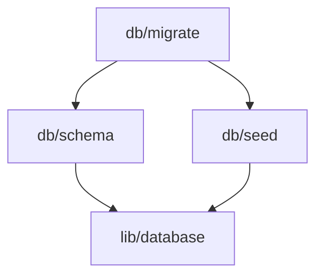

# Script Management System

Complete guide to the RevealUI Script Management Enhancement System - infrastructure for managing 222+ TypeScript scripts with visibility, type safety, verification, and rollback capabilities.

## Table of Contents

- [Overview](#overview)
- [Architecture](#architecture)
- [Quick Start](#quick-start)
- [Features](#features)
  - [Script Registry](#script-registry)
  - [Execution Logging](#execution-logging)
  - [Performance Profiling](#performance-profiling)
  - [Health Monitoring](#health-monitoring)
  - [Script Versioning](#script-versioning)
  - [Migration Helpers](#migration-helpers)
  - [Snapshot & Rollback](#snapshot--rollback)
  - [Dry-Run Mode](#dry-run-mode)
  - [Pre-Execution Validation](#pre-execution-validation)
  - [Dependency Visualization](#dependency-visualization)
  - [Usage Analytics](#usage-analytics)
- [Core Components](#core-components)
- [CLI Reference](#cli-reference)
- [Migration Guide](#migration-guide)
- [Best Practices](#best-practices)
- [Troubleshooting](#troubleshooting)
- [Advanced Topics](#advanced-topics)

## Overview

The Script Management System provides comprehensive tooling for managing TypeScript scripts across the RevealUI monorepo. It offers:

- **Automatic Discovery**: Scans and catalogs 222+ scripts with metadata
- **Type Safety**: Zod-based runtime validation for all inputs
- **Audit Trail**: Complete execution history in PGlite database
- **Performance Insights**: Phase-level profiling with bottleneck detection
- **Health Monitoring**: Automated success rate tracking with alerts
- **Safe Changes**: Dry-run preview and snapshot-based rollback
- **Version Control**: Semantic versioning with deprecation warnings
- **Dependency Analysis**: Visualize relationships and detect cycles
- **Usage Analytics**: Track trends and patterns over time

### Key Benefits

1. **Discoverability**: Find scripts easily with search and categorization
2. **Safety**: Preview changes before execution, rollback on failures
3. **Visibility**: Complete audit trail and performance insights
4. **Reliability**: Automated health monitoring and alerts
5. **Maintainability**: Version tracking and migration helpers

### System Statistics

- **Scripts Cataloged**: 222 TypeScript scripts
- **CLI Commands**: 50+ commands across 7 categories
- **Database Tables**: 6 tables for persistence
- **Test Coverage**: 19 integration tests
- **Documentation**: 1,100+ lines across 3 guides

## Architecture

### System Components

```
┌─────────────────────────────────────────────────────────────┐
│                     EnhancedCLI Base Class                  │
│  (Lifecycle hooks, feature flags, error handling)           │
└─────────────────────────────────────────────────────────────┘
                              │
        ┌─────────────────────┼─────────────────────┐
        ▼                     ▼                     ▼
┌──────────────┐      ┌──────────────┐      ┌──────────────┐
│   Registry   │      │  Validation  │      │   Rollback   │
│   Scanner    │      │   Engine     │      │   Manager    │
└──────────────┘      └──────────────┘      └──────────────┘
        │                     │                     │
        ▼                     ▼                     ▼
┌─────────────────────────────────────────────────────────────┐
│                      PGlite Database                         │
│  (executions, versions, profiles, health, snapshots)        │
└─────────────────────────────────────────────────────────────┘
```

### Database Schema

**executions** - Execution audit trail
- id, script_id, start_time, end_time, success, error, exit_code

**script_versions** - Version tracking
- script_id, version, created_at, breaking_changes, migration_notes

**performance_profiles** - Performance data
- execution_id, phase, duration_ms, memory_mb, cpu_percent, io_ops

**health_snapshots** - Health history
- script_id, timestamp, success_rate, avg_duration, trend

**deprecations** - Deprecation warnings
- script_id, version, deprecated_at, reason, alternative, removal_date

**snapshots** - Rollback points
- id, name, created_at, files, db_dump, config_backup, metadata

### Data Flow

1. **Pre-Execution**: Validation → Snapshot Creation → Dry-Run
2. **Execution**: Profiling → Logging → Error Handling
3. **Post-Execution**: Health Check → Analytics Update → Cleanup

## Quick Start

### 1. Create a Script with EnhancedCLI

```typescript
import { EnhancedCLI, runEnhancedCLI } from './scripts/cli/_base-enhanced.js'

class MyScript extends EnhancedCLI {
  // Enable features
  protected enableValidation = true
  protected enableSnapshots = true
  protected enableProfiling = true

  async execute() {
    // Mark profiling phases
    this.markPhase('initialization')
    // Your initialization code

    this.markPhase('processing')
    // Your processing code

    this.markPhase('finalization')
    // Your finalization code
  }
}

runEnhancedCLI(MyScript)
```

### 2. Run Your Script

```bash
# Normal execution
npm run my-script

# Dry-run mode
npm run my-script -- --dry-run

# With validation
npm run my-script -- --validate

# JSON output
npm run my-script -- --json
```

### 3. View Execution History

```bash
# View recent executions
npm run scripts:history my-script

# Check script health
npm run health:check my-script

# View performance profile
npm run analytics:script my-script
```

### 4. Explore Available Scripts

```bash
# List all scripts
npm run scripts:list

# Search scripts
npm run scripts:search "database"

# View script details
npm run scripts:info my-script
```

## Features

### Script Registry

Automatic discovery and cataloging of all TypeScript scripts in the repository.

#### Usage

```bash
# List all scripts (grouped by category)
npm run scripts:list

# List all scripts in tree format
npm run scripts:tree

# Search scripts by name/category/tags
npm run scripts:search "migration"

# View detailed script information
npm run scripts:info scripts/cli/db/migrate.ts

# Run a script
npm run scripts:run scripts/cli/db/migrate.ts
```

#### API Usage

```typescript
import { ScriptRegistry } from './scripts/lib/registry/script-registry.js'

// Get all scripts
const registry = new ScriptRegistry()
const scripts = await registry.getAllScripts()

// Search scripts
const results = await registry.searchScripts('database')

// Get specific script
const script = await registry.getScript('scripts/cli/db/migrate.ts')
console.log(script.name, script.description, script.category)
```

#### Metadata

Each script includes:
- **name**: Script identifier
- **path**: Absolute file path
- **description**: Extracted from JSDoc or first comment
- **category**: Inferred from directory structure
- **tags**: Keywords for searching
- **author**: From JSDoc @author
- **version**: From JSDoc @version or package.json
- **dependencies**: Imported modules
- **isAsync**: Whether script has async operations
- **estimatedDuration**: Based on execution history

### Execution Logging

Complete audit trail of all script executions with success/failure tracking.

#### Usage

```bash
# View execution history for a script
npm run scripts:history my-script

# View execution history with limit
npm run scripts:history my-script --limit 20

# View all executions
npm run scripts:history
```

#### Automatic Logging

All scripts using `EnhancedCLI` automatically log:
- Start time and end time
- Success/failure status
- Error messages and stack traces
- Exit codes
- Command-line arguments
- Environment information

#### API Usage

```typescript
import { ExecutionLogger } from './scripts/lib/audit/execution-logger.js'

const logger = new ExecutionLogger()

// Start execution
const executionId = await logger.startExecution({
  scriptId: 'my-script',
  args: process.argv.slice(2)
})

try {
  // Your script logic
  await logger.endExecution(executionId, { success: true })
} catch (error) {
  await logger.endExecution(executionId, {
    success: false,
    error: error.message
  })
}

// Query history
const history = await logger.getExecutionHistory('my-script', 10)

// Get statistics
const stats = await logger.getExecutionStats('my-script', 30)
console.log(`Success rate: ${stats.successRate}%`)
```

### Performance Profiling

Track performance metrics at the phase level with bottleneck detection.

#### Usage

```bash
# Enable profiling in your script
class MyScript extends EnhancedCLI {
  protected enableProfiling = true

  async execute() {
    this.markPhase('database-query')
    await runDatabaseQuery()

    this.markPhase('processing')
    await processData()

    this.markPhase('output')
    await writeOutput()
  }
}
```

#### Metrics Collected

- **Duration**: Time spent in each phase
- **Memory**: Heap usage before/after phase
- **CPU**: CPU utilization percentage
- **I/O Operations**: Disk read/write counts

#### Bottleneck Detection

Automatically identifies phases that:
- Take > 50% of total execution time
- Use > 80% of available memory
- Have high CPU utilization (> 90%)
- Perform excessive I/O operations

#### API Usage

```typescript
import { PerformanceProfiler } from './scripts/lib/profiling/performance-profiler.js'

const profiler = new PerformanceProfiler(executionId)

profiler.startProfile()

profiler.markPhase('initialization')
// Your code

profiler.markPhase('processing')
// Your code

const profile = profiler.endProfile()
console.log('Total duration:', profile.totalDuration)
console.log('Bottlenecks:', profile.bottlenecks)
```

### Health Monitoring

Automated monitoring of script success rates with trend analysis and alerts.

#### Usage

```bash
# Check health of a specific script
npm run health:check my-script

# View health dashboard for all scripts
npm run health:dashboard

# View alerts
npm run health:alerts

# View health history
npm run health:history my-script

# Acknowledge an alert
npm run health:ack <alert-id>
```

#### Health Metrics

- **Success Rate**: Percentage of successful executions
- **Average Duration**: Mean execution time
- **Trend**: Improving, stable, or degrading
- **Last Execution**: Timestamp and status
- **Alert Status**: Active alerts for the script

#### Alert Conditions

Alerts are triggered when:
- Success rate drops below 80%
- Success rate drops by 20% in 24 hours
- Average duration increases by 50%
- Script fails 3 times consecutively

#### API Usage

```typescript
import { ScriptHealthMonitor } from './scripts/lib/monitoring/script-health.js'

const monitor = new ScriptHealthMonitor()

// Check health
const health = await monitor.getScriptHealth('my-script')
console.log('Success rate:', health.successRate)
console.log('Trend:', health.trend)

// Get dashboard
const dashboard = await monitor.getHealthDashboard()
console.log('Total scripts:', dashboard.totalScripts)
console.log('Unhealthy:', dashboard.unhealthyScripts)

// Get alerts
const alerts = await monitor.getAlerts({ acknowledged: false })
console.log(`${alerts.length} active alerts`)
```

### Script Versioning

Semantic versioning for scripts with deprecation management.

#### Usage

```bash
# Register a new version
npm run version:register my-script 2.0.0 \
  --breaking "Changed API signature" \
  --notes "Migrated to new database schema"

# List versions for a script
npm run version:list my-script

# Check compatibility
npm run version:check my-script 1.0.0

# Mark version as deprecated
npm run version:deprecate my-script 1.0.0 \
  --reason "Security vulnerability" \
  --alternative "2.0.0" \
  --removal "2026-06-01"

# View deprecation warnings
npm run version:warnings

# Get version statistics
npm run version:stats
```

#### Version Registration

```typescript
import { ScriptVersionManager } from './scripts/lib/versioning/script-version.js'

const versionManager = new ScriptVersionManager()

// Register version
await versionManager.registerVersion({
  scriptId: 'my-script',
  version: '2.0.0',
  breakingChanges: ['Changed parameter order', 'Removed legacy flag'],
  migrationNotes: 'Run migration script first: npm run migrate:v2'
})

// Check if version is deprecated
const isDeprecated = await versionManager.isDeprecated('my-script', '1.0.0')

// Get active version
const latest = await versionManager.getLatestVersion('my-script')
```

#### Deprecation Warnings

Scripts automatically show warnings when using deprecated versions:

```
⚠️  WARNING: Script version 1.0.0 is deprecated
Reason: Security vulnerability found
Alternative: Please upgrade to version 2.0.0
Removal: This version will be removed on 2026-06-01
```

### Migration Helpers

Automated migration planning and execution for script changes.

#### Usage

```bash
# Create migration plan
npm run migrate:plan from-script to-script

# View migration comparison
npm run migrate:compare from-script to-script

# Execute migration
npm run migrate:execute migration-plan.json

# Generate migration checklist
npm run migrate:checklist from-script to-script
```

#### Migration Plan

A migration plan includes:
- Scripts to migrate
- Breaking changes to address
- Required code changes
- Dependency updates
- Test updates needed
- Rollback strategy

#### Example Migration

```typescript
import { MigrationHelper } from './scripts/lib/migration/migration-helper.js'

const helper = new MigrationHelper()

// Generate migration plan
const plan = await helper.createMigrationPlan({
  fromScript: 'old-db-script',
  toScript: 'new-db-script',
  affectedScripts: ['data-import', 'backup-script']
})

console.log('Breaking changes:', plan.breakingChanges)
console.log('Required actions:', plan.requiredActions)

// Execute migration
await helper.executeMigration(plan)
```

### Snapshot & Rollback

Create snapshots of files, database, and configuration for easy rollback.

#### Usage

```bash
# Create a snapshot
npm run rollback:create "Before major refactor"

# List snapshots
npm run rollback:list

# Preview snapshot contents
npm run rollback:preview <snapshot-id>

# Restore from snapshot
npm run rollback:restore <snapshot-id>

# Delete old snapshots
npm run rollback:delete <snapshot-id>

# Cleanup snapshots older than 30 days
npm run rollback:cleanup --days 30
```

#### Automatic Snapshots

Enable automatic snapshots in your script:

```typescript
class MyScript extends EnhancedCLI {
  protected enableSnapshots = true
  protected autoRollbackOnError = true // Auto-restore on failure

  async execute() {
    // Snapshot is created automatically before execution
    // If execution fails, snapshot is restored automatically
  }
}
```

#### What's Included in Snapshots

- **Files**: All modified files in the last 24 hours
- **Database**: Full PGlite database dump
- **Configuration**: Environment variables and config files
- **Metadata**: Timestamp, description, script context

#### API Usage

```typescript
import { SnapshotManager } from './scripts/lib/rollback/snapshot-manager.js'

const manager = new SnapshotManager()

// Create snapshot
const snapshotId = await manager.createSnapshot({
  name: 'Before migration',
  metadata: { scriptId: 'my-script', reason: 'safety' }
})

// List snapshots
const snapshots = await manager.listSnapshots()

// Restore snapshot
await manager.restoreSnapshot(snapshotId)

// Delete old snapshots
await manager.deleteSnapshot(snapshotId)
```

### Dry-Run Mode

Preview changes before execution without modifying any files or data.

#### Usage

```bash
# Run script in dry-run mode
npm run my-script -- --dry-run

# View dry-run report
# Output includes:
# - Files that would be modified
# - Database changes that would occur
# - API calls that would be made
# - Validation warnings
```

#### Implementing Dry-Run Support

```typescript
class MyScript extends EnhancedCLI {
  protected supportsDryRun = true

  async execute() {
    if (this.dryRun) {
      console.log('[DRY-RUN] Would write to file:', filename)
      return
    }

    // Actual file write
    await fs.writeFile(filename, content)
  }
}
```

#### Impact Analysis

The dry-run engine provides:
- List of files to be created/modified/deleted
- Database queries to be executed
- API endpoints to be called
- Estimated execution time
- Resource usage estimate

#### API Usage

```typescript
import { DryRunEngine } from './scripts/lib/dry-run/dry-run-engine.js'

const engine = new DryRunEngine()

// Start dry-run
engine.start()

// Record operations
engine.recordFileOperation('write', '/path/to/file', 'content')
engine.recordDatabaseOperation('insert', 'users', { name: 'John' })
engine.recordApiCall('POST', 'https://api.example.com/users')

// Get report
const report = engine.getReport()
console.log('Files affected:', report.fileOperations.length)
console.log('DB queries:', report.databaseOperations.length)
```

### Pre-Execution Validation

Validate environment and dependencies before script execution.

#### Usage

```typescript
class MyScript extends EnhancedCLI {
  protected enableValidation = true

  // Define custom validation
  protected async customValidation(): Promise<void> {
    // Check environment variables
    if (!process.env.DATABASE_URL) {
      throw new Error('DATABASE_URL is required')
    }

    // Check file existence
    if (!fs.existsSync('./config.json')) {
      throw new Error('config.json not found')
    }

    // Check dependencies
    const version = await getDatabaseVersion()
    if (version < '1.0.0') {
      throw new Error('Database version too old')
    }
  }
}
```

#### Built-in Validations

- **Environment Check**: Required environment variables
- **File System**: Required files and directories exist
- **Dependencies**: Required packages are installed
- **Database**: Database is accessible and schema is up-to-date
- **Network**: Required endpoints are reachable
- **Disk Space**: Sufficient disk space available

#### Validation CLI

```bash
# Run validation only (don't execute)
npm run my-script -- --validate

# Skip validation (not recommended)
npm run my-script -- --no-validate
```

### Dependency Visualization

Visualize script dependencies and detect circular references.

#### Usage

```bash
# Analyze dependencies
npm run deps:analyze

# Generate Mermaid diagram
npm run deps:graph

# Check for circular dependencies
npm run deps:circular

# Find dependency path between scripts
npm run deps:path script-a script-b
```

#### Mermaid Diagram Output



#### API Usage

```typescript
import { DependencyAnalyzer } from './scripts/lib/visualization/dependency-analyzer.js'

const analyzer = new DependencyAnalyzer()

// Analyze all scripts
const analysis = await analyzer.analyze()
console.log('Total scripts:', analysis.nodes.length)
console.log('Total dependencies:', analysis.edges.length)

// Find circular dependencies
const cycles = await analyzer.findCircularDependencies()
console.log('Circular dependencies found:', cycles.length)

// Generate Mermaid diagram
const diagram = await analyzer.generateMermaidDiagram()
console.log(diagram)

// Find path between scripts
const path = await analyzer.findPath('script-a', 'script-b')
console.log('Path:', path.join(' → '))
```

### Usage Analytics

Track script usage patterns and trends over time.

#### Usage

```bash
# View analytics dashboard
npm run analytics:dashboard

# View script-specific analytics
npm run analytics:script my-script

# View usage trends
npm run analytics:trends

# View recent activity
npm run analytics:activity
```

#### Metrics Tracked

- **Execution Count**: Number of times script has run
- **Success Rate**: Percentage of successful executions
- **Average Duration**: Mean execution time
- **Peak Usage**: Busiest times and days
- **Failure Patterns**: Common error types
- **User Activity**: Who runs scripts most often

#### API Usage

```typescript
import { UsageAnalytics } from './scripts/lib/analytics/usage-analytics.js'

const analytics = new UsageAnalytics()

// Get dashboard
const dashboard = await analytics.getDashboard({
  startDate: new Date('2026-01-01'),
  endDate: new Date('2026-01-31')
})

console.log('Total executions:', dashboard.totalExecutions)
console.log('Most used script:', dashboard.mostUsedScript)
console.log('Success rate:', dashboard.overallSuccessRate)

// Get script-specific stats
const stats = await analytics.getScriptStats('my-script', {
  groupBy: 'day',
  limit: 30
})

console.log('Daily usage:', stats.executionsByDay)
console.log('Trend:', stats.trend)
```

## Core Components

### EnhancedCLI Base Class

The foundation for all enhanced scripts.

#### Protected Properties

```typescript
protected scriptId: string             // Unique script identifier
protected dryRun: boolean              // Dry-run mode flag
protected enableValidation: boolean    // Enable pre-execution validation
protected enableSnapshots: boolean     // Enable automatic snapshots
protected enableProfiling: boolean     // Enable performance profiling
protected supportsDryRun: boolean      // Script supports dry-run
protected autoRollbackOnError: boolean // Auto-restore on failure
```

#### Protected Methods

```typescript
// Profiling
protected markPhase(name: string): void

// Validation
protected async customValidation(): Promise<void>

// Logging
protected log(message: string): void
protected logWarning(message: string): void
protected logError(message: string): void

// Execution
protected async execute(): Promise<void> // Override this
```

#### Lifecycle Hooks

1. **preValidate**: Run before validation
2. **postValidate**: Run after validation succeeds
3. **preSnapshot**: Run before snapshot creation
4. **postSnapshot**: Run after snapshot creation
5. **preExecute**: Run before main execution
6. **postExecute**: Run after main execution
7. **onError**: Run when error occurs
8. **onSuccess**: Run when execution succeeds
9. **cleanup**: Always run at the end

### Error Handling

Use `ScriptError` for structured errors:

```typescript
import { ScriptError } from './scripts/lib/errors/script-error.js'

throw new ScriptError(
  'Database connection failed',
  {
    code: 'DB_CONNECTION_ERROR',
    suggestion: 'Check DATABASE_URL environment variable',
    fix: 'Ensure database is running: npm run db:start'
  }
)
```

## CLI Reference

### Script Management

```bash
# List all scripts
npm run scripts:list
npm run scripts:list -- --category database
npm run scripts:list -- --json

# Search scripts
npm run scripts:search <query>

# Get script info
npm run scripts:info <script-path>

# View script tree
npm run scripts:tree

# View execution history
npm run scripts:history [script-id] [--limit N]

# Run a script
npm run scripts:run <script-path> [...args]
```

### Health Monitoring

```bash
# Check script health
npm run health:check [script-id]

# View health dashboard
npm run health:dashboard
npm run health:dashboard -- --json

# View alerts
npm run health:alerts
npm run health:alerts -- --acknowledged

# View health history
npm run health:history <script-id> [--days N]

# Acknowledge alert
npm run health:ack <alert-id>
```

### Version Management

```bash
# Register version
npm run version:register <script-id> <version> \
  [--breaking "change"] [--notes "notes"]

# List versions
npm run version:list <script-id>

# Check compatibility
npm run version:check <script-id> <version>

# Deprecate version
npm run version:deprecate <script-id> <version> \
  --reason "reason" [--alternative "version"] [--removal "date"]

# View warnings
npm run version:warnings

# View statistics
npm run version:stats
```

### Migration

```bash
# Create migration plan
npm run migrate:plan <from-script> <to-script>

# Compare scripts
npm run migrate:compare <from-script> <to-script>

# Execute migration
npm run migrate:execute <plan-file>

# Generate checklist
npm run migrate:checklist <from-script> <to-script>
```

### Rollback

```bash
# Create snapshot
npm run rollback:create <name> [--metadata key=value]

# List snapshots
npm run rollback:list
npm run rollback:list -- --json

# Preview snapshot
npm run rollback:preview <snapshot-id>

# Restore snapshot
npm run rollback:restore <snapshot-id>

# Delete snapshot
npm run rollback:delete <snapshot-id>

# Cleanup old snapshots
npm run rollback:cleanup [--days N]
```

### Dependencies

```bash
# Analyze dependencies
npm run deps:analyze
npm run deps:analyze -- --json

# Generate Mermaid diagram
npm run deps:graph
npm run deps:graph -- --output deps.mmd

# Check for circular dependencies
npm run deps:circular

# Find path between scripts
npm run deps:path <from-script> <to-script>
```

### Analytics

```bash
# View dashboard
npm run analytics:dashboard
npm run analytics:dashboard -- --json

# View script analytics
npm run analytics:script <script-id>

# View trends
npm run analytics:trends [--days N]

# View recent activity
npm run analytics:activity [--limit N]
```

## Migration Guide

### Migrating Existing Scripts to EnhancedCLI

#### Step 1: Update Import

```typescript
// Before
import { BaseCLI, runCLI } from './scripts/cli/_base.js'

// After
import { EnhancedCLI, runEnhancedCLI } from './scripts/cli/_base-enhanced.js'
```

#### Step 2: Change Base Class

```typescript
// Before
class MyScript extends BaseCLI {
  async run() {
    // Your code
  }
}

// After
class MyScript extends EnhancedCLI {
  async execute() {
    // Your code (renamed from run to execute)
  }
}
```

#### Step 3: Update CLI Runner

```typescript
// Before
runCLI(MyScript)

// After
runEnhancedCLI(MyScript)
```

#### Step 4: Enable Features (Optional)

```typescript
class MyScript extends EnhancedCLI {
  // Enable features you want
  protected enableValidation = true
  protected enableSnapshots = true
  protected enableProfiling = true
  protected supportsDryRun = true

  async execute() {
    // Your code
  }
}
```

#### Step 5: Add Dry-Run Support (Optional)

```typescript
async execute() {
  if (this.dryRun) {
    console.log('[DRY-RUN] Would perform operation X')
    return
  }

  // Actual operation
  await performOperationX()
}
```

#### Step 6: Test

```bash
# Test normal execution
npm run my-script

# Test dry-run
npm run my-script -- --dry-run

# Test validation
npm run my-script -- --validate

# Check execution history
npm run scripts:history my-script
```

### Backward Compatibility

The migration is 100% backward compatible:
- ✅ No breaking changes
- ✅ All existing scripts continue to work
- ✅ Features are opt-in
- ✅ Gradual migration path

## Best Practices

### Script Organization

1. **Use Descriptive Names**: `import-products.ts` not `import.ts`
2. **Categorize Properly**: Place in correct subdirectory (db/, api/, etc.)
3. **Add JSDoc Comments**: Include description, author, version
4. **Tag Appropriately**: Add relevant tags for searchability

### Error Handling

1. **Use ScriptError**: Provides structured error information
2. **Include Suggestions**: Tell users how to fix the problem
3. **Provide Fix Commands**: Include exact command to run
4. **Log Context**: Include relevant variables in error messages

### Validation

1. **Validate Early**: Check requirements before execution starts
2. **Custom Validators**: Add script-specific validation
3. **Helpful Messages**: Explain what's missing and how to fix it
4. **Skip When Needed**: Allow `--no-validate` for emergencies

### Dry-Run Support

1. **Support When Possible**: Most scripts should support dry-run
2. **Test Thoroughly**: Ensure dry-run matches actual execution
3. **Clear Output**: Prefix dry-run messages with `[DRY-RUN]`
4. **Document Limitations**: Explain what can't be simulated

### Profiling

1. **Enable for Slow Scripts**: Profile scripts taking > 5 seconds
2. **Mark Clear Phases**: Use descriptive phase names
3. **Set Custom Thresholds**: Adjust based on script requirements
4. **Review Regularly**: Check for performance regressions

### Versioning

1. **Follow SemVer**: Use semantic versioning (major.minor.patch)
2. **Document Breaking Changes**: List all breaking changes clearly
3. **Provide Migration Notes**: Step-by-step upgrade instructions
4. **Deprecate Gracefully**: Give 30+ days notice before removal

### Snapshots

1. **Create Before Major Changes**: Always snapshot before risky operations
2. **Use Descriptive Names**: Explain why snapshot was created
3. **Test Restore**: Verify snapshots can be restored successfully
4. **Cleanup Regularly**: Delete old snapshots to save disk space

### Monitoring

1. **Check Health Weekly**: Review health dashboard regularly
2. **Act on Alerts**: Address alerts within 24 hours
3. **Track Trends**: Watch for degrading performance
4. **Set Realistic Thresholds**: Adjust alert thresholds as needed

### Documentation

1. **Write JSDoc**: Include @description, @author, @version
2. **Add Usage Examples**: Show common use cases
3. **Document Flags**: Explain all command-line options
4. **Link Related Scripts**: Reference dependent/related scripts

### Testing

1. **Test All Modes**: Test normal, dry-run, and validation modes
2. **Test Failures**: Verify error handling works correctly
3. **Test Rollback**: Ensure snapshots restore successfully
4. **Integration Tests**: Test interaction with other scripts

## Troubleshooting

### Database Not Initialized

**Error**: `Database not initialized`

**Cause**: Script management database hasn't been created

**Solution**:
```bash
# Initialize database
npm run db:init

# Or run any enhanced script (auto-initializes)
npm run scripts:list
```

### Validation Failed

**Error**: `Validation failed: DATABASE_URL is required`

**Cause**: Required environment variable is missing

**Solution**:
```bash
# Set environment variable
export DATABASE_URL="postgresql://..."

# Or skip validation (not recommended)
npm run my-script -- --no-validate
```

### Snapshot Creation Failed

**Error**: `Failed to create snapshot: ENOSPC`

**Cause**: Insufficient disk space

**Solution**:
```bash
# Check disk space
df -h

# Cleanup old snapshots
npm run rollback:cleanup --days 7

# Free up space
rm -rf node_modules/.cache
```

### Circular Dependency Detected

**Error**: `Circular dependency: A → B → C → A`

**Cause**: Scripts import each other in a loop

**Solution**:
```bash
# Identify cycle
npm run deps:circular

# Refactor to break cycle
# - Extract shared code to a library
# - Reorganize imports
# - Use dependency injection
```

### Performance Degraded

**Error**: Health alert: `Performance degraded by 50%`

**Cause**: Script is running slower than usual

**Solution**:
```bash
# View profiling data
npm run analytics:script my-script

# Identify bottleneck phase
# - Check database query performance
# - Look for N+1 query patterns
# - Check for memory leaks
# - Review recent code changes
```

### Debug Mode

Enable verbose logging for troubleshooting:

```bash
# Set debug environment variable
export DEBUG=enhanced-cli:*

# Run script with verbose output
npm run my-script

# Check execution history
npm run scripts:history my-script --limit 1

# Check health status
npm run health:check my-script

# View analytics
npm run analytics:script my-script
```

## Advanced Topics

### Custom Validation

Create reusable validators:

```typescript
interface Validator {
  name: string
  validate(): Promise<void>
}

class DatabaseValidator implements Validator {
  name = 'database'

  async validate() {
    const db = await connectToDatabase()
    if (!db) {
      throw new Error('Database not accessible')
    }
  }
}

class MyScript extends EnhancedCLI {
  protected enableValidation = true

  protected async customValidation() {
    const validator = new DatabaseValidator()
    await validator.validate()
  }
}
```

### Custom Profiling Thresholds

Configure thresholds for your script:

```typescript
class MyScript extends EnhancedCLI {
  protected enableProfiling = true

  async execute() {
    // Set custom threshold for this phase
    this.markPhase('heavy-operation', {
      durationThreshold: 30000, // 30 seconds
      memoryThreshold: 1024,    // 1 GB
      cpuThreshold: 95          // 95%
    })

    await heavyOperation()
  }
}
```

### CI/CD Integration

Use JSON output for CI/CD pipelines:

```bash
#!/bin/bash

# Run script with JSON output
RESULT=$(npm run my-script -- --json)

# Parse JSON
SUCCESS=$(echo $RESULT | jq -r '.success')
DURATION=$(echo $RESULT | jq -r '.duration')

if [ "$SUCCESS" != "true" ]; then
  echo "Script failed"
  exit 1
fi

echo "Script succeeded in ${DURATION}ms"
```

### Monitoring Integration

Export metrics to external systems:

```typescript
import { UsageAnalytics } from './scripts/lib/analytics/usage-analytics.js'
import { DatadogClient } from './lib/monitoring/datadog.js'

const analytics = new UsageAnalytics()
const datadog = new DatadogClient()

// Export metrics
const dashboard = await analytics.getDashboard()
await datadog.gauge('scripts.executions', dashboard.totalExecutions)
await datadog.gauge('scripts.success_rate', dashboard.overallSuccessRate)
```

### Custom Lifecycle Hooks

Add custom behavior at any lifecycle stage:

```typescript
class MyScript extends EnhancedCLI {
  protected async preExecute() {
    console.log('Starting execution...')
    await this.setupEnvironment()
  }

  protected async postExecute() {
    console.log('Execution completed')
    await this.cleanup()
  }

  protected async onError(error: Error) {
    console.error('Execution failed:', error)
    await this.notifyTeam(error)
  }

  protected async onSuccess() {
    console.log('Success!')
    await this.sendSuccessMetrics()
  }
}
```

---

For programmatic API usage, see [API_REFERENCE.md](./API_REFERENCE.md).

For version history and changelog, see [CHANGELOG_SCRIPT_MANAGEMENT.md](./CHANGELOG_SCRIPT_MANAGEMENT.md).
