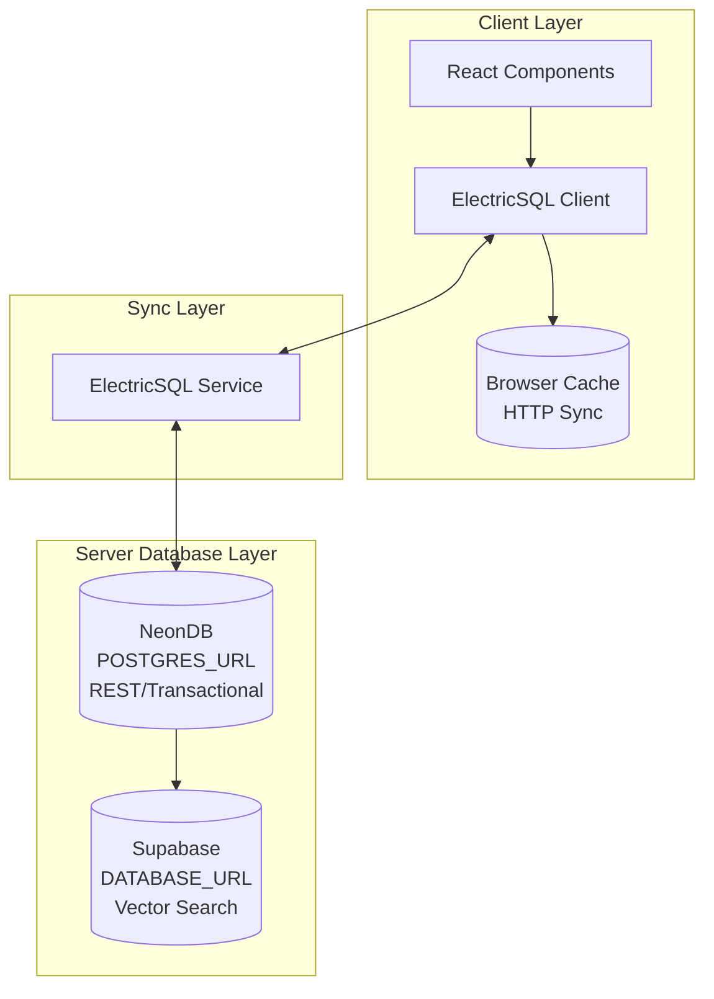

# RevealUI System Architecture

**Last Updated:** 2026-01-31
**Status:** Complete Architecture Design
**Version:** 2.0

---

## Table of Contents

1. [Executive Summary](#executive-summary)
2. [Architecture Overview](#architecture-overview)
3. [Database Architecture](#database-architecture)
   - [Triple Database Design](#triple-database-design)
   - [NeonDB (Primary Database)](#neondb-primary-database)
   - [Supabase (Vector Database)](#supabase-vector-database)
   - [ElectricSQL (Sync Layer)](#electricsql-sync-layer)
   - [Database Client Factory](#database-client-factory)
4. [Multi-Tenant Architecture](#multi-tenant-architecture)
   - [Tenant Model](#tenant-model)
   - [Role Hierarchy](#role-hierarchy)
   - [Access Control](#access-control)
   - [Data Isolation](#data-isolation)
5. [Type Safety & Contracts Layer](#type-safety--contracts-layer)
   - [Contracts System](#contracts-system)
   - [Type Adapters](#type-adapters)
   - [Type Bridges](#type-bridges)
   - [Generated Types](#generated-types)
6. [Vercel Platform Integration](#vercel-platform-integration)
   - [Vercel AI SDK](#vercel-ai-sdk)
   - [Remote Procedure Calls (RPC)](#remote-procedure-calls-rpc)
   - [Vercel Blob Storage](#vercel-blob-storage)
   - [Analytics & Monitoring](#analytics--monitoring)
7. [Build System](#build-system)
   - [Turbopack Configuration](#turbopack-configuration)
   - [Development vs Production](#development-vs-production)
8. [Data Flow Patterns](#data-flow-patterns)
9. [Security & Access Control](#security--access-control)
10. [Performance & Scaling](#performance--scaling)
11. [Migration Strategy](#migration-strategy)
12. [Monitoring & Observability](#monitoring--observability)
13. [Testing Strategy](#testing-strategy)
14. [Best Practices](#best-practices)
15. [Configuration Reference](#configuration-reference)
16. [Troubleshooting](#troubleshooting)
17. [References](#references)

---

## Executive Summary

RevealUI implements a hybrid multi-database architecture with comprehensive type safety, integrating multiple specialized systems for optimal performance and scalability:

### Core Systems

1. **NeonDB (POSTGRES_URL)**: Transactional REST API + ElectricSQL sync source
2. **Supabase (DATABASE_URL)**: Vector database for AI embeddings and semantic search
3. **ElectricSQL**: Real-time synchronization for agent contexts and conversations
4. **Vercel AI SDK**: Streaming AI completions with React hooks
5. **Vercel Blob Storage**: Media and file storage
6. **Remote Procedure Calls (RPC)**: Type-safe API calls
7. **Vercel Analytics & Speed Insights**: Performance monitoring

### Architecture Type

Hybrid Multi-Database + Vercel Cloud Platform Integration with Full Type Safety

### Key Benefits

- ✅ **Performance Isolation**: REST, vector, and sync operations don't interfere
- ✅ **Independent Scaling**: Each system scales based on workload
- ✅ **Type Safety**: End-to-end type safety from database to frontend
- ✅ **Real-Time Sync**: Offline-first with automatic synchronization
- ✅ **Multi-Tenancy**: Complete data isolation between tenants
- ✅ **Security**: Clear access boundaries with row-level security

---

## Architecture Overview

### System Diagram

```
┌─────────────────────────────────────────────────────────────────┐
│                        Frontend (React/Next.js)                  │
│  ┌──────────────────────────────────────────────────────────┐  │
│  │  Generated Types (@revealui/core/generated/types)        │  │
│  │  - CMS Config Types    - Supabase Types                  │  │
│  │  - NeonDB Types        - Shared Type Definitions         │  │
│  └──────────────────────────────────────────────────────────┘  │
└─────────────────────────────────────────────────────────────────┘
                              │
                    ┌─────────┴─────────┐
                    │   Type-Safe APIs  │
                    │   (REST/RPC)      │
                    └─────────┬─────────┘
                              │
┌─────────────────────────────────────────────────────────────────┐
│              Type Safety Layer & Contracts                      │
│  ┌──────────────────────────────────────────────────────────┐  │
│  │  Contracts (@revealui/contracts/cms)                     │  │
│  │  - ConfigContract    - CollectionContract                │  │
│  │  - FieldContract     - GlobalContract                    │  │
│  │  - Runtime Validation (Zod) + Compile-time (TypeScript)  │  │
│  └──────────────────────────────────────────────────────────┘  │
│  ┌──────────────────────────────────────────────────────────┐  │
│  │  Type Adapters & Bridges                                 │  │
│  │  - Type Adapter (DB ↔ RevealUI)                          │  │
│  │  - Type Bridge (Drizzle ↔ Contracts)                     │  │
│  │  - Contract Mappers (DB Rows ↔ Validated Entities)       │  │
│  └──────────────────────────────────────────────────────────┘  │
└─────────────────────────────────────────────────────────────────┘
                              │
        ┌─────────────────────┼─────────────────────┐
        │                     │                     │
┌───────▼────────┐   ┌───────▼────────┐   ┌───────▼────────┐
│  REST API      │   │  Vercel AI SDK │   │  RPC Services  │
│  (NeonDB)      │   │  (Streaming)   │   │  (Type-safe)   │
└───────┬────────┘   └───────┬────────┘   └───────┬────────┘
        │                     │                     │
┌───────▼────────┐   ┌───────▼────────┐   ┌───────▼────────┐
│   NeonDB       │   │   Supabase     │   │ Vercel Blob    │
│  (Relational)  │   │   (Vectors)    │   │   (Storage)    │
└───────┬────────┘   └────────────────┘   └────────────────┘
        │
┌───────▼────────┐
│  ElectricSQL   │
│  (Real-time)   │
└────────────────┘
        │
┌───────▼────────┐
│  Vercel Tools  │
│ (Analytics,    │
│  Insights)     │
└────────────────┘
```

### Type Safety Flow

1. **Frontend** → Uses generated types for compile-time safety
2. **API Routes** → Validates with contracts (runtime + compile-time)
3. **Type Adapters** → Convert DB types ↔ RevealUI types
4. **Database** → Drizzle ORM provides type-safe queries

---

## Database Architecture

### Triple Database Design

RevealUI uses three separate database layers for optimal performance and scalability:



### Benefits of Triple Database Architecture

#### 1. Performance Isolation ✅

**Problem Solved:**
- Vector similarity searches (HNSW indexes) are CPU/memory intensive
- Heavy vector queries can slow down transactional REST operations
- Embedding generation competes with user-facing queries

**Benefit:**
- NeonDB handles REST/transactional workloads with predictable latency
- Supabase handles vector operations independently
- Each database optimized for its workload

**Real-World Impact:**
```
Scenario: Agent performs semantic search over 1M embeddings
- Single DB: REST API latency spikes 200-500ms during search
- Triple DB: REST API unaffected, vector search isolated
```

#### 2. Independent Scaling ✅

**NeonDB:**
- Scale for transactional throughput (connections, query speed)
- Serverless/scale-to-zero for variable REST workload

**Supabase:**
- Scale for vector storage/query performance (CPU, memory for HNSW)
- Dedicated instances for CPU-heavy operations

**ElectricSQL:**
- Lightweight sync service
- Scales with client connections

#### 3. Security & Access Control ✅

**Separation of Concerns:**
- **NeonDB**: Contains user PII, auth data, sensitive business logic
- **Supabase**: Contains embeddings, agent memories (less sensitive)
- **ElectricSQL**: Syncs filtered data with row-level security

**Access Pattern:**
```
REST API Services → NeonDB (user data, CMS)
AI Agent Services → Supabase (vector search)
Client Apps → ElectricSQL → NeonDB (real-time sync)
```

#### 4. Real-Time Sync & Local-First Architecture ✅

**ElectricSQL Benefits:**
- Client-side local-first storage (browser cache via HTTP sync)
- Cross-tab synchronization for agent data
- Offline-first operation with automatic sync
- Reduced server load (queries against local DB)
- Better user experience (instant reads, background writes)

#### 5. Cost Efficiency ✅

**Optimized Spend:**
- NeonDB: Pay for transactional capacity needed
- Supabase: Pay for vector storage/compute needed
- ElectricSQL: Self-hosted sync service (no additional DB cost)
- Avoid over-provisioning one database for both workloads

---

## NeonDB (Primary Database)

### Role
Transactional REST API + Real-time Sync Source

### Stores

**Core Relational Data:**
- Users, sessions, authentication
- Sites, pages, CMS content
- Media, posts, metadata

**Agent Relational Data:**
- `agent_contexts` - Working memory, session context
- `conversations` - Chat threads with messages
- `agent_actions` - Audit log of agent actions

**NOT Stored:**
- ❌ Agent memories with embeddings (moved to Supabase)

### Characteristics

- High connection count for REST API
- Low-latency transactional queries
- Optimized for relational joins
- Source of truth for ElectricSQL sync

### Connection

```env
POSTGRES_URL=postgresql://...@neon.tech/...
```

### Schema Organization

```typescript
// packages/db/src/core/rest.ts (NeonDB schema)
export * from './users'
export * from './sites'
export * from './pages'
export * from './sessions'
export * from './agents/contexts'        // ElectricSQL sync
export * from './agents/conversations'    // ElectricSQL sync
export * from './agents/actions'
```

---

## Supabase (Vector Database)

### Role
AI/Vector Operations + Semantic Search

### Stores

**Agent Memories with Embeddings:**
- `agent_memories` - Long-term memory with `vector(1536)` embeddings
- Vector similarity search optimized
- HNSW indexes for fast semantic retrieval

### Characteristics

- CPU-optimized for vector operations
- Large embedding storage capacity
- Optimized for similarity search
- Isolated from transactional workloads

### Connection

```env
DATABASE_URL=postgresql://...@db.supabase.co/...
```

### Why Separate

1. Vector similarity searches are CPU/memory intensive
2. Heavy vector queries don't affect REST API latency
3. Independent scaling for vector workloads
4. Better cost optimization

### Schema Organization

```typescript
// packages/db/src/core/vector.ts (Supabase schema)
export * from './agents/vector-memories'  // Vector data only
```

### Vector Memory Service

```typescript
// packages/ai/src/memory/vector-memory.ts
import { getVectorClient } from '@revealui/db/client'
import { agentMemories } from '@revealui/db/core/vector'

export class VectorMemoryService {
  private db = getVectorClient()  // Supabase

  async searchSimilar(
    queryEmbedding: number[],
    options: {
      userId?: string
      siteId?: string
      limit?: number
    } = {}
  ) {
    let query = this.db
      .select()
      .from(agentMemories)
      .orderBy(sql`embedding <-> ${queryEmbedding}::vector`)
      .limit(options.limit ?? 10)

    // Filter by user/site (reference IDs, not FKs)
    if (options.userId) {
      query = query.where(eq(agentMemories.userId, options.userId))
    }
    if (options.siteId) {
      query = query.where(eq(agentMemories.siteId, options.siteId))
    }

    return await query
  }

  async create(memory: AgentMemory) {
    // Only writes to Supabase
    return await this.db.insert(agentMemories).values({
      ...memory,
      embedding: `[${memory.embedding.vector.join(',')}]`,
      // Reference IDs (not foreign keys)
      userId: memory.metadata?.custom?.userId,
      siteId: memory.metadata?.siteId,
    })
  }
}
```

---

## ElectricSQL (Sync Layer)

### Role
Real-time synchronization for client-side data

### Syncs from NeonDB

- ✅ `agent_contexts` - Working memory across tabs
- ✅ `conversations` - Chat threads across sessions
- ❌ **NOT** `agent_memories` - Don't need real-time sync

### Characteristics

- Reads from NeonDB (POSTGRES_URL)
- Syncs via HTTP shapes to clients
- CRDT-based conflict resolution
- Offline-first with automatic sync

### Connection

```env
ELECTRIC_SERVICE_URL=http://localhost:5133
NEXT_PUBLIC_ELECTRIC_SERVICE_URL=http://localhost:5133
```

### Why ElectricSQL

- Real-time updates across browser tabs
- Offline support with automatic sync
- Optimistic updates with conflict resolution
- Type-safe client-side queries

### Configuration

```yaml
# docker-compose.electric.yml
services:
  electric-sql:
    environment:
      # Connect to NeonDB (not Supabase)
      - DATABASE_URL=${POSTGRES_URL}  # Source of truth

      # Sync configuration
      - ELECTRIC_WRITE_TO_PG_MODE=direct_writes
      - ELECTRIC_REPLICATION_MODE=pglite
```

### Shape Proxy Routes

```typescript
// apps/cms/src/app/api/shapes/agent-contexts/route.ts
export async function GET(request: NextRequest) {
  const session = await getSession(request.headers)

  // Build ElectricSQL shape URL
  const originUrl = prepareElectricUrl(request.url)
  originUrl.searchParams.set('table', 'agent_contexts')
  originUrl.searchParams.set('where', 'agent_id = $1')
  originUrl.searchParams.set('params', JSON.stringify([session.user.id]))

  // ElectricSQL reads from NeonDB (POSTGRES_URL)
  return proxyElectricRequest(originUrl)
}
```

### Client-Side Usage

```typescript
// packages/sync/src/hooks/useAgentContext.ts
export function useAgentContext(agentId: string, sessionId: string) {
  // Shape request goes to CMS API proxy
  const shape = useShape({
    source: 'http://localhost:3000/api/shapes/agent-contexts',
    table: 'agent_contexts',
    where: { agent_id: agentId, session_id: sessionId },
  })

  // ElectricSQL syncs from NeonDB
  // Local storage in IndexedDB
  return shape.data
}
```

---

## Database Client Factory

### Implementation

```typescript
// packages/db/src/client/index.ts

export type DatabaseType = 'rest' | 'vector'

let restClient: Database | null = null
let vectorClient: Database | null = null

export function getClient(type: DatabaseType = 'rest'): Database {
  if (type === 'vector') {
    if (!vectorClient) {
      const url = process.env.DATABASE_URL
      if (!url) throw new Error('DATABASE_URL required for vector database')
      vectorClient = createClient({ connectionString: url })
    }
    return vectorClient
  }

  // Default: REST/NeonDB (also used by ElectricSQL)
  if (!restClient) {
    const url = process.env.POSTGRES_URL || process.env.DATABASE_URL
    if (!url) throw new Error('POSTGRES_URL required for REST database')
    restClient = createClient({ connectionString: url })
  }
  return restClient
}

// Explicit helpers
export function getRestClient(): Database {
  return getClient('rest')
}

export function getVectorClient(): Database {
  return getClient('vector')
}
```

### Usage

```typescript
// REST operations
const db = getRestClient()
const users = await db.query.users.findMany()

// Vector operations
const vectorDb = getVectorClient()
const memories = await vectorDb
  .select()
  .from(agentMemories)
  .orderBy(sql`embedding <-> ${queryEmbedding}::vector`)
```

---

## Multi-Tenant Architecture

### Tenant Model

RevealUI implements robust multi-tenancy using RevealUI CMS 3.x, allowing multiple organizations to share the same application instance with complete data isolation.

```typescript
Tenants Collection {
  id: number
  name: string
  url: string
  // ... other fields
}
```

### User-Tenant Relationship

Users can be associated with multiple tenants, each with different roles:

```typescript
User {
  id: number
  email: string
  roles: ["user-super-admin" | "user-admin"]  // System-level roles
  tenants: [
    {
      tenant: Tenant (relationship)
      roles: ["tenant-super-admin" | "tenant-admin"]  // Tenant-specific roles
    }
  ]
  lastLoggedInTenant: Tenant (relationship)
}
```

---

## Role Hierarchy

### System-Level Roles

1. **User Super Admin** (`user-super-admin`)
   - Full system access across all tenants
   - Can manage all users and tenants
   - Can assign roles to other users
   - Highest privilege level

2. **User Admin** (`user-admin`)
   - System administration capabilities
   - Can manage users within assigned scope
   - Cannot modify super admin roles

### Tenant-Level Roles

3. **Tenant Super Admin** (`tenant-super-admin`)
   - Full access within their tenant(s)
   - Can manage tenant users and data
   - Cannot access other tenants' data

4. **Tenant Admin** (`tenant-admin`)
   - Administrative access within tenant
   - Limited user management
   - Cannot modify super admin settings

---

## Access Control

### Collection-Level Access

All collections implement tenant-aware access control:

```typescript
// Example: Pages Collection
{
  access: {
    create: authenticated,           // Must be logged in
    delete: authenticated,
    read: authenticatedOrPublished,  // Public can read published
    update: authenticated,
  }
}
```

### Access Control Functions

Located in `apps/cms/src/lib/access/`:

- `isAdmin.ts` - Checks for user-admin or user-super-admin
- `isSuperAdmin.ts` - Checks for user-super-admin only
- `isTenantAdminOrSuperAdmin.ts` - Checks tenant-level admin roles
- `checkTenantAccess.ts` - Verifies user has access to specific tenant
- `lastLoggedInTenant.ts` - Returns user's most recent tenant context

---

## Data Isolation

### Automatic Tenant Filtering

RevealUI CMS hooks automatically filter data by tenant:

```typescript
// All queries are scoped to user's current tenant
const pages = await revealui.find({
  collection: 'pages',
  // Tenant filter applied automatically via hooks
})
```

### Last Logged-In Tenant

The system tracks which tenant a user most recently accessed:

```typescript
User.lastLoggedInTenant -> Tenant

// Updated automatically on login
hooks: {
  afterLogin: [recordLastLoggedInTenant]
}
```

### Tenant Isolation Guarantees

1. **Database Level**: Queries filtered by tenant relationship
2. **API Level**: Access control validates tenant membership
3. **UI Level**: Admin panel shows only current tenant's data

### Testing Tenant Isolation

**CRITICAL**: Always test that:
- Users cannot access other tenants' records
- Cross-tenant relationships are prevented
- Tenant switching properly updates context
- Super admins can access all tenants (by design)

---

## Type Safety & Contracts Layer

### Contracts System

The contracts system provides unified validation (TypeScript + Zod):

**Location:** `packages/contracts/src/cms/`

**What Contracts Provide:**
- **TypeScript Types** (compile-time safety)
- **Zod Schemas** (runtime validation)
- **Validation Functions** (runtime validation)
- **Type Guards** (runtime type checking)
- **Metadata** (documentation, versioning)

**Contract Types:**
- **ConfigContract** - Root CMS configuration validation
- **CollectionContract** - Collection configuration validation
- **FieldContract** - Field configuration validation
- **GlobalContract** - Global configuration validation

**Example Usage:**

```typescript
// Server: API Route validation
import { UserSchema } from '@revealui/contracts'
import { getRestClient } from '@revealui/db/client'

export async function POST(request: NextRequest) {
  const body = await request.json()

  // 1. Validate with contract (runtime + compile-time)
  const validatedUser = UserSchema.parse(body)  // Throws if invalid

  // 2. Type is now known: User
  const db = getRestClient()
  await db.insert(users).values(validatedUser)

  return NextResponse.json(validatedUser)
}
```

### Type Adapters

**Role:** Convert between database types and RevealUI internal types

**Location:** `packages/core/src/core/database/type-adapter.ts`

**Key Functions:**

```typescript
// Convert DB row to RevealUI document
function dbRowToRevealUIDoc<TDoc, TDbRow>(dbRow: TDbRow): TDoc

// Convert RevealUI document to DB insert
function revealUIDocToDbInsert<TDoc, TInsert>(doc: TDoc): TInsert

// Convert DB row to contract-validated entity
function dbRowToContract<TContract, TDbRow>(
  contract: Contract<TContract>,
  dbRow: TDbRow
): TContract
```

**Usage in API Routes:**

```typescript
// apps/cms/src/app/api/users/route.ts
import { getRestClient } from '@revealui/db/client'
import { UserSchema } from '@revealui/contracts'
import { dbRowToContract } from '@revealui/core/database/type-adapter'

export async function GET() {
  const db = getRestClient()
  const dbUser = await db.query.users.findFirst()

  // Convert DB type to validated contract type
  const validatedUser = dbRowToContract(UserSchema, dbUser)

  // Return to frontend (types match generated types)
  return NextResponse.json(validatedUser)
}
```

### Type Bridges

**Role:** Convert between Drizzle ORM types and Contract types

**Location:** `packages/contracts/src/database/type-bridge.ts`

**Key Functions:**

```typescript
// Convert DB row to contract type with mapper
function createDbRowMapper<TContract, TDbRow>(
  contract: Contract<TContract>,
  mapper?: (row: TDbRow) => unknown
): (row: TDbRow) => TContract

// Convert contract type to DB insert with mapper
function createContractToDbMapper<TContract, TInsert>(
  mapper?: (data: TContract) => TInsert
): (data: TContract) => TInsert
```

### Generated Types

**Role:** Auto-generated TypeScript types for frontend consumption

**Location:** `packages/core/src/core/generated/types/`

**Sources:**
1. **CMS Config Types** (`cms.ts`) - Generated from `revealui.config.ts`
2. **Supabase Types** (`supabase.ts`) - Generated from Supabase schema
3. **NeonDB Types** (`neon.ts`) - Generated from Drizzle schema

**Frontend Usage:**

```typescript
// apps/web/src/components/Page.tsx
import type { Page, Site, User } from '@revealui/core/generated/types'

export function PageComponent({ page }: { page: Page }) {
  // Full type safety from generated types
  return (
    <div>
      <h1>{page.title}</h1>  {/* TypeScript knows this exists */}
      <p>{page.content}</p>
    </div>
  )
}
```

**Type Safety Flow:**

```
Frontend → Generated Types → API Route → Contract Validation → Type Adapter → Database
```

---

## Vercel Platform Integration

### Vercel AI SDK

**Role:** Type-safe streaming AI completions with React hooks

**Features:**
- ✅ **Streaming Responses:** Real-time token streaming to clients
- ✅ **React Hooks:** `useChat`, `useCompletion`, `useAssistant`
- ✅ **Type Safety:** Full TypeScript support
- ✅ **Error Handling:** Built-in error boundaries
- ✅ **Multi-Provider:** OpenAI, Anthropic, custom providers

**Integration with Vector Database:**

```typescript
// Server: apps/cms/src/app/api/chat/route.ts
import { streamText } from 'ai'
import { openai } from '@ai-sdk/openai'
import { getVectorClient } from '@revealui/db/client'

export async function POST(request: NextRequest) {
  const { messages } = await request.json()

  // 1. Search relevant memories from Supabase
  const vectorDb = getVectorClient()
  const queryEmbedding = await generateEmbedding(messages[messages.length - 1].content)
  const relevantMemories = await vectorDb
    .select()
    .from(agentMemories)
    .orderBy(sql`embedding <-> ${queryEmbedding}::vector`)
    .limit(5)

  // 2. Use memories as context in AI SDK
  const result = await streamText({
    model: openai('gpt-4'),
    messages,
    system: `Relevant memories: ${relevantMemories.map(m => m.content).join('\n')}`,
  })

  return result.toDataStreamResponse()
}

// Client: apps/cms/src/lib/components/Agent/index.tsx
import { useChat } from 'ai/react'

export function AgentChat() {
  const { messages, input, handleInputChange, handleSubmit, isLoading } = useChat({
    api: '/api/chat',
  })

  return <Chat messages={messages} input={input} handleSubmit={handleSubmit} />
}
```

### Remote Procedure Calls (RPC)

**Role:** Type-safe API calls with shared types between client and server

**Implementation Pattern:**

```typescript
// Shared RPC Types (packages/core/src/rpc/types.ts)
export type RPCProcedure<TInput, TOutput> = {
  input: TInput
  output: TOutput
}

export type RPCRouter = {
  // AI/Agent Procedures
  'ai.chat': RPCProcedure<{ messages: Message[] }, { response: string }>
  'ai.searchMemories': RPCProcedure<{ query: string }, { memories: AgentMemory[] }>

  // Memory Procedures
  'memory.create': RPCProcedure<{ memory: AgentMemory }, { id: string }>
  'memory.search': RPCProcedure<{ queryEmbedding: number[] }, { memories: AgentMemory[] }>
}
```

**Server-Side RPC Handler:**

```typescript
// apps/cms/src/app/api/rpc/route.ts
import type { RPCRouter } from '@revealui/core/rpc/types'

export async function POST(request: NextRequest) {
  const { procedure, input } = await request.json()

  switch (procedure) {
    case 'memory.search': {
      // Use Supabase vector search
      const vectorDb = getVectorClient()
      const memories = await vectorDb
        .select()
        .from(agentMemories)
        .orderBy(sql`embedding <-> ${input.queryEmbedding}::vector`)
        .limit(10)
      return NextResponse.json({ memories })
    }
  }
}
```

**Client-Side RPC Client:**

```typescript
// packages/core/src/rpc/client.ts
export class RPCClient {
  async call<T extends keyof RPCRouter>(
    procedure: T,
    input: RPCRouter[T]['input']
  ): Promise<RPCRouter[T]['output']> {
    const response = await fetch('/api/rpc', {
      method: 'POST',
      headers: { 'Content-Type': 'application/json' },
      body: JSON.stringify({ procedure, input }),
    })
    return response.json()
  }
}

// Usage: Type-safe calls with automatic type inference
const rpc = new RPCClient()
const memories = await rpc.call('memory.search', { queryEmbedding })
// TypeScript knows memories is AgentMemory[]
```

### Vercel Blob Storage

**Role:** Scalable media and file storage for CMS content

**Implementation:**

```typescript
// packages/core/src/core/storage/vercel-blob.ts
import { put, del } from '@vercel/blob'

export function vercelBlobStorage(config: VercelBlobStorageConfig): Plugin {
  // Configure upload adapters for media collections
  collection.upload = {
    adapters: [{
      upload: async (file) => {
        const blob = await put(filePath, file.data, {
          access: 'public',
          token: config.token, // BLOB_READ_WRITE_TOKEN
        })
        return { url: blob.url, filename: file.name }
      },
      delete: async (blobUrl) => await del(blobUrl),
    }],
  }
}
```

**Data Flow:**
```
Media Upload → Next.js API → Vercel Blob Storage → Store URL in NeonDB
```

### Analytics & Monitoring

**Setup:**

```typescript
// apps/cms/src/app/(frontend)/layout.tsx
import { Analytics } from '@vercel/analytics/react'
import { SpeedInsights } from '@vercel/speed-insights/react'

export default function RootLayout({ children }) {
  return (
    <html>
      <body>
        {children}
        <Analytics />      {/* Pageview tracking */}
        <SpeedInsights />  {/* Core Web Vitals */}
      </body>
    </html>
  )
}
```

**Metrics Tracked:**
- **Analytics:** Page views, sessions, bounce rate
- **Speed Insights:** LCP, FID, CLS, TTFB

---

## Build System

### Turbopack Configuration

**Status:** Enabled for Development, Disabled for Production

**Date:** 2026-01-30

### Development Mode

```javascript
// apps/cms/next.config.mjs
turbopack: {
  root: path.join(__dirname, '../..'), // Point to monorepo root
  resolveExtensions: ['.ts', '.tsx', '.js', '.jsx', '.mjs', '.json'],
}
```

**Status:** ✅ Working correctly
- Monorepo workspace resolution works
- Fast hot reload (HMR)
- Proper module resolution

### Production Mode

```json
// apps/cms/package.json
"vercel-build": "cross-env NODE_OPTIONS=--no-deprecation TURBOPACK=0 next build"
```

**Status:** ❌ Disabled due to blocking issues

### Why Turbopack is Disabled for Production

#### Critical Issues

1. **Module Resolution Failures (46 errors)**
   - Turbopack cannot resolve `.js` extension imports from TypeScript source
   - Workspace packages use `moduleResolution: "bundler"`
   - TypeScript source uses `.js` extensions (ESM convention)
   - Webpack handles this correctly, Turbopack does not

2. **Edge Runtime Compatibility Warnings**
   - Node.js modules loaded in Edge Runtime routes
   - `instrumentation.ts` uses Node.js modules
   - Webpack allows this, Turbopack is stricter

3. **Workspace Package Subpath Exports**
   - Cannot resolve package subpath exports from workspace packages
   - Packages use complex `exports` maps in `package.json`
   - Turbopack's subpath resolution differs from Webpack

### Performance Comparison

**Build Time:**
- **Webpack (current):** ~45-60 seconds for full production build
- **Turbopack:** Build fails, unable to measure

**Dev Server Startup:**
- **Webpack:** ~8-12 seconds
- **Turbopack:** ~3-5 seconds ✅ (why we keep it for dev)

### Recommendations

**Short Term:** ✅ Keep Turbopack disabled for production builds

**Medium Term:** Monitor Next.js 16.x updates for Turbopack improvements

**Long Term:** Re-evaluate when Next.js 17 stable is released

### Testing Checklist

When re-evaluating Turbopack for production:

- [ ] Remove `TURBOPACK=0` flag from build script
- [ ] Run `pnpm build:cms` to test production build
- [ ] Check for module resolution errors
- [ ] Verify all workspace package imports resolve
- [ ] Test instrumentation.ts Edge Runtime warnings
- [ ] Compare bundle size with Webpack build
- [ ] Measure build time improvements
- [ ] Test production deployment
- [ ] Verify all API routes work correctly
- [ ] Check for runtime errors in production

---

## Data Flow Patterns

### REST API Flow

```
Client Request
    │
    ▼
Next.js API Route (apps/cms/src/app/api/...)
    │
    ├─→ NeonDB (POSTGRES_URL) ──┐
    │                            │
    │   ┌────────────────────────┘
    │   │
    │   ├─→ Query users/sites/pages
    │   ├─→ Query agent_contexts
    │   ├─→ Query conversations
    │   └─→ Write to NeonDB
    │
    └─→ Response to Client
```

### Vector Search Flow

```
AI Agent Request
    │
    ▼
Vector Memory Service (packages/ai/src/memory/...)
    │
    ├─→ Generate Embedding (OpenAI/Cohere)
    │
    ▼
Supabase (DATABASE_URL)
    │
    ├─→ Semantic Search (pgvector)
    │   └─→ SELECT * FROM agent_memories
    │       ORDER BY embedding <-> query_embedding
    │
    └─→ Return Similar Memories
```

### ElectricSQL Sync Flow

```
Client (Browser)
    │
    ├─→ Shape Request (/api/shapes/agent-contexts)
    │       │
    │       ▼
    │   CMS API Route (apps/cms/src/app/api/shapes/...)
    │       │
    │       ▼
    │   ElectricSQL Service (localhost:5133)
    │       │
    │       ▼
    │   NeonDB (POSTGRES_URL) ──┐
    │                           │
    │   ┌───────────────────────┘
    │   │
    │   └─→ Sync agent_contexts/conversations
    │
    ▼
Browser Cache (HTTP Sync)
    │
    └─→ React Hooks (useAgentContext, useConversations)
```

---

## Security & Access Control

### Connection Security

- Use different credentials for each database
- Rotate credentials independently
- Use connection pooling per database

### Access Control Layers

**REST API services:** Access to NeonDB only
**AI Agent services:** Access to Supabase only
**Admin services:** Access to both (for migrations, monitoring)

### Network Security

- Use VPC/private networking where possible
- Restrict Supabase access to AI agent IPs
- Use different API keys/permissions

### Tenant Security

**Database Level:** Queries filtered by tenant relationship
**API Level:** Access control validates tenant membership
**UI Level:** Admin panel shows only current tenant's data

---

## Performance & Scaling

### Database Performance

**NeonDB (REST):**
- Query latency (p50, p95, p99)
- Connection pool usage
- Transaction throughput
- ElectricSQL replication lag

**Supabase (Vector):**
- Vector search latency
- Embedding write throughput
- Storage growth
- HNSW index performance

**ElectricSQL:**
- Shape subscription count
- Sync latency
- Client connection count
- Replication lag from NeonDB

### Scaling Strategy

**NeonDB:**
- Scale for REST API connection count
- Serverless/scale-to-zero for variable workload
- Optimize for transactional throughput

**Supabase:**
- Scale for vector storage/compute
- Dedicated instances for CPU-heavy operations
- Optimize for embedding query patterns

**ElectricSQL:**
- Lightweight sync service
- Minimal resource usage
- Scales with client connections

---

## Migration Strategy

### Current Status

✅ **ElectricSQL Setup Complete**
- ElectricSQL service connected to NeonDB
- Agent tables electrified (agent_contexts, agent_memories, conversations)
- Client-side sync configured (@revealui/sync package)
- Real-time sync working for agent data

### Future Migration: Vector Operations to Supabase

#### Phase 1: Supabase Setup (Week 1)
- [ ] Enable `pgvector` extension in Supabase
- [ ] Create `agent_memories` table in Supabase
- [ ] Update config to support vector database
- [ ] Implement `getClient('vector')` in `@revealui/db`

#### Phase 2: Dual Write (Week 2)
- [ ] Write new agent memories to both NeonDB and Supabase
- [ ] Validate data consistency
- [ ] Monitor performance

#### Phase 3: Vector Migration (Week 3)
- [ ] Migrate existing embeddings from NeonDB to Supabase
- [ ] Update vector search to use Supabase
- [ ] Remove vector columns from NeonDB `agent_memories`
- [ ] Keep non-vector agent data in NeonDB (synced via ElectricSQL)

#### Phase 4: Cleanup (Week 4)
- [ ] Stop writing vectors to NeonDB
- [ ] Remove old vector infrastructure from NeonDB
- [ ] Update documentation
- [ ] Final architecture: NeonDB (REST) + Supabase (Vector) + ElectricSQL (Sync)

---

## Monitoring & Observability

### Key Metrics

**NeonDB:**
- P95 latency > 200ms
- Connection pool > 80%
- Error rate > 1%
- ElectricSQL lag > 5s

**Supabase:**
- Vector search latency > 500ms
- Storage growth > 10GB/day
- Embedding write failures

**ElectricSQL:**
- Sync latency > 2s
- Replication lag > 5s
- Service downtime > 1min
- Client connection failures > 1%

### Alerts Configuration

```
NeonDB:
- P95 latency > 200ms
- Connection pool > 80%
- ElectricSQL lag > 5s

Supabase:
- Vector search latency > 500ms
- Storage growth > 10GB/day

ElectricSQL:
- Sync latency > 2s
- Replication lag > 5s
```

---

## Testing Strategy

### Unit Tests

```typescript
// Test REST operations use NeonDB
test('user service uses NeonDB', async () => {
  const db = getRestClient()
  // Mock NeonDB, verify POSTGRES_URL used
})

// Test vector operations use Supabase
test('vector memory service uses Supabase', async () => {
  const db = getVectorClient()
  // Mock Supabase, verify DATABASE_URL used
})
```

### Integration Tests

```typescript
// Test ElectricSQL sync
test('agent context syncs via ElectricSQL', async () => {
  // Create context in NeonDB
  await restDb.insert(agentContexts).values(...)

  // Request shape via CMS API
  const response = await fetch('/api/shapes/agent-contexts')

  // Verify ElectricSQL syncs from NeonDB
  expect(response.ok).toBe(true)
})

// Test cross-database references
test('memory references user from NeonDB', async () => {
  // Create user in NeonDB
  const user = await createUserInNeonDB()

  // Create memory in Supabase with user ID
  const memory = await createMemoryInSupabase({ userId: user.id })

  // Verify reference works
  const retrieved = await getMemoryWithUser(memory.id)
  expect(retrieved.userId).toBe(user.id)
})
```

### Tenant Isolation Tests

```typescript
// Test cross-tenant data access prevention
test('users cannot access other tenants records', async () => {
  // Setup users in different tenants
  // Attempt cross-tenant access
  // Verify access denied
})

// Test tenant switching
test('tenant switching updates context', async () => {
  // User with multiple tenants
  // Switch tenant
  // Verify data filtered to new tenant
})
```

---

## Best Practices

### 1. Always Validate Tenant Access

Never assume tenant access. Always validate:

```typescript
// ✅ GOOD
const hasAccess = await checkTenantAccess({ req })
if (!hasAccess) return { status: 403 }

// ❌ BAD
// Assuming user has access without checking
```

### 2. Use Tenant-Scoped Queries

Filter by tenant in all custom queries:

```typescript
// ✅ GOOD
const data = await revealui.find({
  collection: 'products',
  where: {
    tenant: {
      equals: user.lastLoggedInTenant,
    },
  },
})

// ❌ BAD
// Fetching all products without tenant filter
```

### 3. Use Database Client Factory

Always use the appropriate database client:

```typescript
// ✅ GOOD
const restDb = getRestClient()      // For REST/relational data
const vectorDb = getVectorClient()  // For vector operations

// ❌ BAD
// Using wrong database for operation
```

### 4. Validate with Contracts

Always validate API inputs with contracts:

```typescript
// ✅ GOOD
const validatedUser = UserSchema.parse(body)

// ❌ BAD
// Assuming input is valid without validation
```

### 5. Handle Cross-Database References

Use reference IDs, not foreign keys:

```typescript
// ✅ GOOD
await vectorDb.insert(agentMemories).values({
  userId: neonUser.id,  // Reference ID
  // ... other fields
})

// ❌ BAD
// Attempting foreign key across databases
```

---

## Configuration Reference

### Environment Variables

```env
# NeonDB (REST + ElectricSQL source)
POSTGRES_URL=postgresql://...@neon.tech/...

# Supabase (Vector database)
DATABASE_URL=postgresql://...@db.supabase.co/...

# ElectricSQL Service
ELECTRIC_SERVICE_URL=http://localhost:5133
NEXT_PUBLIC_ELECTRIC_SERVICE_URL=http://localhost:5133

# Vercel Blob Storage
BLOB_READ_WRITE_TOKEN=vercel_blob_...

# AI Providers
OPENAI_API_KEY=sk-...
ANTHROPIC_API_KEY=sk-ant-...
```

### Database Connections

```
REST API Routes → NeonDB (POSTGRES_URL)
Vector Services → Supabase (DATABASE_URL)
ElectricSQL → NeonDB (POSTGRES_URL)
```

### Table Distribution

**NeonDB Tables:**
```sql
-- Core relational data
users, sessions, sites, pages, site_collaborators
page_revisions, media, posts

-- Agent relational data (ElectricSQL sync)
agent_contexts      -- Working memory, session context
conversations       -- Chat threads with messages
agent_actions       -- Audit log of actions
```

**Supabase Tables:**
```sql
-- Vector data only
agent_memories      -- Long-term memory with embeddings
  - id
  - content
  - embedding vector(1536)  -- For similarity search
  - embedding_metadata jsonb
  - metadata jsonb
  - userId (reference, no FK)
  - siteId (reference, no FK)
```

**ElectricSQL Shapes:**
- `agent_contexts` - Real-time working memory
- `conversations` - Real-time chat threads

---

## Troubleshooting

### Common Issues

**Issue:** Users see data from wrong tenant
- **Solution:** Check `lastLoggedInTenant` is set correctly
- **Verify:** `recordLastLoggedInTenant` hook is active

**Issue:** Super admins can't access all tenants
- **Solution:** Verify super admin checks in access control
- **Check:** `isSuperAdmin` function implementation

**Issue:** Vector search not working
- **Solution:** Verify Supabase connection and pgvector extension
- **Check:** `getVectorClient()` returns correct database

**Issue:** ElectricSQL sync not working
- **Solution:** Verify ElectricSQL service is running
- **Check:** Shape proxy routes are configured correctly

**Issue:** Turbopack production build fails
- **Solution:** Verify `TURBOPACK=0` flag in build script
- **Check:** Module resolution errors in build output

---

## References

### Documentation

- [Supabase Vector Database Guide](https://supabase.com/modules/vector)
- [Supabase pgvector Extension](https://supabase.com/docs/guides/database/extensions/pgvector)
- [Neon Serverless Postgres](https://neon.tech)
- [ElectricSQL Documentation](https://electric-sql.com/docs)
- [Drizzle ORM Documentation](https://orm.drizzle.team)
- [Vercel AI SDK](https://sdk.vercel.ai/docs)
- [Next.js Turbopack Documentation](https://nextjs.org/docs/app/api-reference/turbopack)

### Related Documentation

- [Component Mapping](./COMPONENT_MAPPING.md) - Component, logic, and schema mapping
- [Package Conventions](../../packages/PACKAGE-CONVENTIONS.md) - Package structure
- [Database Types Reference](../reference/database/DATABASE_TYPES_REFERENCE.md) - Type definitions
- [Fresh Database Setup](../reference/database/FRESH-DATABASE-SETUP.md) - Database setup guide
- [Drizzle Guide](../development/DRIZZLE_GUIDE.md) - Drizzle ORM usage
- [ElectricSQL Integration](../development/electric-integration.md) - ElectricSQL setup
- [Master Index](../INDEX.md) - Complete documentation index

---

**Document Status:** ✅ Ready for Production
**Architecture Status:** ✅ Triple Database Architecture Implemented
**Turbopack Status:** ✅ Dev Only (Production uses Webpack)
