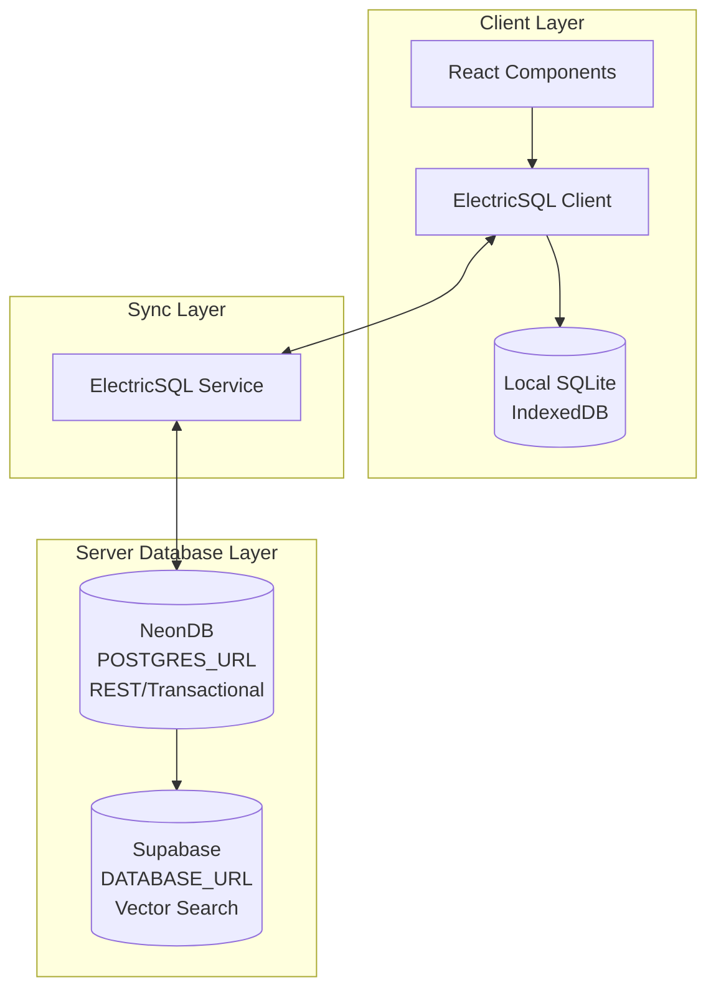

# Triple Database Architecture: NeonDB (REST) + Supabase (Vector) + ElectricSQL (Sync)

**Date:** 2026-01-16  
**Status:** Analysis & Implementation Plan

---

## Executive Summary

This document outlines the architecture, benefits, and implementation approaches for using three separate database layers:
- **NeonDB (POSTGRES_URL)**: Transactional REST API, user data, CMS operations (primary database)
- **Supabase (DATABASE_URL)**: Vector database for AI agents, embeddings, semantic search
- **ElectricSQL**: Real-time sync layer on top of NeonDB for client-side local-first storage and cross-tab/session synchronization

**Recommendation:** ✅ **Proceed with triple database architecture** for production scalability.

---

## Current State Analysis

### Existing Setup
- ✅ **NeonDB** (`POSTGRES_URL`): Primary database with pgvector extension
- ✅ **Supabase** (`DATABASE_URL`): Available, not yet used for vectors
- ✅ **ElectricSQL**: Real-time sync layer connected to NeonDB for agent data synchronization
- ✅ **Vector Storage**: Currently using NeonDB with `vector(1536)` columns in `agent_memories`
- ✅ **Schema**: `agent_memories` table with embeddings already defined

### Database Layer Overview



### Current Vector Usage
```sql
-- From drizzle/0000_misty_pepper_potts.sql
CREATE TABLE "agent_memories" (
  "id" text PRIMARY KEY NOT NULL,
  "embedding" vector(1536),
  "embedding_metadata" jsonb,
  -- ... other fields
);
```

**Current Pattern:** 
- Relational data + vectors in NeonDB
- ElectricSQL syncs agent data (contexts, memories, conversations) from NeonDB to client-side local storage
- Vector operations planned to migrate to Supabase

---

## Benefits of Triple Database Architecture

### 1. Performance Isolation ✅

**Problem Solved:**
- Vector similarity searches (especially with HNSW indexes) are CPU/memory intensive
- Heavy vector queries can slow down transactional REST operations
- Embedding generation/writes can compete with user-facing queries

**Benefit:**
- NeonDB handles REST/transactional workloads with predictable latency
- Supabase handles vector operations independently
- Each database can be scaled/optimized for its workload

**Real-World Impact:**
```
Scenario: Agent performs semantic search over 1M embeddings
- Single DB: REST API latency spikes 200-500ms during search
- Dual DB: REST API unaffected, vector search isolated
```

---

### 2. Independent Scaling ✅

**Benefits:**
- **NeonDB**: Scale for transactional throughput (connections, query speed)
- **Supabase**: Scale for vector storage/query performance (CPU, memory for HNSW)

**Cost Optimization:**
- NeonDB can use scale-to-zero/serverless for variable REST workload
- Supabase can optimize for vector query patterns (larger instances, dedicated compute)

**Resource Allocation:**
```
NeonDB Instance: Optimized for:
- High connection count
- Low-latency transactional queries
- Fast reads/writes for relational data

Supabase Instance: Optimized for:
- CPU-heavy vector operations
- Large embedding storage
- HNSW index performance
```

---

### 3. Security & Access Control ✅

**Separation of Concerns:**
- **NeonDB**: Contains user PII, auth data, sensitive business logic
- **Supabase**: Contains embeddings, agent memories (less sensitive)

**Benefits:**
- Different connection strings/credentials per database
- Network-level access controls possible
- Reduced blast radius if vector DB is compromised
- AI agents only need access to Supabase, not full NeonDB

**Access Pattern:**
```
REST API Services → NeonDB (user data, CMS)
AI Agent Services → Supabase (vector search)
Client Apps → ElectricSQL → NeonDB (real-time sync for agent data)
```

---

### 4. Operational Flexibility ✅

**Migration & Upgrades:**
- Upgrade pgvector versions independently
- Modify vector schemas without affecting REST operations
- Different backup/retention policies

**Development Workflow:**
- Test vector operations without impacting main database
- Separate staging environments per database
- Independent monitoring/alerting

---

### 5. Real-Time Sync & Local-First Architecture ✅

**ElectricSQL Benefits:**
- Client-side local-first storage (SQLite via IndexedDB)
- Cross-tab synchronization for agent data
- Offline-first operation with automatic sync
- Reduced server load (queries against local DB)
- Better user experience (instant reads, background writes)

**Sync Pattern:**
```
Client Apps → ElectricSQL Local DB → ElectricSQL Service → NeonDB
  (Reads: instant from local DB)
  (Writes: queued, synced to NeonDB via service)
```

**Use Cases:**
- Agent contexts, memories, conversations
- Real-time collaborative features
- Offline-capable applications

### 6. Cost Efficiency ✅

**Optimized Spend:**
- NeonDB: Pay for transactional capacity needed
- Supabase: Pay for vector storage/compute needed
- ElectricSQL: Self-hosted sync service (no additional DB cost)
- Avoid over-provisioning one database for both workloads

**Cost Scenarios:**
```
Single DB (NeonDB for both):
- Need larger instance for vector queries
- Cost: $XXX/month for instance that handles both

Triple DB Architecture:
- NeonDB: Smaller instance for REST ($YYY/month)
- Supabase: Optimized for vectors ($ZZZ/month)
- ElectricSQL: Self-hosted (compute cost only)
- Total: Often less than single large instance
```

---

## Implementation Approaches

### Approach 1: Pure Separation (Recommended for Production)

**Concept:** Complete separation - NeonDB for all relational data, Supabase for all vectors

**Data Flow:**
```
REST Operations:
  Users, Sites, Pages, Sessions → NeonDB only
  Foreign keys, relational queries → NeonDB

Vector Operations:
  Agent Memories (with embeddings) → Supabase only
  Semantic search, similarity queries → Supabase
  Reference NeonDB IDs (no foreign keys)

Real-Time Sync (ElectricSQL):
  Agent Contexts, Memories, Conversations → NeonDB (source of truth)
  ElectricSQL Service → Syncs to client-side local DB (IndexedDB/SQLite)
  Client reads from local DB, writes sync back to NeonDB
```

**Implementation:**
```typescript
// packages/db/src/client/index.ts
export function getClient(type: 'rest' | 'vector' = 'rest'): Database {
  if (type === 'vector') {
    // Use Supabase (DATABASE_URL)
    const url = process.env.DATABASE_URL
    return createClient({ connectionString: url! })
  }
  
  // Use NeonDB (POSTGRES_URL)
  const url = process.env.POSTGRES_URL
  return createClient({ connectionString: url! })
}

// Usage:
const restDb = getClient('rest')  // NeonDB
const vectorDb = getClient('vector')  // Supabase
```

**Schema Split:**
```typescript
// NeonDB Schema (packages/db/src/core/neon.ts)
export const users = pgTable('users', { ... })
export const sites = pgTable('sites', { ... })
export const pages = pgTable('pages', { ... })
export const sessions = pgTable('sessions', { ... })

// Supabase Schema (packages/db/src/core/supabase.ts)
export const agentMemories = pgTable('agent_memories', {
  id: text('id').primaryKey(),
  embedding: vector('embedding', { dimensions: 1536 }),
  // Reference IDs (not foreign keys)
  userId: text('user_id'),  // References NeonDB users.id
  siteId: text('site_id'),  // References NeonDB sites.id
  // ... other fields
})
```

**Pros:**
- ✅ Clear separation of concerns
- ✅ Maximum performance isolation
- ✅ Independent scaling
- ✅ Best security boundaries

**Cons:**
- ⚠️ No cross-DB foreign keys (enforce in application)
- ⚠️ Data synchronization for metadata (e.g., user IDs)

---

### Approach 2: Triple Database with ElectricSQL Sync (Current Implementation)

**Concept:** NeonDB for relational data, Supabase for vectors, ElectricSQL for real-time client sync

**Data Flow:**
```
REST Operations → NeonDB
Vector Operations → Supabase
Client Sync → ElectricSQL Service → NeonDB → Local DB (IndexedDB)
```

**Implementation:**
```typescript
// packages/db/src/client/index.ts
export function getClient(type: 'rest' | 'vector' | 'electric' = 'rest'): Database {
  if (type === 'vector') {
    // Use Supabase (DATABASE_URL)
    const url = process.env.DATABASE_URL
    return createClient({ connectionString: url! })
  }
  
  if (type === 'electric') {
    // ElectricSQL connects to NeonDB (POSTGRES_URL)
    // Client uses local DB, service syncs with NeonDB
    const url = process.env.POSTGRES_URL
    return createClient({ connectionString: url! })
  }
  
  // Use NeonDB (POSTGRES_URL)
  const url = process.env.POSTGRES_URL
  return createClient({ connectionString: url! })
}

// ElectricSQL Client Setup (packages/sync/src/client/index.ts)
export function createElectricClientConfig(config: ElectricClientConfig) {
  // Client connects to ElectricSQL service
  // Service is connected to NeonDB (POSTGRES_URL)
  // Local DB (SQLite via IndexedDB) syncs with service
}
```

**ElectricSQL Schema:**
```typescript
// ElectricSQL syncs agent tables from NeonDB
// Tables must be electrified in PostgreSQL:
// ALTER TABLE agent_contexts ENABLE ELECTRIC;
// ALTER TABLE agent_memories ENABLE ELECTRIC;
// ALTER TABLE conversations ENABLE ELECTRIC;

// Client-side usage (packages/sync/src/hooks/useAgentContext.ts)
export function useAgentContext(agentId: string, options?: AgentContextOptions) {
  // Uses ElectricSQL local DB for reads
  // Writes sync via ElectricSQL service to NeonDB
}
```

**Pros:**
- ✅ Local-first architecture (offline-capable)
- ✅ Real-time cross-tab synchronization
- ✅ Reduced server load (client queries local DB)
- ✅ Clear separation: REST (NeonDB), Vector (Supabase), Sync (ElectricSQL)

**Cons:**
- ⚠️ Additional complexity (ElectricSQL service to manage)
- ⚠️ Sync conflicts need resolution
- ⚠️ ElectricSQL service must be available for writes

---

### Approach 3: Hybrid with Metadata Replication

**Concept:** NeonDB for relational data, Supabase for vectors, but replicate minimal metadata to Supabase

**Data Flow:**
```
REST Operations → NeonDB
Vector Operations → Supabase (with replicated metadata)

Metadata Replication:
  User ID, Email (for filtering) → Sync to Supabase
  Site ID, Site Name → Sync to Supabase
  Minimal data for vector queries
```

**Implementation:**
```typescript
// Replication Service (packages/db/src/replication/user-sync.ts)
export async function syncUserMetadata(userId: string) {
  // Read from NeonDB
  const user = await neonDb.query.users.findById(userId)
  
  // Write minimal metadata to Supabase
  await supabaseDb.insert(metadataUsers).values({
    id: user.id,
    email: user.email,
    name: user.name,
    // Only fields needed for vector queries
  }).onConflictDoUpdate({ ... })
}

// Triggered on user updates, or periodic sync
```

**Schema:**
```typescript
// Supabase: Minimal metadata tables for filtering
export const metadataUsers = pgTable('metadata_users', {
  id: text('id').primaryKey(),
  email: text('email'),
  name: text('name'),
})

export const metadataSites = pgTable('metadata_sites', {
  id: text('id').primaryKey(),
  name: text('name'),
})

// Agent memories reference metadata
export const agentMemories = pgTable('agent_memories', {
  // ... vector fields
  userId: text('user_id').references(() => metadataUsers.id),  // FK within Supabase
})
```

**Pros:**
- ✅ Can use foreign keys within Supabase
- ✅ Filter vector queries by user/site without cross-DB calls
- ✅ Still maintains separation

**Cons:**
- ⚠️ Replication complexity
- ⚠️ Eventual consistency (sync lag)
- ⚠️ More tables to maintain

---

### Approach 4: Read Replicas Pattern

**Concept:** NeonDB as primary, Supabase as read-optimized vector search layer

**Data Flow:**
```
Writes:
  All writes → NeonDB (source of truth)
  Async replication → Supabase (for vector queries)

Reads:
  Relational queries → NeonDB
  Vector queries → Supabase (read-only)
```

**Implementation:**
```typescript
// Write Service
export async function createAgentMemory(memory: AgentMemory) {
  // Write to NeonDB (source of truth)
  await neonDb.insert(agentMemories).values(memory)
  
  // Async replication to Supabase (for vector search)
  await replicateToSupabase(memory)  // Queue job, background process
}

// Read Service
export async function searchMemories(queryEmbedding: number[]) {
  // Read from Supabase (optimized for vector search)
  return await supabaseDb
    .select()
    .from(agentMemories)
    .orderBy(sql`embedding <-> ${queryEmbedding}`)
    .limit(10)
}
```

**Pros:**
- ✅ NeonDB remains source of truth
- ✅ Supabase optimized for reads/search
- ✅ Can failover to NeonDB if Supabase unavailable

**Cons:**
- ⚠️ Replication lag
- ⚠️ Write operations still hit both DBs
- ⚠️ More complex synchronization

---

## Recommended Implementation: Approach 2 (Triple Database with ElectricSQL Sync)

**Current Status:** ✅ **This is the current implementation**

**Why:**
1. Provides local-first architecture for better UX
2. Real-time sync across tabs and sessions
3. Clear separation of concerns (REST, Vector, Sync)
4. Offline-capable applications
5. Reduced server load for agent data reads

**Note:** Vector operations still in NeonDB; planned migration to Supabase (Approach 1 for vectors).

**Alternative for vectors:** Approach 1 (Pure Separation) is recommended for production vector workloads when migrating to Supabase.

**Why:**
1. Simplest to understand and maintain
2. Best performance isolation
3. Clear security boundaries
4. Most flexible for future changes

**Migration Path (Vector Operations to Supabase):**
1. Set up Supabase with `pgvector` extension
2. Create `agent_memories` table in Supabase
3. Implement vector client in `@revealui/db`
4. Migrate vector operations to Supabase
5. Keep NeonDB for relational data only

**Current ElectricSQL Setup:**
1. ✅ ElectricSQL service connected to NeonDB (POSTGRES_URL)
2. ✅ Agent tables electrified in PostgreSQL
3. ✅ Client-side sync configured (@revealui/sync)
4. ✅ Real-time sync working for agent contexts, memories, conversations

---

## Implementation Details

### 1. Database Client Factory

```typescript
// packages/db/src/client/index.ts

export type DatabaseType = 'rest' | 'vector'

const restClient: Database | null = null
const vectorClient: Database | null = null

export function getClient(type: DatabaseType = 'rest'): Database {
  if (type === 'vector') {
    if (!vectorClient) {
      const url = process.env.DATABASE_URL
      if (!url) throw new Error('DATABASE_URL required for vector database')
      vectorClient = createClient({ connectionString: url })
    }
    return vectorClient
  }

  // Default to REST/NeonDB
  if (!restClient) {
    const url = process.env.POSTGRES_URL || process.env.DATABASE_URL
    if (!url) throw new Error('POSTGRES_URL required for REST database')
    restClient = createClient({ connectionString: url })
  }
  return restClient
}

// Explicit helpers
export function getRestClient(): Database {
  return getClient('rest')
}

export function getVectorClient(): Database {
  return getClient('vector')
}
```

### 2. Schema Organization

```typescript
// packages/db/src/core/rest.ts (NeonDB schema)
export * from './users'
export * from './sites'
export * from './pages'
export * from './sessions'
// ... all relational tables

// packages/db/src/core/vector.ts (Supabase schema)
export * from './agents/vector-memories'
export * from './agents/vector-contexts'
// ... all vector tables
```

### 3. Vector Memory Service

```typescript
// packages/ai/src/memory/vector-memory.ts
import { getVectorClient } from '@revealui/db/client'
import { agentMemories } from '@revealui/db/core/vector'

export class VectorMemoryService {
  private db = getVectorClient()

  async searchSimilar(queryEmbedding: number[], limit = 10) {
    return await this.db
      .select()
      .from(agentMemories)
      .orderBy(sql`embedding <-> ${queryEmbedding}::vector`)
      .limit(limit)
  }

  async create(memory: AgentMemory) {
    // Only writes to Supabase
    return await this.db.insert(agentMemories).values({
      ...memory,
      embedding: `[${memory.embedding.vector.join(',')}]`,
    })
  }
}
```

### 4. ElectricSQL Configuration

```typescript
// packages/sync/src/client/index.ts
export function getElectricServiceUrl(): string {
  if (typeof window !== 'undefined') {
    return process.env.NEXT_PUBLIC_ELECTRIC_SERVICE_URL || ''
  }
  return process.env.ELECTRIC_SERVICE_URL || ''
}

export function createElectricClientConfig(config: ElectricClientConfig) {
  // ElectricSQL service connects to NeonDB (POSTGRES_URL)
  // Client connects to ElectricSQL service
  // Local DB (IndexedDB/SQLite) syncs with service
}
```

### 5. Configuration Updates

```typescript
// packages/config/src/modules/database.ts
export function getDatabaseConfig(env: EnvConfig): {
  rest: DatabaseConfig
  vector: DatabaseConfig
  electric: DatabaseConfig
} {
  return {
    rest: {
      url: env.POSTGRES_URL || '',
      connectionString: env.POSTGRES_URL || '',
    },
    vector: {
      url: env.DATABASE_URL || '',
      connectionString: env.DATABASE_URL || '',
    },
    electric: {
      // ElectricSQL service URL (not a database connection string)
      url: env.ELECTRIC_SERVICE_URL || '',
      // ElectricSQL connects to NeonDB for sync
      connectionString: env.POSTGRES_URL || '',
    },
  }
}
```

---

## Migration Strategy

### Current Status: ✅ ElectricSQL Setup Complete

**ElectricSQL (Already Implemented):**
- ✅ ElectricSQL service connected to NeonDB
- ✅ Agent tables electrified (agent_contexts, agent_memories, conversations)
- ✅ Client-side sync configured (@revealui/sync package)
- ✅ Real-time sync working for agent data

### Future Migration: Vector Operations to Supabase

### Phase 1: Supabase Setup (Week 1)
- [ ] Enable `pgvector` extension in Supabase
- [ ] Create `agent_memories` table in Supabase
- [ ] Update config to support vector database
- [ ] Implement `getClient('vector')` in `@revealui/db`

### Phase 2: Dual Write (Week 2)
- [ ] Write new agent memories to both NeonDB and Supabase
- [ ] Validate data consistency
- [ ] Monitor performance

### Phase 3: Vector Migration (Week 3)
- [ ] Migrate existing embeddings from NeonDB to Supabase
- [ ] Update vector search to use Supabase
- [ ] Remove vector columns from NeonDB `agent_memories`
- [ ] Keep non-vector agent data in NeonDB (synced via ElectricSQL)

### Phase 4: Cleanup (Week 4)
- [ ] Stop writing vectors to NeonDB
- [ ] Remove old vector infrastructure from NeonDB
- [ ] Update documentation
- [ ] Final architecture: NeonDB (REST) + Supabase (Vector) + ElectricSQL (Sync)

---

## Monitoring & Observability

### Key Metrics

**NeonDB (REST):**
- Query latency (p50, p95, p99)
- Connection pool usage
- Transaction throughput
- Error rate

**Supabase (Vector):**
- Vector search latency
- Embedding write throughput
- Storage growth
- HNSW index performance

**ElectricSQL (Sync):**
- Sync latency (server → client)
- Local DB read/write performance
- Conflict resolution rate
- Service uptime
- Client connection count

### Alerts

```
NeonDB:
- P95 latency > 200ms
- Connection pool > 80%
- Error rate > 1%

Supabase:
- Vector search latency > 500ms
- Storage growth > 10GB/day
- Embedding write failures

ElectricSQL:
- Sync latency > 1s
- Conflict resolution failures > 5%
- Service downtime > 1min
- Client connection failures > 1%
```

---

## Testing Strategy

### Unit Tests
```typescript
// Test vector operations use Supabase
test('vector memory service uses Supabase', async () => {
  const service = new VectorMemoryService()
  // Mock Supabase client
  // Verify operations go to DATABASE_URL
})

// Test REST operations use NeonDB
test('user service uses NeonDB', async () => {
  const service = new UserService()
  // Mock NeonDB client
  // Verify operations go to POSTGRES_URL
})
```

### Integration Tests
```typescript
// Test cross-DB references work
test('agent memory references user ID from NeonDB', async () => {
  // Create user in NeonDB
  const user = await createUserInNeonDB()
  
  // Create memory in Supabase with user ID reference
  const memory = await createMemoryInSupabase({ userId: user.id })
  
  // Verify memory can be retrieved and linked
  const retrieved = await getMemoryWithUser(memory.id)
  expect(retrieved.userId).toBe(user.id)
})
```

---

## Security Considerations

### Connection Security
- Use different credentials for each database
- Rotate credentials independently
- Use connection pooling per database

### Access Control
- REST API services: Access to NeonDB only
- AI Agent services: Access to Supabase only
- Admin services: Access to both (for migrations, monitoring)

### Network Security
- Use VPC/private networking where possible
- Restrict Supabase access to AI agent IPs
- Use different API keys/permissions

---

## Cost Analysis

### Single Database (Current)
```
NeonDB Instance (large, handles both):
- Compute: $XXX/month
- Storage: $YYY/month
- Total: $ZZZ/month
```

### Dual Database (Proposed)
```
NeonDB Instance (optimized for REST):
- Compute: $AAA/month (smaller)
- Storage: $BBB/month
- Subtotal: $CCC/month

Supabase Instance (optimized for vectors):
- Compute: $DDD/month
- Storage: $EEE/month (vector storage)
- Subtotal: $FFF/month

Total: $CCC + $FFF = $GGG/month

Comparison: Often 20-40% savings vs single large instance
```

---

## Alternative: Single Database Optimization

**If dual database is too complex initially:**

1. **Optimize within NeonDB:**
   - Separate connection pools for REST vs vector queries
   - Use read replicas for vector searches
   - Index optimization (HNSW for vectors, B-tree for relational)

2. **Consider later migration:**
   - Start with single DB
   - Build abstraction layer (`getClient(type)`)
   - Migrate to dual DB when scale requires it

---

## Decision Matrix

| Factor | Single DB | Dual DB | Triple DB (Current) |
|--------|-----------|---------|---------------------|
| **Complexity** | Low ✅ | Medium ⚠️ | Medium-High ⚠️ |
| **Performance Isolation** | Poor ❌ | Excellent ✅ | Excellent ✅ |
| **Scalability** | Limited ⚠️ | Excellent ✅ | Excellent ✅ |
| **Cost** | Higher at scale ❌ | Lower at scale ✅ | Lower at scale ✅ |
| **Security** | Single boundary ⚠️ | Better isolation ✅ | Best isolation ✅ |
| **Real-Time Sync** | None ❌ | None ❌ | Built-in ✅ |
| **Offline Support** | None ❌ | None ❌ | Local-first ✅ |
| **Operational Overhead** | Low ✅ | Medium ⚠️ | Medium-High ⚠️ |
| **Migration Effort** | N/A | Medium ⚠️ | N/A (already done) ✅ |

**Current Status:** ✅ **Triple Database Architecture Implemented**

**Recommendation:** 
- **Early stage / MVP**: Start with single DB (NeonDB)
- **Production / Scale**: Triple DB architecture (current)
  - NeonDB for REST operations
  - Supabase for vector search (when migrated)
  - ElectricSQL for real-time sync
- **Build abstraction now**: Use `getClient(type)` pattern for REST/Vector, ElectricSQL client for sync

---

## Next Steps

1. **Review & Decision:** Evaluate approach based on current scale
2. **Proof of Concept:** Implement `getClient(type)` with current single DB
3. **Benchmark:** Measure performance impact of vector queries on REST operations
4. **Plan Migration:** If dual DB needed, create detailed migration plan
5. **Document:** Update architecture docs with chosen approach

---

## References

- [Supabase Vector Database Guide](https://supabase.com/modules/vector)
- [Supabase pgvector Extension](https://supabase.com/docs/guides/database/extensions/pgvector)
- [Supabase Scaling for AI](https://supabase.com/docs/guides/ai/engineering-for-scale)
- [Neon Serverless Postgres](https://neon.tech)
- [Drizzle ORM Documentation](https://orm.drizzle.team)
- [ElectricSQL Documentation](https://electric-sql.com/docs)
- [ElectricSQL Local-First Architecture](https://electric-sql.com/docs/introduction/local-first)

---

**Document Status:** Updated to reflect triple database architecture (NeonDB REST + Supabase Vector + ElectricSQL Sync)
