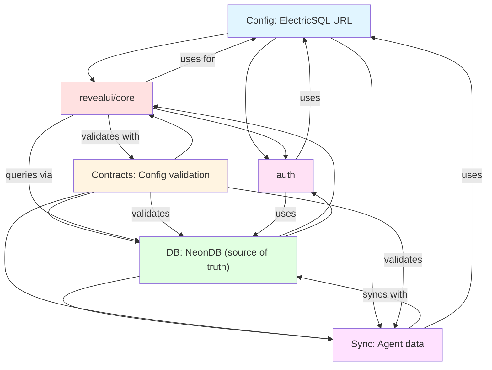
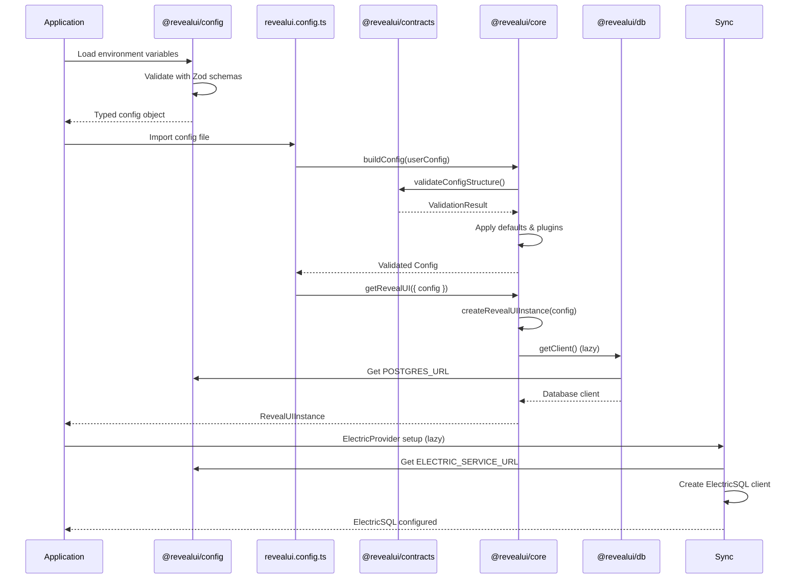
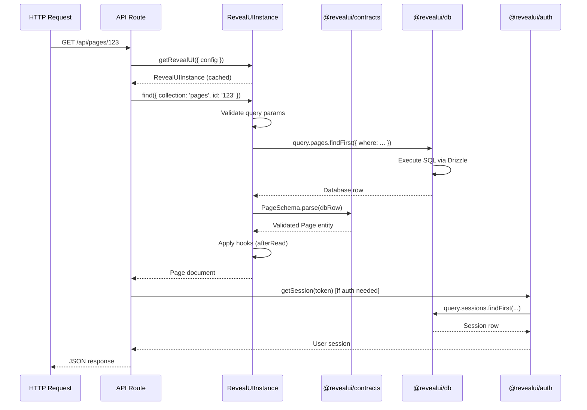
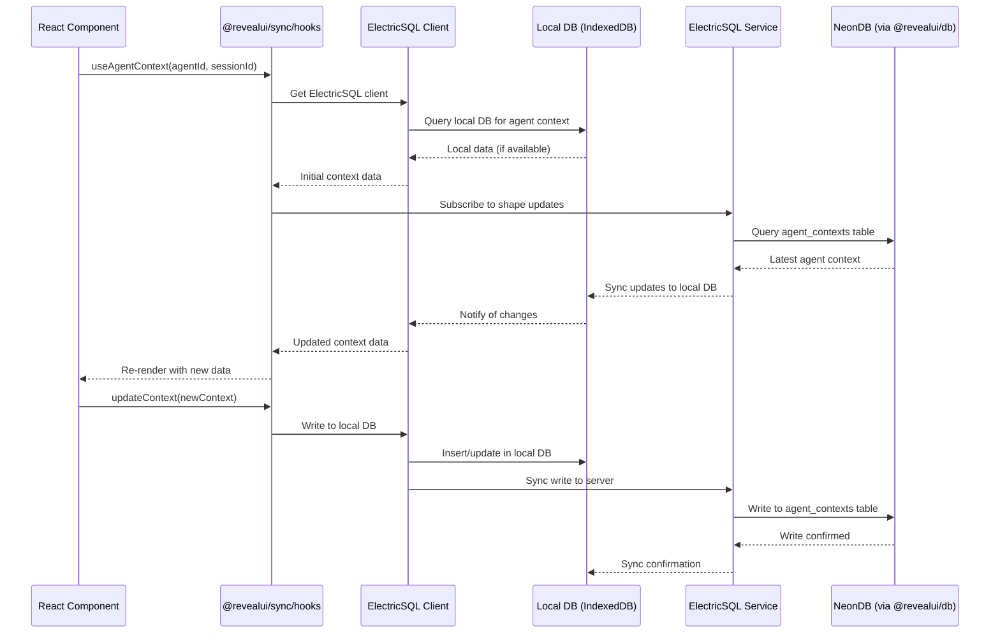
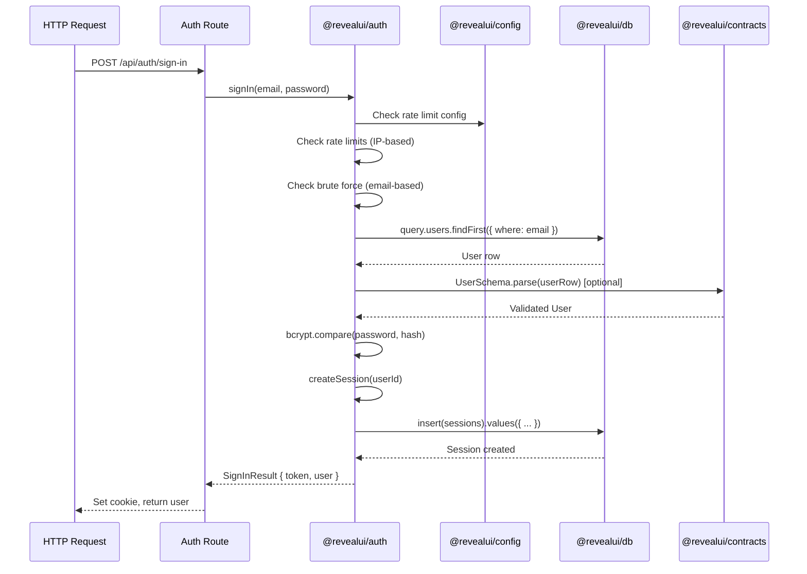

# RevealUI Package Architecture Map

**Date:** After Migration Analysis  
**Status:** Complete Architecture Documentation

---

## Executive Summary

This document maps the architecture, communication patterns, and application lifecycle of RevealUI's core packages. Understanding this flow is critical for development, debugging, and feature implementation.

---

## Package Overview

### Package Roles

| Package | Role | Primary Responsibility |
|---------|------|----------------------|
| **@revealui/config** | Configuration Layer | Environment variable loading, validation, and typed config access |
| **@revealui/contracts** | Contract Layer | Zod schemas, validation, type safety, entity contracts |
| ~~@revealui/schema~~ | ~~Schema Layer~~ | ✅ **DELETED** - Merged into `@revealui/contracts` |
| **@revealui/db** | Database Layer | Drizzle ORM schemas, database client, type definitions (NeonDB, Supabase) |
| **@revealui/sync** | Sync Layer | ElectricSQL client for real-time sync, local-first storage |
| **@revealui/core** | Core Framework | CMS runtime, collection operations, field traversal, business logic |
| **@revealui/auth** | Authentication Layer | User authentication, sessions, password management |

---

## Dependency Graph



**Legend:**
- **Blue (config)**: Configuration and environment
- **Yellow (contracts)**: Validation and contracts (schema merged)
- **Green (db)**: Database layer (NeonDB, Supabase)
- **Pink (sync)**: Real-time sync layer (ElectricSQL)
- **Red (revealui)**: Core framework
- **Pink (auth)**: Authentication

---

## Package Responsibilities

### 1. @revealui/config

**Purpose:** Centralized environment variable management

**Key Features:**
- Lazy-loaded Proxy-based config (validates on access)
- Environment-aware loading (development, production, test)
- Type-safe config access via Zod schemas
- Build-time vs runtime validation modes

**Exports:**
```typescript
export function getConfig(strict?: boolean): Config
export function detectEnvironment(): Environment
export function loadEnvironment(): Record<string, string>
```

**Communication:**
- **Imported by:** `@revealui/auth`, `apps/cms`, `apps/web`
- **Uses:** Zod for validation
- **No dependencies** on other RevealUI packages

**Role in Lifecycle:**
- **Bootstrap:** First package loaded, provides environment config
- **Runtime:** Provides typed access to environment variables

---

### 2. @revealui/contracts

**Purpose:** Unified contract system for validation and type safety

**Key Features:**
- Zod schemas for all entities (User, Site, Page, Block, etc.)
- Contract validation system
- Database ↔ Contract bridges
- Action validation
- CMS configuration contracts

**Exports:**
```typescript
// Foundation
export { createContract, type Contract } from './foundation'

// Entities
export { UserSchema, PageSchema, SiteSchema } from './entities'

// CMS
export { CollectionConfig, Field, validateConfigStructure } from './cms'

// Database Bridges
export { dbRowToContract, contractToDbInsert } from './database'

// Actions
export { validateAction } from './actions'
```

**Communication:**
- **Imported by:** `@revealui/core`, `@revealui/db` (types), `@revealui/auth` (types), `apps/cms`
- **Uses:** Zod for schemas
- **No dependencies** on other RevealUI packages

**Role in Lifecycle:**
- **Build-time:** Provides type definitions
- **Runtime:** Validates data at boundaries (config, DB rows, API inputs)

---

### 3. @revealui/db

**Purpose:** Database layer using Drizzle ORM

**Key Features:**
- Drizzle ORM schema definitions
- Database client factory (NeonDB REST, Supabase Vector)
- Type-safe database operations
- Vector database support (pgvector)
- Dual database architecture support (REST + Vector)
- Neon Postgres integration

**Exports:**
```typescript
// Schema
export { users, sites, pages, ... } from './core'

// Client
export { getClient, createClient, type Database } from './client'

// Types
export type { Database, TableRow, TableInsert } from './types'
```

**Communication:**
- **Imported by:** `@revealui/core`, `@revealui/auth`, `apps/cms`
- **Uses:** Drizzle ORM, Postgres client
- **Depends on:** `@revealui/config` (for connection strings)

**Role in Lifecycle:**
- **Runtime:** All database operations go through this layer
- **Type Safety:** Provides TypeScript types for all database operations

---

### 4. @revealui/sync

**Purpose:** Real-time sync layer using ElectricSQL for local-first storage

**Key Features:**
- ElectricSQL client configuration
- React hooks for agent data (contexts, memories, conversations)
- Local-first storage (SQLite via IndexedDB)
- Real-time cross-tab synchronization
- Offline-first operation with automatic sync
- Type-safe API with Zod validation

**Exports:**
```typescript
// Client
export { createElectricClientConfig, getElectricServiceUrl } from './client'

// Provider
export { ElectricProvider, useElectric } from './provider'

// Hooks
export { useAgentContext, useAgentMemory, useConversations } from './hooks'

// Sync
export { createAgentContextsShape, createAgentMemoriesShape, createConversationsShape } from './sync'

// Schema compatibility
export { zodToElectricAgentContext, electricToZodAgentContext } from './schema/compat'
```

**Communication:**
- **Imports from:**
  - `@revealui/contracts` - Agent data validation (contexts, memories, conversations)
  - `@revealui/contracts` - Agent types (schema merged)
  - `@electric-sql/client` - ElectricSQL client library
  - `@electric-sql/react` - ElectricSQL React hooks
- **Used by:** `apps/cms`, `apps/web` (for real-time agent data sync)
- **Synced with:** `@revealui/db` (NeonDB via ElectricSQL service)

**Role in Lifecycle:**
- **Runtime:** Provides client-side sync for agent data
- **Storage:** Local SQLite (IndexedDB) with sync to NeonDB via ElectricSQL service
- **Sync:** ElectricSQL service connects to NeonDB, syncs agent tables to client

**Architecture:**
```
Client Apps → ElectricSQL Client → Local DB (IndexedDB/SQLite)
                                      ↕ (sync)
                           ElectricSQL Service → NeonDB
```

---

### 6. @revealui/core (Core Framework)

**Purpose:** Main CMS framework and runtime

**Key Features:**
- Collection and global operations
- Field traversal and validation
- Config building and validation
- Database adapters
- Plugin system
- Query building

**Exports:**
```typescript
// Config
export { buildConfig, getRevealUI } from './core/config'

// Instance
export { createRevealUIInstance } from './core/instance'

// Database
export { sqliteAdapter, universalPostgresAdapter } from './core/database'

// Collections
export { RevealUICollection } from './core/collections'
```

**Communication:**
- **Imports from:**
  - `@revealui/contracts` - Config validation, entity contracts
  - `@revealui/db` - Database operations
  - `@revealui/contracts` - Types (schema merged into contracts)
- **Used by:** `apps/cms`, `apps/web`

**Role in Lifecycle:**
- **Build-time:** Validates config using contracts
- **Runtime:** Creates CMS instance, handles all operations

---

### 6. @revealui/auth

**Purpose:** Authentication and session management

**Key Features:**
- User sign-in/sign-up
- Password hashing (bcryptjs)
- Session management
- Rate limiting
- Brute force protection

**Exports:**
```typescript
// Server
export { signIn, signUp } from './server/auth'
export { createSession, getSession } from './server/session'

// Client
export { useAuth } from './react'

// Storage
export { DatabaseStorage } from './server/storage'
```

**Communication:**
- **Imports from:**
  - `@revealui/db` - User queries, session storage
  - `@revealui/config` - Environment variables
  - `@revealui/core` - Logger utilities
  - `@revealui/contracts` - User types (schema merged)
- **Used by:** `apps/cms`

**Role in Lifecycle:**
- **Runtime:** Handles all authentication operations
- **Storage:** Uses database for sessions and rate limiting

---

## Application Lifecycle Flow

### Phase 1: Bootstrap (Application Start)



**Steps:**
1. **Environment Loading:** `@revealui/config` loads and validates environment variables
2. **Config Building:** `revealui.config.ts` imports collections/globals, calls `buildConfig()`
3. **Config Validation:** `buildConfig()` uses `@revealui/contracts/cms` to validate structure
4. **Instance Creation:** `getRevealUI()` creates RevealUI instance with validated config
5. **Database Connection:** Database client is created lazily when first accessed
6. **ElectricSQL Setup:** `ElectricProvider` configures ElectricSQL client (client-side only)

---

### Phase 2: Runtime (Request Handling)



**Flow:**
1. **Request Arrives:** HTTP request hits API route
2. **Get Instance:** Route calls `getRevealUI()` (returns cached instance)
3. **Execute Operation:** Instance method (find, create, update, delete) called
4. **Database Query:** Operation queries database via `@revealui/db`
5. **Contract Validation:** Database row validated using `@revealui/contracts`
6. **Hook Execution:** Field hooks executed (beforeRead, afterRead, etc.)
7. **Response:** Validated document returned to route

---

### Phase 3: ElectricSQL Sync Flow (Client-Side)



**Flow:**
1. **Hook Initialization:** Component calls `useAgentContext()` hook
2. **Local Query:** Hook queries local DB (IndexedDB/SQLite) for cached data
3. **Shape Subscription:** Hook subscribes to ElectricSQL shape updates
4. **Service Sync:** ElectricSQL service syncs with NeonDB for latest data
5. **Local Update:** Service pushes updates to local DB
6. **Re-render:** Component re-renders with updated data
7. **Writes:** Writes go to local DB first, then sync to NeonDB via service

---

### Phase 4: Authentication Flow



**Flow:**
1. **Sign-in Request:** User submits credentials
2. **Rate Limiting:** Check IP-based rate limits
3. **Brute Force:** Check if account is locked
4. **User Lookup:** Query database for user by email
5. **Password Validation:** Compare password hash
6. **Session Creation:** Create session record in database
7. **Response:** Return session token and user data

---

## Communication Patterns

### 1. Configuration Flow

**Pattern:** Unidirectional data flow from config → contracts → core

```
@revealui/config (env vars)
    ↓
revealui.config.ts (user config)
    ↓
@revealui/core (buildConfig)
    ↓
@revealui/contracts/cms (validateConfigStructure)
    ↓
@revealui/core (createRevealUIInstance)
```

**Key Points:**
- Config package has no dependencies (pure utility)
- Contracts validate config structure
- Core uses validated config to create instance

---

### 2. Database Flow

**Pattern:** Contract validation at database boundaries

```
@revealui/core (operation)
    ↓
@revealui/db (query)
    ↓
Postgres Database
    ↓
@revealui/db (row returned)
    ↓
@revealui/contracts (validate row)
    ↓
@revealui/core (validated entity)
```

**Key Points:**
- Database layer is thin (just Drizzle ORM)
- Contracts validate all database rows
- Type adapters bridge DB types ↔ Contract types

---

### 3. Authentication Flow

**Pattern:** Auth uses DB and Config independently

```
@revealui/auth
    ├─→ @revealui/db (user queries, sessions)
    ├─→ @revealui/config (env vars)
    └─→ @revealui/core/utils (logger)
```

**Key Points:**
- Auth is self-contained (doesn't use RevealUI instance)
- Uses database directly for user/session operations
- Uses config for connection strings and settings

---

### 6. Type Flow

**Pattern:** Contracts as source of truth for types

```
@revealui/contracts (Zod schemas)
    ├─→ @revealui/core (uses for validation)
    ├─→ @revealui/db (uses types, validates rows)
    ├─→ @revealui/auth (uses User types)
    ├─→ @revealui/sync (uses Agent types, validates sync data)
    └─→ @revealui/contracts (schema merged into contracts)
```

**Key Points:**
- Contracts define all entity types
- Schemas are derived from Zod
- TypeScript types inferred from Zod schemas
- Sync validates agent data with contracts

---

## Package Boundaries

### Layer Separation

```
┌─────────────────────────────────────────┐
│         Application Layer               │
│  (apps/cms, apps/web)                   │
└──────────────┬──────────────────────────┘
               │
┌──────────────▼──────────────────────────┐
│      Core Framework Layer               │
│  (@revealui/core)              │
│  - Config building                      │
│  - Instance management                  │
│  - Collection operations                │
└──────┬─────────────────────┬────────────┘
       │                     │
┌──────▼──────────┐  ┌───────▼────────────┐
│  Contract Layer │  │  Database Layer    │
│  (@revealui/    │  │  (@revealui/db)    │
│   contracts)    │  │  - Drizzle schemas │
│  - Validation   │  │  - DB client       │
│  - Types        │  │  - Queries         │
└─────────────────┘  └────────────────────┘
       │
┌──────▼──────────┐
│  Config Layer   │
│  (@revealui/    │
│   config)       │
│  - Env loading  │
│  - Validation   │
└─────────────────┘
       │
┌──────▼──────────┐
│  Sync Layer     │
│  (@revealui/    │
│   sync)         │
│  - ElectricSQL  │
│  - Local DB     │
│  - Real-time    │
└─────────────────┘
```

---

## Key Integration Points

### 1. Config → Core Integration

**Location:** `packages/core/src/config/buildConfig.ts`

```typescript
import { validateConfigStructure, ConfigValidationError } from '@revealui/contracts/cms'

export function buildConfig(config: Config): Config {
  // Validate using contracts
  const validationResult = validateConfigStructure(config)
  if (!validationResult.success) {
    throw new ConfigValidationError(validationResult.errors, 'config')
  }
  // ... build config
}
```

**Flow:**
- User defines config in `revealui.config.ts`
- `buildConfig()` validates using `@revealui/contracts/cms`
- Validated config used to create instance

---

### 2. Core → DB Integration

**Location:** `packages/core/src/database/type-adapter.ts`

```typescript
import type { Database } from '@revealui/db/types'
import type { Contract } from '@revealui/contracts/foundation'

export function dbRowToContract<TContract, TDbRow>(
  contract: Contract<TContract>,
  dbRow: TDbRow,
): TContract {
  return contract.parse(dbRow) // Zod validation
}
```

**Flow:**
- Core queries database via `@revealui/db`
- Database returns raw rows
- Core validates rows using contracts
- Validated entities used in business logic

---

### 3. Auth → DB Integration

**Location:** `packages/auth/src/server/auth.ts`

```typescript
import { getClient } from '@revealui/db/client'
import { users } from '@revealui/db/core'

export async function signIn(email: string, password: string) {
  const db = getClient()
  const [user] = await db.select().from(users).where(eq(users.email, email))
  // ... validate password, create session
}
```

**Flow:**
- Auth directly queries `@revealui/db`
- No RevealUI instance required
- Uses database types for queries
- Creates sessions in database

---

### 4. Config → Auth Integration

**Location:** `packages/auth/src/server/storage/database.ts`

```typescript
import configModule from '@revealui/config'

const config = configModule as { database: { url: string } }
const url = config.database?.url || process.env.POSTGRES_URL
```

**Flow:**
- Auth uses `@revealui/config` for connection strings
- Lazy loading (config validates on access)
- Falls back to `process.env` if config not available

---

## Initialization Sequence

### Application Startup (apps/cms)

```
1. Next.js starts
   └─> loads next.config.mjs

2. next.config.mjs imports revealui.config.ts
   └─> Config file is evaluated

3. revealui.config.ts imports @revealui/config
   └─> Environment variables loaded and validated

4. revealui.config.ts imports collections/globals
   └─> Collection configs defined using @revealui/contracts/cms types

5. revealui.config.ts calls buildConfig()
   └─> @revealui/core validates with @revealui/contracts/cms

6. buildConfig() returns validated Config
   └─> Config exported from revealui.config.ts

7. Next.js instrumentation.ts runs
   └─> Calls getRevealUI({ config }) when needed

8. getRevealUI() creates RevealUIInstance
   └─> Instance cached, reused for subsequent requests
```

---

## Data Validation Flow

### Input Validation (API Request → Database)

```
1. HTTP Request arrives
   └─> Raw request body (unknown type)

2. API Route validates with @revealui/contracts
   └─> e.g., CreatePageInputSchema.parse(body)

3. Validated input passed to RevealUIInstance
   └─> create({ collection: 'pages', data: validatedInput })

4. Instance validates with contracts again
   └─> PageSchema.parse(data)

5. Instance converts to database format
   └─> contractToDbInsert(contract, entity)

6. Database insert via @revealui/db
   └─> db.insert(pages).values(insertData)

7. Database returns row
   └─> Raw database row

8. Instance validates returned row
   └─> dbRowToContract(PageSchema, dbRow)

9. Validated entity returned to route
   └─> Response sent to client
```

**Key Principle:** Validate at every boundary
- API input → Contract validation
- Before DB insert → Contract validation
- After DB query → Contract validation
- Before return → Contract validation

---

## Error Handling Flow

### Error Propagation

```
@revealui/contracts/cms
    ↓ (throws ConfigValidationError)
@revealui/core/buildConfig
    ↓ (re-throws or wraps)
apps/cms/revealui.config.ts
    ↓ (Next.js catches during build)
Next.js Error Page
```

**Pattern:**
- Contracts throw typed errors (`ConfigValidationError`, `ValidationError`)
- Core may wrap or re-throw errors
- Applications handle errors with error boundaries

---

## Type Safety Flow

### Type Inference Chain

```
@revealui/contracts (Zod schemas)
    ↓ (TypeScript infers from z.infer<Schema>)
TypeScript types (User, Page, CollectionConfig)
    ↓ (Exported as TypeScript types)
@revealui/core (uses types)
    ↓ (Type-checked at compile time)
Applications (apps/cms, apps/web)
```

**Benefits:**
- Single source of truth (Zod schemas)
- Runtime validation matches compile-time types
- Type safety across all layers

---

## Package Responsibilities Matrix

| Responsibility | config | contracts | db | sync | revealui | auth |
|----------------|--------|-----------|----|------|----------|-----|
| **Environment Loading** | ✅ | ❌ | ❌ | ❌ | ❌ | ❌ |
| **Config Validation** | ❌ | ✅ | ❌ | ❌ | ❌ | ❌ |
| **Entity Validation** | ❌ | ✅ | ❌ | ❌ | ❌ | ❌ |
| **Database Schema** | ❌ | ❌ | ✅ | ❌ | ❌ | ❌ |
| **Database Queries** | ❌ | ❌ | ✅ | ❌ | ✅ | ✅ |
| **Real-Time Sync** | ❌ | ❌ | ❌ | ✅ | ❌ | ❌ |
| **Local-First Storage** | ❌ | ❌ | ❌ | ✅ | ❌ | ❌ |
| **CMS Operations** | ❌ | ❌ | ❌ | ❌ | ✅ | ❌ |
| **Authentication** | ❌ | ❌ | ❌ | ❌ | ❌ | ✅ |
| **Type Definitions** | ❌ | ✅ | ✅ | ✅ | ✅ | ✅ |

---

## Communication Best Practices

### Do's

✅ **Use contracts for validation:**
```typescript
import { validateConfigStructure } from '@revealui/contracts/cms'
const result = validateConfigStructure(config)
```

✅ **Use config for environment:**
```typescript
import config from '@revealui/config'
const dbUrl = config.database.url
```

✅ **Use DB client for queries:**
```typescript
import { getClient } from '@revealui/db/client'
const db = getClient()
const users = await db.select().from(users)
```

✅ **Use contracts for type definitions:**
```typescript
import type { User, Page } from '@revealui/contracts/entities'
```

### Don'ts

❌ **Don't bypass contract validation:**
```typescript
// Bad: Using database row directly
const user = dbRow // No validation

// Good: Validate with contracts
const user = UserSchema.parse(dbRow)
```

❌ **Don't import from @revealui/schema (package deleted):**
```typescript
// Bad: Old path (package deleted)
import { Field } from '@revealui/schema/core/contracts'

// Good: New path
import { Field } from '@revealui/contracts/cms'
```

❌ **Don't access process.env directly (use config):**
```typescript
// Bad: Direct access
const url = process.env.POSTGRES_URL

// Good: Use config package
import config from '@revealui/config'
const url = config.database.url
```

---

## Summary

### Package Communication Summary

1. **config** → Independent (no dependencies)
   - Provides environment variables to all packages

2. **contracts** → Independent (only Zod)
   - Provides validation and types to all packages

3. **db** → Depends on config, contracts (types)
   - Provides database operations (NeonDB REST, Supabase Vector), uses config for connections

4. **sync** → Depends on contracts, config
   - ElectricSQL client for real-time sync, local-first storage
   - Syncs with NeonDB via ElectricSQL service

5. **revealui** → Depends on contracts, db
   - Core framework, orchestrates all operations

6. **auth** → Depends on config, db, core (utils), contracts (types)
   - Authentication system, uses DB and config independently

### Application Flow Summary

1. **Bootstrap:** Config loads → Config builds → Contracts validate → Instance creates → ElectricSQL setup (client-side)
2. **Runtime:** Request → Instance operation → DB query → Contract validation → Response
3. **Sync:** Component → Hook → Local DB query → ElectricSQL service → NeonDB sync → Local DB update → Re-render
4. **Auth:** Request → Auth operation → DB query → Session creation → Response

---

**Last Updated:** After architecture analysis  
**Status:** Complete Architecture Map
