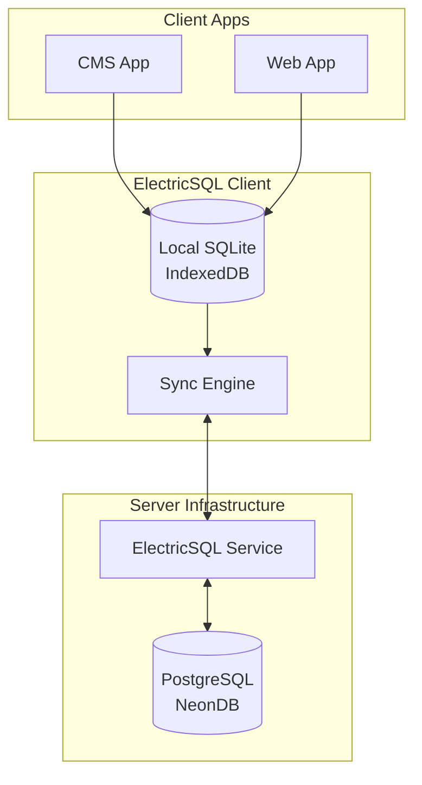

# ElectricSQL Integration Guide

This document describes how to integrate ElectricSQL into RevealUI for cross-tab/session agent memory sharing.

## Overview

ElectricSQL enables local-first real-time sync for agent context, memories, and conversations. It works alongside Drizzle ORM, providing:

- Cross-tab synchronization
- Cross-session persistence
- Offline-first operation
- Real-time updates
- Type-safe API

## Architecture



## Setup Steps

### 1. Install Dependencies

The `@revealui/sync` package is already set up. Install dependencies:

```bash
pnpm install
```

### 2. Set Up ElectricSQL Service

Deploy and configure ElectricSQL service (self-hosted):

1. Install ElectricSQL service
2. Connect to your PostgreSQL database
3. Configure sync rules for agent tables
4. Start the service

See [ElectricSQL documentation](https://electric-sql.com/docs) for details.

### 3. Configure Environment Variables

Add to `.env`:

```env
# ElectricSQL Service URL (server-side)
ELECTRIC_SERVICE_URL=http://localhost:5133

# ElectricSQL Service URL (client-side)
NEXT_PUBLIC_ELECTRIC_SERVICE_URL=http://localhost:5133

# Optional: Authentication token
ELECTRIC_AUTH_TOKEN=your_token_here
```

### 4. Generate ElectricSQL Schema

After ElectricSQL service is set up and running, generate client types:

```bash
# Generate ElectricSQL client from PostgreSQL schema
pnpm electric:generate
# Or manually:
pnpm dlx electric-sql generate
```

This will generate TypeScript types that match your PostgreSQL schema and create the `.electric/` directory.

**Note**: The service must be running and connected to your database before generating the schema.

### 5. Client Code Status

The client code is already implemented and ready to use:

- ✅ `packages/sync/src/client/index.ts` - Client initialization with `createElectricClient()`
- ✅ `packages/sync/src/provider/ElectricProvider.tsx` - React provider component
- ✅ `packages/sync/src/hooks/*.ts` - All hooks use `useLiveQuery` for real-time sync
- ✅ `packages/sync/src/schema.ts` - Automatically uses generated types when available

The implementation automatically detects and uses generated types when available, with graceful fallbacks.

### 6. Integrate Provider

#### CMS App

Add `ElectricProvider` to `apps/cms/src/lib/providers/index.tsx`:

```tsx
import { ElectricProvider } from '@revealui/sync/provider'

export function Providers({ children }) {
  return (
    <ElectricProvider serviceUrl={process.env.NEXT_PUBLIC_ELECTRIC_SERVICE_URL}>
      {children}
    </ElectricProvider>
  )
}
```

#### Web App

Add `ElectricProvider` to app entry point (e.g., `apps/web/src/main.tsx`):

```tsx
import { ElectricProvider } from '@revealui/sync/provider'

function App() {
  return (
    <ElectricProvider serviceUrl={import.meta.env.VITE_ELECTRIC_SERVICE_URL}>
      <YourApp />
    </ElectricProvider>
  )
}
```

## Usage

### Basic Hook Usage

```tsx
import { useAgentContext } from '@revealui/sync/hooks'

function AgentPanel({ agentId, sessionId }) {
  const { context, updateContext, isLoading } = useAgentContext(agentId, {
    sessionId
  })

  const handleUpdate = async () => {
    await updateContext({
      context: {
        tokensUsed: 150,
        lastUsed: new Date()
      }
    })
  }

  if (isLoading) return <div>Loading...</div>

  return (
    <div>
      <pre>{JSON.stringify(context, null, 2)}</pre>
      <button onClick={handleUpdate}>Update</button>
    </div>
  )
}
```

### Memory Management

```tsx
import { useAgentMemory } from '@revealui/sync/hooks'

function MemoryList({ agentId, siteId }) {
  const { memories, addMemory, isLoading } = useAgentMemory(agentId, {
    siteId,
    type: 'fact',
    limit: 100
  })

  const handleAdd = async () => {
    await addMemory({
      content: 'User prefers dark mode',
      type: 'preference',
      source: { type: 'user', id: 'user-123' },
      metadata: { importance: 0.8 }
    })
  }

  return (
    <div>
      <button onClick={handleAdd}>Add Memory</button>
      <ul>
        {memories.map(memory => (
          <li key={memory.id}>{memory.content}</li>
        ))}
      </ul>
    </div>
  )
}
```

## Sync Configuration

### Security Filters

Sync shapes filter data by user/agent for security:

```tsx
import { createAgentContextsShape } from '@revealui/sync/sync'

// Only sync contexts for specific agent and session
const shape = createAgentContextsShape('agent-123', 'session-456')
```

### PostgreSQL Sync Rules

Configure sync rules in ElectricSQL service to match these filters:

```sql
-- Example: Sync rule for agent_contexts
CREATE POLICY sync_agent_contexts ON agent_contexts
  FOR SELECT
  USING (agent_id = current_setting('app.agent_id')::text);
```

## Troubleshooting

### Connection Issues

- Verify ElectricSQL service is running: `curl http://localhost:5133/health`
- Check `ELECTRIC_SERVICE_URL` or `NEXT_PUBLIC_ELECTRIC_SERVICE_URL` is correct
- Check network connectivity
- Review service logs: `pnpm electric:service:logs`

### Sync Not Working

- Ensure tables are electrified: Run `ALTER TABLE <table> ENABLE ELECTRIC;` in PostgreSQL
- Verify sync shapes are configured correctly in client code
- Check that ElectricSQL service can connect to PostgreSQL
- Review ElectricSQL service logs for sync errors
- Verify RLS policies match sync filters (if using RLS)

### Type Errors

- Ensure ElectricSQL schema is generated: `pnpm electric:generate`
- Run `pnpm build` in `packages/sync` after generating types
- Check that `.electric/@config.ts` exists (generated file)
- Verify generated types match PostgreSQL schema

### Client Not Initializing

- Check that `ElectricProvider` is wrapping your app
- Verify service URL is provided via props or environment variable
- Check browser console for initialization errors
- Ensure `createElectricClient()` is not throwing errors

## Related Documentation

- [ElectricSQL Documentation](https://electric-sql.com/docs)
- [@revealui/sync README](../../packages/sync/README.md)
- [Agent Schema](../../packages/schema/src/agents/index.ts)
- [Database Schema](../../packages/db/src/core/agents.ts)

## Testing & Validation

- **[ElectricSQL Testing Results](../assessments/TESTING_RESULTS.md)** - Detailed testing results and critical findings
- **[ElectricSQL Testing Summary](../assessments/TESTING_SUMMARY.md)** - Quick summary of testing status and blockers

## Related Documentation

- [ElectricSQL Setup Guide](./electric-setup-guide.md) - Setup instructions
- [ElectricSQL Migrations](../reference/database/electric.migrations.sql) - SQL migrations
- [Drizzle Guide](./DRIZZLE-GUIDE.md) - Drizzle ORM usage
- [Fresh Database Setup](../reference/database/FRESH-DATABASE-SETUP.md) - Database setup
- [Unified Backend Architecture](../architecture/UNIFIED_BACKEND_ARCHITECTURE.md) - System architecture
- [Dual Database Architecture](../architecture/DUAL_DATABASE_ARCHITECTURE.md) - Database architecture
- [Master Index](../INDEX.md) - Complete documentation index
- [Task-Based Guide](../TASKS.md) - Find docs by task

### External Resources

- [ElectricSQL Documentation](https://electric-sql.com/docs) - Official ElectricSQL docs
