# Scripts Architecture

## Consolidated Module Structure

This document describes the architecture of the consolidated scripts infrastructure after the Phase 1-4 consolidation effort.

## Architecture Diagram

```mermaid
graph TB
    subgraph "CLI Entry Points"
        CLI[cli/revealui.ts<br/>Master Router]
        AnalyzeCLI[cli/analyze.ts]
        ValidateCLI[cli/validate.ts]
        MaintainCLI[cli/maintain.ts]
        SetupCLI[cli/setup.ts]

        CLI --> AnalyzeCLI
        CLI --> ValidateCLI
        CLI --> MaintainCLI
        CLI --> SetupCLI
    end

    subgraph "Unified Dispatcher"
        Dispatcher[lib/cli/dispatch.ts<br/>dispatchCommand&#40;&#41;]

        AnalyzeCLI --> Dispatcher
        ValidateCLI --> Dispatcher
        MaintainCLI --> Dispatcher
    end

    subgraph "Command Implementations"
        AnalyzeCmd[commands/analyze/*<br/>quality, types, console, etc.]
        ValidateCmd[commands/validate/*<br/>docs, packages, etc.]
        FixCmd[commands/fix/*<br/>5 fix scripts]
        MaintainCmd[commands/maintain/*<br/>audit-scripts, etc.]

        Dispatcher --> AnalyzeCmd
        Dispatcher --> ValidateCmd
        Dispatcher --> FixCmd
        Dispatcher --> MaintainCmd
    end

    subgraph "Consolidated Libraries"
        Analyzers[lib/analyzers/<br/>ConsoleAnalyzer]
        Validators[lib/validators/<br/>DocumentationValidator]
        Utils[lib/utils.ts<br/>scanDirectory&#40;&#41;]
        Errors[lib/errors.ts<br/>Enhanced ScriptError]

        AnalyzeCmd --> Analyzers
        AnalyzeCmd --> Utils
        ValidateCmd --> Validators
        ValidateCmd --> Utils
        FixCmd --> Utils
        FixCmd --> Errors
    end

    subgraph "Workflows"
        AutoEngine[workflows/automation-engine.ts]
        WorkflowDefs[workflows/definitions/*]

        AutoEngine --> WorkflowDefs
        AutoEngine --> Dispatcher
    end

    style CLI fill:#e1f5ff
    style Dispatcher fill:#fff4e1
    style Analyzers fill:#e8f5e9
    style Validators fill:#e8f5e9
    style Utils fill:#f3e5f5
    style Errors fill:#f3e5f5
```



## Module Breakdown

### 1. CLI Layer (`cli/`)

**Entry Points:**
- `revealui.ts` - Master router that delegates to specialized CLIs
- `analyze.ts` - Code analysis commands (9 commands)
- `validate.ts` - Validation commands (4 commands)
- `maintain.ts` - Maintenance/fix commands (11 commands)
- `setup.ts` - Project setup commands

**Key Features:**
- All CLIs extend `BaseCLI` for consistent behavior
- Unified argument parsing via `lib/args.ts`
- JSON output support for automation
- Auto-completion support

### 2. Unified Dispatcher (`lib/cli/`)

**dispatch.ts:**
```typescript
dispatchCommand(scriptPath, {
  mode: 'auto' | 'import' | 'subprocess',
  args: ParsedArgs,
  cwd: string
})
```

**Features:**
- Smart mode selection (import vs subprocess)
- Heuristics: workflows/build → subprocess, analysis → import
- Consistent error handling
- Result format: `{ success, error, exitCode, mode }`

**Benefits:**
- Eliminated 2 inconsistent patterns
- Reduced CLI code by 111 lines
- Better performance through auto-mode

### 3. Consolidated Libraries (`lib/`)

#### Analyzers (`lib/analyzers/`)

**ConsoleAnalyzer** - Merged from 2 files:
- `analyze/console-usage.ts` (AST mode)
- `validate/console-statements.ts` (Regex mode)

**Features:**
- Dual-mode analysis (AST + Regex)
- Auto-mode selection by file type
- Production guard detection
- File categorization (production/test/script)

**Savings:** ~480 lines

#### Validators (`lib/validators/`)

**DocumentationValidator** - Merged from 4 files:
- `analyze/docs.ts`
- `validate/validate-docs.ts`
- `validate/validate-docs-comprehensive.ts`
- `analyze/audit-docs.ts`

**Features:**
- Link validation
- JSDoc coverage analysis
- Script reference checking
- False claim detection
- Deprecated reference detection
- Quality metrics

**Savings:** ~800 lines

#### Utilities (`lib/utils.ts`)

**Centralized File Scanning:**
```typescript
scanDirectory(dir, options)      // Async generator
scanDirectoryAll(dir, options)   // Async array
scanDirectorySync(dir, options)  // Sync array
```

**Features:**
- Configurable extensions, exclusions, depth
- Memory-efficient async generator
- Replaces 15+ duplicate implementations

**Savings:** ~300 lines

#### Enhanced Errors (`lib/errors.ts`)

**ScriptError** - Merged from 2 files:
- `lib/errors.ts`
- `lib/error-handler.ts`

**Features:**
- Auto-generated suggestions
- Recovery steps
- Documentation URLs
- Rich context
- Pretty formatting

**Savings:** ~300 lines

### 4. Command Implementations

#### Analysis Commands (`commands/analyze/`)
- `code-quality.ts` - Complexity, duplication metrics
- `types.ts` - TypeScript coverage
- `console-usage.ts` - Console statement detection
- `docs.ts` - Documentation analysis
- `dependencies.ts` - Dependency analysis

#### Validation Commands (`commands/validate/`)
- `console-statements.ts` - Production console checks
- `validate-package-scripts.ts` - Package.json validation
- `pre-launch.ts` - Comprehensive validation

#### Fix Commands (`commands/fix/`)
- `fix-import-extensions.ts`
- `fix-linting-errors.ts`
- `fix-typescript-errors.ts`
- `fix-supabase-types.ts`
- `fix-test-errors.ts`

**Organization:** Moved from `analyze/` to proper location

#### Maintenance Commands (`commands/maintain/`)
- `audit-scripts.ts` - Script duplication detection
- `validate-scripts.ts` - Template compliance
- `fix-scripts.ts` - Auto-fix package scripts

### 5. Workflows (`workflows/`)

**automation-engine.ts** - Consolidated automation engine
- Deleted redundant `engine.ts` wrapper
- Full workflow execution and resumption
- State machine integration

## Before vs After

### Before Consolidation

```
scripts/
├── cli/                    # 2 different dispatch patterns
├── analyze/                # Mixed analysis + fix scripts
│   ├── console-usage.ts    # AST-based
│   ├── fix-*.ts            # 5 files (wrong location)
│   └── docs.ts             # Duplicate validation
├── validate/
│   ├── console-statements.ts  # Regex-based (duplicate)
│   ├── validate-docs.ts       # Duplicate
│   └── validate-docs-comprehensive.ts  # Duplicate
├── lib/
│   ├── errors.ts
│   └── error-handler.ts    # Separate error system
└── workflows/
    ├── engine.ts           # Redundant wrapper
    └── automation-engine.ts
```

**Issues:**
- 8 redundant file pairs
- 15+ duplicate scanDirectory implementations
- 2 inconsistent CLI dispatch patterns
- 2 incompatible error systems
- Poor separation of concerns

### After Consolidation

```
scripts/
├── cli/                        # Unified dispatcher
│   ├── _base.ts               # Enhanced with projectRoot
│   ├── analyze.ts             # Uses dispatchCommand()
│   ├── validate.ts            # Uses dispatchCommand()
│   └── maintain.ts            # Uses dispatchCommand()
├── lib/
│   ├── analyzers/             # ✨ NEW: Reusable analysis
│   │   ├── console-analyzer.ts
│   │   └── index.ts
│   ├── validators/            # ✨ NEW: Reusable validation
│   │   ├── documentation-validator.ts
│   │   └── index.ts
│   ├── cli/                   # ✨ NEW: Unified dispatch
│   │   ├── dispatch.ts
│   │   └── index.ts
│   ├── utils.ts               # ✨ Enhanced: scanDirectory
│   └── errors.ts              # ✨ Enhanced: Merged systems
├── commands/
│   ├── analyze/               # Read-only analysis
│   ├── validate/              # Pass/fail checks
│   └── fix/                   # ✨ NEW: Code modifications
└── workflows/
    └── automation-engine.ts   # ✨ Consolidated
```

**Improvements:**
- ✅ Zero duplicate implementations
- ✅ Single scanDirectory implementation
- ✅ Unified CLI dispatch pattern
- ✅ Consolidated error handling
- ✅ Clear separation: analyze/validate/fix
- ✅ Reusable modules in lib/

## Data Flow

### Analysis Flow
```
User → CLI → Dispatcher → Analyze Command → ConsoleAnalyzer → scanDirectory
                                           ↓
                                      Results → User
```

### Validation Flow
```
User → CLI → Dispatcher → Validate Command → DocumentationValidator
                                           ↓
                                    scanDirectory → Files
                                           ↓
                                      Validation → Pass/Fail
```

### Fix Flow
```
User → CLI → Dispatcher → Fix Command → scanDirectory → Files
                                      ↓
                                  Modifications
                                      ↓
                                  ScriptError (if needed)
```

## Performance Characteristics

### Dispatch Mode Selection

**Import Mode** (Fast, same process):
- Quick analysis scripts
- Validation checks
- ~50-100ms startup overhead

**Subprocess Mode** (Isolated):
- Workflows (long-running)
- Build/deploy scripts
- Resource-intensive tasks
- ~200-500ms startup overhead

**Auto Mode** (Smart):
- Analyzes script path
- Chooses optimal mode
- `/workflows/` → subprocess
- `build|deploy|release` → subprocess
- Everything else → import

### scanDirectory Performance

**Generator** (`scanDirectory`):
- Memory: O(1) - constant
- Best for: Processing files one at a time
- Use case: Large directories, streaming

**Async Array** (`scanDirectoryAll`):
- Memory: O(n) - proportional to file count
- Best for: Batch processing, analysis
- Use case: <1000 files

**Sync** (`scanDirectorySync`):
- Memory: O(n)
- Blocks: Yes (event loop)
- Best for: Config loading, initialization
- Use case: Synchronous requirements only

## Consolidation Metrics

### Code Reduction
- **Total:** ~2,000 lines removed (-10.5%)
- Console analyzers: 2 → 1 (-480 lines)
- Doc validators: 4 → 1 (-800 lines)
- Error systems: 2 → 1 (-300 lines)
- Automation engines: 2 → 1 (-200 lines)
- CLI dispatch: 111 lines removed

### File Consolidation
- Redundant pairs: 8 → 0 (-100%)
- scanDirectory implementations: 15+ → 1 (-93%)
- CLI patterns: 2 → 1 (-50%)

### Quality Improvements
- ✅ 330+ lines of JSDoc added
- ✅ Comprehensive examples
- ✅ Type-safe interfaces
- ✅ Consistent error handling
- ✅ Auto-generated suggestions
- ✅ Better separation of concerns

## Module Dependencies

```mermaid
graph LR
    subgraph "External Dependencies"
        TS[TypeScript]
        FS[Node.js fs]
        Path[Node.js path]
    end

    subgraph "Core Modules"
        Utils[lib/utils.ts]
        Errors[lib/errors.ts]
        Args[lib/args.ts]
    end

    subgraph "Specialized Modules"
        Analyzers[lib/analyzers/*]
        Validators[lib/validators/*]
        Dispatch[lib/cli/dispatch.ts]
    end

    subgraph "Commands"
        Commands[commands/*/*]
    end

    TS --> Analyzers
    FS --> Utils
    Path --> Utils

    Utils --> Analyzers
    Utils --> Validators
    Utils --> Commands

    Errors --> Commands
    Args --> Dispatch

    Analyzers --> Commands
    Validators --> Commands
    Dispatch --> Commands
```

## Usage Examples

### Using ConsoleAnalyzer

```typescript
import { ConsoleAnalyzer } from '@revealui/scripts-lib'

const analyzer = new ConsoleAnalyzer(process.cwd())

// Analyze single file
const usages = await analyzer.analyze('src/app.ts', 'auto')

// Analyze multiple files
const files = await scanDirectoryAll('./src', { extensions: ['.ts'] })
const result = await analyzer.analyzeMultiple(files)

console.log(`Found ${result.summary.total} console statements`)
console.log(`Production issues: ${result.summary.production}`)
```

### Using DocumentationValidator

```typescript
import { DocumentationValidator } from '@revealui/scripts-lib'

const validator = new DocumentationValidator(process.cwd())

// Full validation
const result = await validator.validate()

// Selective validation
const linkResult = await validator.validate({
  validateLinks: true,
  validateJSDoc: false
})

console.log(`Issues found: ${result.issues.length}`)
console.log(`By severity:`, result.bySeverity)
```

### Using Unified Dispatcher

```typescript
import { dispatchCommand } from '@revealui/scripts-lib'

// Auto mode (recommended)
const result = await dispatchCommand('scripts/analyze/quality.ts', {
  mode: 'auto',
  args: { flags: { json: true } }
})

// Force subprocess for isolation
await dispatchCommand('scripts/workflows/build.ts', {
  mode: 'subprocess',
  timeout: 60000
})
```

### Using scanDirectory

```typescript
import { scanDirectory, scanDirectoryAll } from '@revealui/scripts-lib'

// Memory-efficient streaming
for await (const file of scanDirectory('./src', {
  extensions: ['.ts', '.tsx'],
  excludeDirs: ['__tests__']
})) {
  console.log(file)
}

// Batch processing
const files = await scanDirectoryAll('./packages', {
  extensions: ['.ts'],
  maxDepth: 3
})
```

## Migration Guide

See [CONSOLIDATION-SUMMARY.md](./CONSOLIDATION-SUMMARY.md) for detailed migration examples and patterns.

## Dependency Management

### Overview

All scripts now use standardized `@dependencies` and `@requires` JSDoc headers for dependency tracking. This enables automated validation, graph generation, and better understanding of script relationships.

### Documentation Format

```typescript
/**
 * Script Name
 *
 * @dependencies
 * - scripts/lib/utils.ts - Utility functions
 * - @revealui/db - Database operations
 * - fast-glob - File pattern matching
 *
 * @requires
 * - Environment: DATABASE_URL - PostgreSQL connection
 * - External: psql - PostgreSQL CLI tool
 * - Scripts: generate-types.ts (must run first)
 */
```

### Validation System

**Validator** (`commands/validate/validate-dependencies.ts`):
- Parses @dependencies from all script files
- Builds complete dependency graph
- Detects circular dependencies using DFS
- Verifies file dependencies exist
- Identifies undocumented imports

**Usage:**
```bash
# Validate all scripts
pnpm check validate:dependencies

# Check specific file
pnpm check validate:dependencies --file scripts/cli/ops.ts

# JSON output
pnpm check validate:dependencies --json
```

### Graph Generation

**Generator** (`commands/info/deps-graph.ts`):
- Creates visual dependency graphs
- Supports multiple output formats
- Automatic grouping by directory
- Highlights circular dependencies

**Formats:**
1. **Mermaid** - Flowchart diagrams for documentation
2. **JSON** - Structured data for programmatic access
3. **DOT** - Graphviz format for advanced visualization

**Usage:**
```bash
# Generate Mermaid diagram
pnpm info deps:graph --format mermaid --output docs/DEPENDENCY_GRAPH.md

# Generate JSON for analysis
pnpm info deps:graph --format json --scope cli

# Generate DOT for Graphviz
pnpm info deps:graph --format dot --output deps.dot
```

### CI/CD Integration

**GitHub Actions** (`.github/workflows/ci.yml`):
- Runs dependency validation on all PRs
- Fails build on circular dependencies or missing files
- Generates dependency graph on main branch
- Uploads graph artifacts for 30 days

**Pre-commit Hook** (`.husky/pre-commit`):
- Validates modified script files
- Warns about missing @dependencies
- Non-blocking (warnings only)

### Architecture

```mermaid
graph TB
    subgraph "Documentation"
        Headers[@dependencies Headers<br/>in JSDoc]
    end

    subgraph "Validation"
        Validator[validate-dependencies.ts<br/>~550 lines]
        Parser[Parse Headers]
        Graph[Build Graph]
        Cycles[Detect Cycles]
    end

    subgraph "Visualization"
        Generator[deps-graph.ts<br/>~450 lines]
        Mermaid[Mermaid Output]
        JSON[JSON Output]
        DOT[DOT Output]
    end

    subgraph "Integration"
        CI[GitHub Actions]
        Hooks[Pre-commit Hook]
    end

    Headers --> Parser
    Parser --> Graph
    Graph --> Cycles
    Graph --> Generator
    Generator --> Mermaid
    Generator --> JSON
    Generator --> DOT
    Validator --> CI
    Validator --> Hooks

    style Headers fill:#e1f5ff
    style Validator fill:#fff4e1
    style Generator fill:#e8f5e9
    style CI fill:#f3e5f5
```

### Statistics

**Current Coverage:**
- Total script files: 281
- Documented files: 18 (Phase 1 & 2 infrastructure)
- Validation rate: 6.4%
- Circular dependencies: 0 (in documented files)

**Tools:**
- Validator: ~550 lines
- Graph generator: ~450 lines
- Total tooling: ~1,000 lines

### Benefits

1. **Automated Validation**
   - Detects circular dependencies automatically
   - Verifies file dependencies exist
   - Identifies undocumented imports

2. **Visual Understanding**
   - Mermaid diagrams show relationships
   - Scope filtering for focused views
   - Cycle highlighting in red

3. **CI/CD Quality Gates**
   - Blocks PRs with circular dependencies
   - Ensures critical files are documented
   - Generates graphs on every main branch commit

4. **Developer Experience**
   - Clear template in CONTRIBUTING.md
   - Examples for all script types
   - Integration with CLI tools

### Template

See [CONTRIBUTING.md](../CONTRIBUTING.md#script-dependencies-documentation) for the complete @dependencies template and examples.

## Future Enhancements

Potential areas for further improvement:

1. **Performance Benchmarking**
   - Measure scanDirectory variants
   - Profile dispatch mode overhead
   - Document performance characteristics

2. **Architecture Diagram Export**
   - Generate SVG/PNG from Mermaid
   - Include in documentation site

3. **Additional Consolidations**
   - Package.json manipulation utilities
   - Test helper consolidation
   - Remaining validation logic

4. **TypeScript Improvements**
   - Stricter type checking
   - Better generic constraints
   - More detailed JSDoc

## References

- [Main README](./README.md) - Scripts overview
- [Consolidation Summary](./CONSOLIDATION-SUMMARY.md) - Detailed consolidation report
- [lib/analyzers](./lib/analyzers/) - Analysis modules
- [lib/validators](./lib/validators/) - Validation modules
- [lib/cli/dispatch.ts](./lib/cli/dispatch.ts) - Unified dispatcher

---

**Last Updated:** 2026-02-03
**Status:** ✅ Architecture Finalized
**Phase:** 1-4 Complete, Phase 3 (Dependencies) 80% Complete
