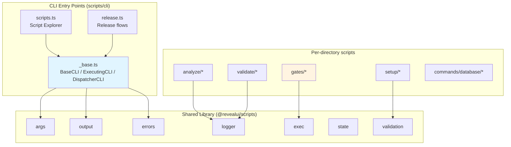

# Scripts Architecture

This document describes the structure of the `scripts/` infrastructure: how the
CLIs are built, how CI gates are composed, and where shared utilities live.

## Layers


```mermaid
graph TB
    subgraph "CLI Entry Points (scripts/cli)"
        Base[_base.ts<br/>BaseCLI / ExecutingCLI / DispatcherCLI]
        ScriptsCLI[scripts.ts<br/>Script Explorer]
        ReleaseCLI[release.ts<br/>Release flows]

        ScriptsCLI --> Base
        ReleaseCLI --> Base
    end

    subgraph "Shared Library (@revealui/scripts)"
        Args[args]
        Output[output]
        Errors[errors]
        Logger[logger]
        Exec[exec]
        State[state]
        Validation[validation]
    end

    subgraph "Per-directory scripts"
        Analyze[analyze/*]
        Validate[validate/*]
        Setup[setup/*]
        Gates[gates/*]
        Commands[commands/database/*]
    end

    Base --> Args
    Base --> Output
    Base --> Errors
    Analyze --> Logger
    Validate --> Logger
    Setup --> Validation
    Gates --> Exec

    style Base fill:#e1f5ff
    style Gates fill:#fff4e1
```

Most scripts are standalone `tsx` entry points invoked through a root
`package.json` alias. They are not routed through a central dispatcher. The
`scripts/cli/` directory holds the two scripts that are genuinely interactive
CLIs and therefore build on the shared `BaseCLI` abstractions.

## CLI Layer (`scripts/cli/`)

### `_base.ts`

Provides three abstract classes:

- **`BaseCLI`**, the foundation. Handles argument parsing (`@revealui/scripts/args`),
  dual-mode output (human-readable or JSON via `@revealui/scripts/output`),
  error handling with exit codes (`@revealui/scripts/errors`), confirmation
  prompts, interactive selection, and help-text generation.
- **`ExecutingCLI`**, extends `BaseCLI` to record executions in the audit log
  (`@revealui/scripts/audit/execution-logger`). Enable per-CLI with
  `enableExecutionLogging = true`.
- **`DispatcherCLI`**, extends `ExecutingCLI` with a `commandMap` that maps
  command names to script paths, dispatching via
  `@revealui/scripts/cli/dispatch`.

`runCLI(CLIClass)` instantiates and runs a CLI.

### `scripts.ts` (`pnpm scripts`)

The Script Explorer. An `ExecutingCLI` backed by a script registry
(`@revealui/scripts/registry/*`). Commands: `list`, `search`, `info`, `tree`,
`run`, `history`. Used to discover, inspect, and run registered scripts with
validation and execution history.

### `release.ts` (`pnpm release`)

Release and publish flows. Sub-entries wired as root aliases:
`release:dry-run`, `release:oss`, `release:pro`, `release:status`.

## Shared Library (`@revealui/scripts`)

Reusable utilities live in `packages/scripts`, imported as `@revealui/scripts/*`.
Exported subpaths include: `errors`, `exec`, `logger`, `paths`, `state`
(with `memory` and `pglite` adapters plus `workflow`), and `validation`
(`env`, `database`). CLIs additionally import `args`, `output`,
`cli/dispatch`, `audit/execution-logger`, and `registry/*` from the same package.

Local helpers:

- `scripts/lib/md-links.ts`, zero-regex markdown extractors shared by the
  root-level doc validators (see the no-regex M2 posture).
- `scripts/utils/base.ts`, shared script helpers.

## CI Gates (`scripts/gates/`)

The gates compose the quality pipeline:

- `ci-gate.ts` (`pnpm gate`, `pnpm gate:quick`), orchestrates the phased CI
  gate: quality (lint, audits, structure, boundary, claim-drift), typecheck,
  then test + build.
- `security-gate.ts` (`pnpm gate:security`)
- `test-coverage-gate.ts` (`pnpm coverage:check`)
- `types-gate.ts` (`pnpm gate:types`)
- `ops/deploy.ts` (`pnpm deploy`)

## Directory Conventions

- `analyze/`, read-only audits. Never mutate source.
- `validate/`, pass/fail gates that exit non-zero on failure. See
  [validate/README.md](./validate/README.md).
- `setup/`, environment and database setup. See [setup/README.md](./setup/README.md).
- `commands/database/`, database operations (backup, restore, status).
- `secrets/`, `sync/`, secret generation and revvault path sync.
- `dev-tools/`, developer and integration-test utilities. See
  [dev-tools/README.md](./dev-tools/README.md).

## Dependency Documentation Convention

Scripts document their dependencies in a JSDoc header so a reader can trace what
a script imports and requires without running it:

```typescript
/**
 * Script Name
 *
 * @dependencies
 * - scripts/lib/md-links.ts - markdown extractors
 * - @revealui/scripts/errors - error handling
 *
 * @requires
 * - Environment: DATABASE_URL - PostgreSQL connection
 * - External: psql - PostgreSQL CLI
 */
```

This is a documentation convention, not an enforced gate. The CLIs in
`scripts/cli/` carry these headers as reference examples.

## References

- [Main README](./README.md), scripts overview and command index
- [STANDARDS.md](./STANDARDS.md), package.json script conventions
- [cli/_base.ts](./cli/_base.ts), the BaseCLI abstractions
